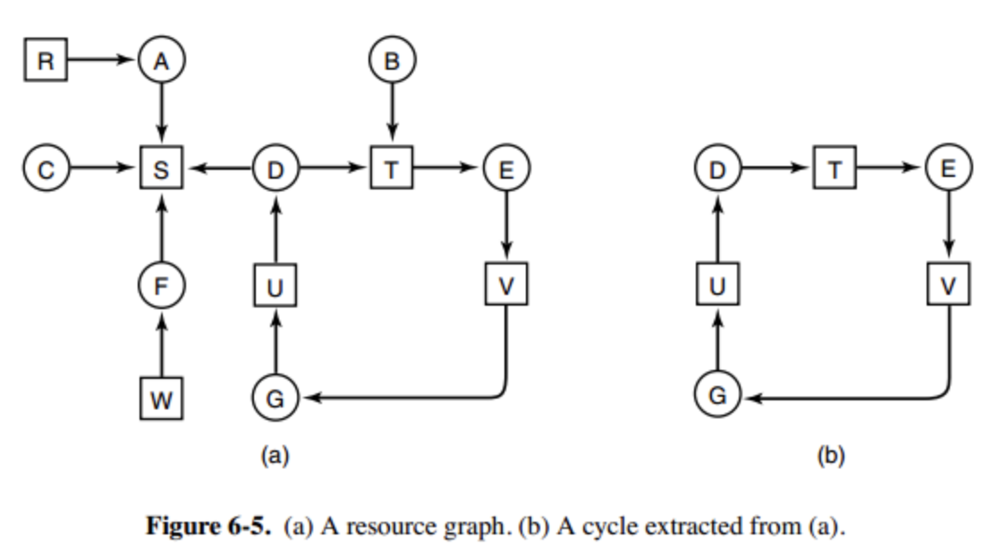
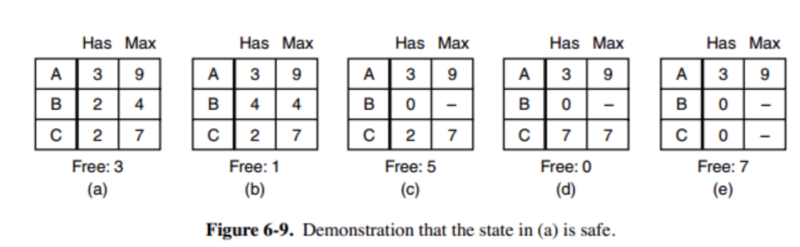
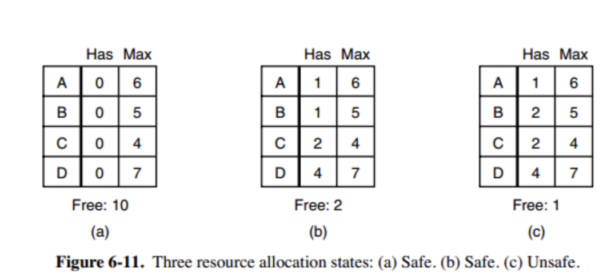
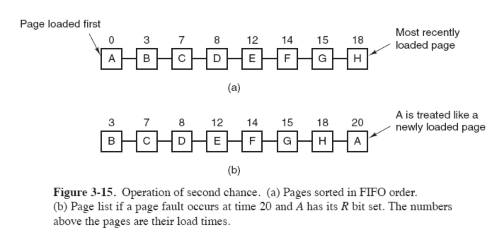

# ALGO  
---  


## BACKTRACKING  
### STRUCTURE CODE  
```javascript
const problem = function() {
  const res = []
  helper()
  return res

  function helper() {
    // end point
    if ()
    else {
      // choose
      do something()
      // explore
      backtracking()
      // un-choose
      back to the condition that do something()
    }
  }
}

```
### EXAMPLES  
#### Permutations  
> Given a collection of distinct integers, return all possible permutations.  
```javascript
Input: [1,2,3]
Output:
[
  [1,2,3],
  [1,3,2],
  [2,1,3],
  [2,3,1],
  [3,1,2],
  [3,2,1]
]
```
```javascript
const permute = function(nums) {
  const res = []
  nums.sort((a, b) => a - b) // when the nums may contains duplicated
  helper(nums, [])
  return res
  
  function helper(left, tmp) {
    if (left.length === 0) res.push(tmp.slice())
    else {
      for (let i = 0; i < left.length; i++) {
        // choose
        tmp.push(left[i])
        const del = left.splice(i, 1)[0]
        // explore
        helper(left, tmp)
        // un-choose
        tmp.pop()
        left.splice(i, 0, del)
        // remove duplicate
        while (left[i] === left[i + 1]) {i++}  // when the nums may contains duplicated
      }
    }
  }
}
```
#### Combinations  
> Given two integers n and k, return all possible combinations of k numbers out of 1 ... n.
```javascript
Input: n = 4, k = 2
Output:
[
  [2,4],
  [3,4],
  [2,3],
  [1,2],
  [1,3],
  [1,4],
]
```
```javascript
const combine = function(n, k) {
  const data = [], res = []
  for (let i = 0; i < n; i++) { data[i] = i + 1 }
  helper(0, [])
  return res
  
  function helper(idx, tmp) {
    if (tmp.length === k) res.push(tmp.slice())
    else {
      for (let i = idx; i < n; i++) {
        // choose
        tmp.push(data[i])
        // explore
        helper(i + 1, tmp)
        // un-choose
        tmp.pop()
      }
    }
  }
}
```
#### Combination Sum
> Given a set of candidate numbers (candidates) (without duplicates) and a target number (target),
> find all unique combinations in candidates where the candidate numbers sums to target.  
> The same repeated number may be chosen from candidates unlimited number of times.
```javascript
Input: candidates = [2,3,5], target = 8,
A solution set is:
[
  [2,2,2,2],
  [2,3,3],
  [3,5]
]
```
```javascript
const combinationSum = function(candidates, target) {
  const res = []
  candidates.sort((a, b) => a - b) // when has duplicates
  helper(0, target, [])
  return res
  
  function helper(idx, left, tmp) {
    if (left < 0) return
    else if (left === 0) res.push(tmp.slice())
    else {
      for (let i = idx; i < candidates.length; i++) {
        // choose
        tmp.push(candidates[i])
        // explore
        helper(i, left - candidates[i], tmp)
        // un-choose
        tmp.pop()
        // remove duplicates
        while (candidates[i] === candidates[i + 1]) {i++} // when has duplicates
      }
    }
  }
}
```
#### Combination Sum II  
> Given a collection of candidate numbers (candidates) and a target number (target),   
> find all unique combinations in candidates where the candidate numbers sums to target.  
> Each number in candidates may only be used once in the combination.  
``` javascript
const combinationSum2 = function(candidates, target) {
  const res = []
  candidates.sort((a, b) => a - b)
  helper(0, target, [])
  return res
  
  function helper(idx, left, tmp) {
    if (left < 0) return
    else if (left === 0) res.push(tmp.slice())
    else {
      for (let i = idx; i < candidates.length; i++) {
        // choose
        tmp.push(candidates[i])
        // explore
        helper(i + 1, left - candidates[i], tmp)
        // un-choose
        tmp.pop()
        // remove duplicates
        while (candidates[i] === candidates[i + 1]) {i++}
      }
    }
  }
}
```
#### Combination Sum III
> Find all possible combinations of k numbers that add up to a number n, given that only numbers from 1 to 9 can be used and each combination should be a unique set of numbers.
```javascript
Input: k = 3, n = 9
Output: [[1,2,6], [1,3,5], [2,3,4]]
```
```javascript
const combinationSum3 = function(k, n) {
  const res = [], data = [1, 2, 3, 4, 5, 6, 7, 8, 9]
  helper(n, [], 0)
  return res
  
  function helper(left, tmp, idx) {
    if (left < 0) return 
    if (left === 0 && tmp.length === k) res.push(tmp.slice())
    else {
      for (let i = idx; i < data.length; i++) {
        // choose
        tmp.push(data[i])
        // explore
        helper(left - data[i], tmp, i + 1)
        // un-choose
        tmp.pop()
      }
    }
  }
}
```
#### Subsets I && II 
> Given a set of distinct integers, nums, return all possible subsets (the power set).  
```javascript 
const subsets = function(nums) {
  const res = []
  nums.sort((a, b) => a - b) // if has duplicates
  helper(0, [])
  return res

  function helper(idx, tmp) {
    res.push(tmp.slice)
    for (let i = idx; i < nums.length; i++) {
      // choose
      tmp.push(nums[i])
      // explore
      helper(i + 1, tmp)
      // un-choose
      tmp.pop()
      // remove duplicates
      while (nums[i] === nums[i + 1]) {i++}
    }
  }
}
```
#### N-QUEENS
> As the N-QUEENS description
```javascript
const solveNQueens = function(n) {
  const board = [...Array(n)].map(_ => '.'.repeat(n)), res = []
  helper(board, 0)
  return res
  
  function helper(board, row) {
    if (row === n) res.push(board.slice())
    else {
      for (let col = 0; col < n; col++) {
        // validation
        if (!isValid(row, col, board)) continue
        // choose
        const tmp = board[row].split('')
        tmp[col] = 'Q'
        board[row] = tmp.join('')
        // explore
        helper(board, row + 1)
        // un-choose
        tmp[col] = '.'
        board[row] = tmp.join('')
      }
    }
  }
  
  function isValid(row, col, board) {
    // validate col
    for (let i = 0; i < row; i++) {
      if (board[i][col] === 'Q') return false
    }
    // validate left-top
    for (let i = row - 1, j = col - 1; i >= 0 && j >= 0; i--, j--) {
      if (board[i][j] === 'Q') return false
    }
    // validate right-top
    for (let i = row - 1, j = col + 1; i >= 0 && j < n; i--, j++) {
      if (board[i][j] === 'Q') return false
    }
    return true
  }
}
```  
> If just count the solutions
```javascript
const totalNQueens = function(n) {
  let res = 0
  const cols = Array(n).fill(false), diag = Array(2n).fill(false), antiDiag = Array(2n).fill(false)
  helper(0)
  return res
  
  function helper(row) {
    if (row === n) res++
    else {
      for (let col = 0; col < n; col++) {
        // validate
        if (!isValid(row, col)) continue
        // choose
        cols[col] = diag[row - col + n] = antiDiag[row + col] = true
        // explore
        helper(row + 1)
        // un-choose
        cols[col] = diag[row - col + n] = antiDiag[row + col] = false
        
      }
    }
  }
  
  function isValid(row, col) {
    if (cols[col] || diag[row - col + n] || antiDiag[row + col]) return false
    return true
  }
}
```
#### Sudoku Solver  
> As description 37.
``` javascript
const solveSudoku = function(board) {
  helper(0, 0)

  function helper(i, j) {
    if (i === 9) return true
    if (j === 9) return helper(i + 1, 0)
    if (board[i][j] != '.') return helper(i, j + 1)

    for (let c = 1; c <= 9; c++) {
      if (check(i, j, c)) {
        // choose
        board[i][j] = String(c)
        // explore
        if (helper(i, j + 1)) return true
        // un-choose
        board[i][j] = '.'
      }
      return false
    }
    
    function check(i, j, val) {
      for (let k = 0; k < 9; k++) {
        // check col 
        if (board[k][j] == val) return false
        // check row
        if (board[i][k] == val) return false
        // check cube
        if (board[i - i % 3 + k / 3 | 0][j - j % 3 + k % 3] == val) return false
      }

      return true
    }
  }
}
```
#### Word Search  
> As description 79.
```javascript  
const exist = function(board, word) {
  for (let i = 0; i < board.length; i++) {
    for (let j = 0; j < board[0].length; j++) {
      if (helper(i, j, board, 0)) return true
    }
  }
  return false

  function helper(idx, idy, board, path) {
    if (idx < 0 || idy < 0 || idx >= board.length || idy >= board[0].length || 
      board[idx][idy] !== word[path] || path > word.length) return false

    // choose
    board[idx][idy] = '*'
    path++
    // judge
    if (path === word.length) return true
    // explore
    let isFound = helper(idx + 1, idy, board, path) ||
                  helper(idx - 1, idy, board, path) ||
                  helper(idx, idy + 1, board, path) ||
                  helper(idx, idy - 1, board, path)
    // un-choose
    board[idx][idy] = word[--path]
  }
  return isFound
}
```
#### Word Search II  
> As description 212
```javascript
// use trie
const findWords = function(board, words) {
  let res = []
  const root = buildTrie()
  for (let i = 0; i < board.length; i++) {
    for (let j = 0; j < board[0].length; j++) {
      search(root, i, j)
    }
  }
  return res
  
  function buildTrie() {
    const root = {}
    for (let w of words) {
      let node = root
      for (let c of w) {
        if (node[c] == null) node[c] = {}
        node = node[c]
      }
      node.word = w
    }
    return root
  }
  
  function search(node, i, j) {
    if (node.word != null) {
      res.push(node.word)
      node.word = null
    }
    if (i < 0 || j < 0 || i >= board.length || j >= board[0].length) return
    if (node[board[i][j]] == null) return 
    
    // choose
    const c = board[i][j]
    board[i][j] = '#'
    // explore
    search(node[c], i + 1, j)
    search(node[c], i - 1, j)
    search(node[c], i, j + 1)
    search(node[c], i, j - 1)
    // un-choose
    board[i][j] = c
  }
}
```

#### Generate Parentheses
> Given n pairs of parentheses, write a function to generate all combinations of well-formed parentheses.
```javascript
input: n = 3
output: [
  "((()))",
  "(()())",
  "(())()",
  "()(())",
  "()()()"
]
```  
```javascript
const generateParenthesis = function(n) {
  const res = []
  helper(0, 0, 0, '')
  return res
  
  function helper(left, right, level, tmp) {
    if (right > left || level > 2 * n) return
    else if (level === 2 * n && left === right) res.push(tmp.slice())
    else {
      helper(left + 1, right, level + 1, tmp + '(')
      helper(left, right + 1, level + 1, tmp + ')')
    }
  }
}
```
#### Regular Expression Matching  
> Like regexp  
```javascript
// actually using dp =.=
const isMatch = function(s, p) {
  const lenS = s.length, lenP = p.length
  const map = new Map()
  return check(0, 0)

  function check(ids, idp) {
    if (map[ids + ':' + idp] != undefined) return map[ids + ':' + idp]
    if (ids > lenS) return false
    if (ids === lenS && idp === lenP) return true

    // p: ?.? / ?a?  s: ?a?
    if (p[idp] === '.' || p[idp] === s[ids]) {
      map[ids + ':' + idp] = p[idp + 1] === '*' ?
        check(ids + 1, idp) || check(ids, idp + 2) :
        check(ids + 1, idp + 1)
    } else {
      map[ids + ':' + idp] = p[idp + 1] === '*' ?
        check(ids, idp + 2) : false 
    }
    return map[ids + ':' + idp]
  }
}
```
#### Restore IP Address  
> As description 93  
``` javascript
const restoreIpAddress = function(s) {
  const res = []
  helper([], 0)
  return res

  function helper(tmp, idx) {
    if (tmp.length === 4 && idx < s.length) return
    else if (tmp.length === 4 && idx === s.length) res.push(tmp.slice().join('.'))
    else {
      for (let i = idx; i < s.length; i++) {
        if (i != idx && s[i] === '0') return
        const num = parseInt(s.slice(idx, i + 1))
        if (num > 255) return
        // choose
        tmp.push(num)
        // explore
        helper(tmp, i + 1)
        // un-choose
        tmp.pop()
      }
    }
  }
}
```
#### Palindrome Partitioning  
> 131  
``` javascript
const partition = function(s) {
  const res = []
  helper(0, []) 
  return res

  function helper(idx, tmp) {
    if (tmp.length > 0 && idx >= s.length) res.push(tmp.slice())
    else {
      for (let i = idx; i < s.length; i++) {
        if (isPalindrome(idx, i)) {
          // choose
          tmp.push(s.slice(idx, i + 1))
          // explore
          helper(i + 1, tmp)
          // un-choose
          tmp.pop()
        }
      }
    }
  }

  function isPalindrome(start, end) {
    if (start === end) return true
    while (start < end) {
      if (s[start] !== s[end]) return false
      else {start++;end--}
    }
    return true
  }
}
```

### TIME-COMPLEXITY  
According to the specific problems. O(N!)/ O(2^N) / balabala
## Binary Search  
### STRUCTURE CODE  
``` javascript
// NORMAL  
const bs = function(nums, target) {
  if (!nums.length) return -1
  let lo = 0, hi = nums.length - 1
  while (lo <= hi) {
    let mid = lo + ((hi - lo) >> 1)
    if (nums[mid] === target) return mid
    else if (nums[mid] > target) hi = mid - 1
    else lo = mid + 1
  }
  return -1
}
// LEFT BOUND
const bs = function(nums, target) {
  if (!nums.length) return -1
  let lo = 0, hi = nums.length
  while (lo < hi) {
    let mid = lo + ((hi - lo) >> 1)
    if (nums[mid] === target) hi = mid
    else if (nums[mid] > target) hi = mid
    else lo = mid + 1
  }
  return lo
}
// RIGHT BOUND
const bs = function(nums, target) {
  if (!nums.length) return -1
  let lo = 0, hi = nums.length
  while (lo < hi) {
    let mid = lo + ((hi - lo) >> 1)
    if (nums[mid] === target) lo = mid + 1
    else if (nums[mid] < target) lo = mid + 1
    else hi = mid
  }
  return lo - 1
}
```
### EXAMPLES  
#### Median of Two Sorted Array  
> 4  
``` javascript
const findMedianSortedArrays = function(nums1, nums2) {
  const m = nums1.length, n = nums2.length, resLeft = 0, resRight = 0
  // swap
  if (m > n) {
    let tmp = n, tmpNums = num2
    n = m
    nums2 = nums1
    m = tmp
    nums1 = tmpNums
  }
  let lo = 0, hi = m, halfLen = (m + n + 1) >> 1
  while (lo <= hi) {
    let i = lo + ((hi - lo) >> 1), j = halfLen - i
    if (i < m && nums2[j - 1] > nums1[i]) lo = i + 1
    else if (i > 0 && nums1[i - 1] > nums2[j]) hi = i - 1
    else {
      if (i === 0) resLeft = nums2[j - 1]
      else if (j === 0) resLeft = nums1[i - 1]
      else resLeft = Math.max(nums2[j - 1], nums1[i - 1])

      if ((m + n) % 2 === 1) return resLeft

      if (i === m) resRight = nums2[j]
      else if (j === n) resRight = nums1[i]
      else resRight = Math.min(nums1[i], nums2[j])

      return (resLeft + resRight) / 2.0
    }
  }
}
```
#### Search In Sorted Array I && II
> 33, 81  
``` javascript
const search = function(nums, target) {
  let lo = 0, hi = nums.length - 1
  while (lo <= hi) {
    let mid = lo + ((hi - lo) >> 1)
    if (target === nums[mid]) return mid   // true for 81
    // remove duplicates in right part for 81
    while (nums[mid] === nums[hi] && mid !== hi) { hi-- }
    if (nums[mid] > nums[hi]) {
      if (target < nums[mid] && target >= nums[lo]) hi = mid - 1
      else lo = mid + 1
    } else {
      if (target > nums[mid] && target <= nums[hi]) lo = mid + 1
      else hi = mid - 1
    }
  }
  return -1  // false for 81
}
```
#### Search a 2D Matrix  
> 74
``` javascript
const searchMatrix = function(matrix, target) {
  if (!matrix || !matrix.length || !matrix[0].length) return false
  let lo = 0, hi = matrix.length * matrix[0].length - 1
  while (lo <= hi) {
    let mid = lo + ((hi - lo) >> 1)
    let x = mid % matrix[0].length
    let y = mid / matrix[0].length | 0
    if (target === matrix[x][y]) return true
    else if (target > matrix[x][y]) lo = mid + 1
    else hi = mid - 1
  }
  return false
}
```
#### Search a 2D Matrix II  
> 240. Top Right is max, right to left, up to down, decreasing.  
```javascript
const searchMatrix = function(matrix, target) {
  if (!matrix || !matrix.length || !matrix[0].length) return false
  let x = 0, y = matrix[0].length - 1
  while (x < matrix.length && y >= 0) {
    if (matrix[x][y] === target) return true
    else if (target > matrix[x][y]) x++
    else y--
  }
  return false
}
```
#### Search Insert Position  
> 35
``` javascript
// left bound
const searchInsert = function(nums, target) {
  let lo = 0, hi = nums.length
  while (lo < hi) {
    let mid = lo + ((hi - lo) >> 1)
    if (target > nums[mid]) lo = mid + 1
    else hi = mid
  }
  return lo
}
```
#### Kth Smallest Element in a Sorted Matrix  
> 378  
``` javascript
// The correctness of this algorithm is to ensure that the target value is   
// within the range of [low, high] for each loop step.
const kthSmallest = function(matrix, k) {
  let lo = matrix[0][0], N = matrix.length, hi = matrix[N - 1][N - 1]
  while (lo < hi) {
    let mid = lo + ((hi - lo) >> 1)
    let cnt = 0
    for (let i = 0; i < N; i++) {
      let j = N - 1
      // count num smaller than mid
      while (matrix[i][j] > mid && j >= 0) { j-- }  
      cnt += j + 1
    }
    if (cnt < k) lo = mid + 1
    else hi = mid
  }
  return lo
}
```
#### Find Peak Element  
> 162
``` javascript
const findPeakElement = function(nums) {
  let lo = 0, hi = nums.length - 1
  while (lo < hi) {
    let mid = lo + ((hi - lo) >> 1)
    // make each boundary hold true
    if (nums[mid] < nums[mid + 1]) lo = mid + 1
    else hi = mid
  }
  return lo
}
```
#### Find the Duplicate Number  
> 287
``` javascript
const findDuplicate = function(nums) {
  let lo = 1, hi = nums.length
  while (lo < hi) {
    let mid = lo + ((hi - lo) >> 1)
    let cnt = 0
    for (let j = 0; j < nums.length; j++) {
      if (nums[j] <= mid) cnt++
    }
    if (cnt > mid) hi = mid // duplicates in [lo, mid]
    else lo = mid + 1 // duplicates in [mid + 1, hi]
  }
}
```
#### Pow(x, n)  
> 50
```javascript
const myPow = function(x, n) {
  if (n === 0) return 1
  if (n < 0) return 1 / myPow(x, -n)
  if (n & 1) return x * myPow(x, n - 1) 
  return myPow(x * x, n / 2)
}
```
#### Sqrt(x)  
> 69
```javascript
const mySqrt = function(x) {
  let hi = x
  while (hi * hi > x) {
    hi = (hi + x / hi) / 2 | 0
  }
  return hi
}
const mySqrt = function(x) {
  let lo = 0, hi = x
  while (lo < hi) {
    let mid = lo + ((hi - lo) >> 1)
    if (mid * mid === x) return mid
    else if (x > mid * mid) lo = mid + 1
    else hi = mid
  }
  return x < lo * lo ? lo - 1 : lo
}
```
#### Find Minimum in Rotated Sorted Array  
> 153
``` javascript
const findMin = function(nums) {
  let lo = 0, hi = nums.length - 1
  while (lo < hi) {
    let mid = lo + ((hi - lo) >> 1)
    if (nums[mid] > nums[hi]) lo = mid + 1
    else hi = mid
  }
  return nums[lo]
}
```
#### Find Minimum in Rotated Sorted Array II  
> 154
``` javascript
const findMin = function(nums) {
  let lo = 0, hi = nums.length - 1
  while (lo < hi) {
    let mid = lo + ((hi - lo) >> 1)
    if (nums[mid] > nums[hi]) lo = mid + 1
    else if (nums[mid] < nums[hi]) hi = mid
    else {
      if (nums[hi - 1] > nums[hi]) {
        lo = hi
        break
      }
      // nums[mid] == nums[hi] shrink the upper bound like 81
      hi--
    }
  }
  return nums[lo]
}
```
#### Longest Increasing Subsequence  
> 300 
``` javascript
const lengthOfLIS = function(nums) {
  let tails = Array(nums.length).fill(0)
  let max = 0
  for (let n of nums) {
    let i = 0, j = max
    // search for the pos of num in tails
    while (i < j) {
      let mid = i + ((j - i) >> 1)
      if (num > tails[mid]) i = mid + 1
      else j = mid
    }
    // update tails, will cover previous bigger one
    tails[i] = num
    // if insert to the last, then max++
    if (max === i) max++
  }
  return max
}
```
#### Count Of Smaller Numbers After Self  
> 315  
```javascript
// a little bit similar to 300
const countSmaller = function(nums) {
  const len = nums.length
  const res = Array(len).fill(0)
  const arr = []
  for (let i = len - 1; i >= 0; i--) {
    let lo = 0, hi = arr.length
    while (lo < hi) {
      let mid = lo + ((hi - lo) >> 1)
      if (arr[mid] < nums[i]) lo = mid + 1
      else hi = mid
    }
    res[i] = lo
    arr.splice(lo, 0, nums[i])
  }
  return res
}
```
#### Koko Eating Bananas  
> 875  
```javascript
const minEatingSpeed = function(piles, H) {
  let lo = 1, hi = Math.max(...piles) + 1
  while (lo < hi) {
    let mid = lo + ((hi - lo) >> 1)
    let cnt = 0
    for (let i = 0; i < piles.length; i++) {
      cnt += (piles[i] + mid - 1) / mid | 0
    }
    if (cnt <= H) hi = mid
    else lo = mid + 1
  }
  return lo
}
```
#### Capacity To Ship Packages Within D Days  
> 1011 
```javascript
const shipWithinDays = function(weights, D) {
  let sum = 0
  for (let w of weights) {sum += w}
  let lo = Math.max(...weights), hi = sum + 1
  while (lo < hi) {
    let mid = lo + ((hi - lo) >> 1)
    let cnt = 1
    let tmp = 0
    for (let w of weights) {
      if (tmp + w > mid) {
        cnt++
        tmp = 0
      }
      tmp += w
    }
    if (cnt > D) lo = mid + 1
    else hi = mid
  }
  return lo
}
```

## BFS & DFS 
### STRUCTURE CODE  
```javascript
function bfs(start, target) {
  let q = [start]
  let visited = new Set([start])
  let cnt = 0

  while (q.length) {
    const len = q.length
    for (let i = 0; i < len; i++) {
      let cur = q.shift()
      // judge
      if (q === target) return cnt
      // add neighbors to q
      for (let node of q) {
        if (!visited.has(node)) {
          q.push(node)
          visited.add(node)
        }
      }
    }
    cnt++
  }

  function dfs() {
    /* It's similar to the backtracking but not exactly the same. */
  }
}
```
### EXAMPLES  
#### Binary Tree Level Order Traversal  
> Given a binary tree, return the level order traversal of its nodes' values. (ie, from left to right, level by level).  
``` javascript
// bfs
const levelOrder = function(root) {
  if (!root) return []
  let q = [root], res = []
  while (q.length) {
    const len = q.length
    let tmp = []
    for (let i = 0; i < len; i++) {
      let cur = q.shift()
      tmp.push(cur.val)
      if (cur.left) q.push(cur.left)
      if (cur.right) q.push(cur.right)
    }
    res.push(tmp)
  }
  return res

  // dfs
  if (!root) return []
  const res = []
  dfs(root, 0)
  return res

  function dfs(node, l) {
    if (!node) return
    if (!res[l]) res[l] = []
    res[l].push(node.val)
    if (node.left) dfs(node.left, l + 1)
    if (node.right) dfs(node.right, l + 1)
  }
}
```
#### Binary Tree Level Order Traversal II  
> Given a binary tree, return the bottom-up level order traversal of its nodes' values. (ie, from left to right,   
> level by level from leaf to root).
```javascript
// bfs
const levelOrderBottom = function(root) {
  if (!root) return []
  let q = [root], cnt = 1
  let res = []
  const maxl = dpt(root)

  while (q.length) {
    const len = q.length
    let tmp = []
    for (let i = 0; i < len; i++) {
      let cur = q.shift()
      tmp.push(cur.val)
      if (cur.left) q.push(cur.left)
      if (cur.right) q.push(cur.right)
    }
    res[maxl - cnt] = tmp
    cnt++
  }
  return res

  function dpt(root) {
    if (!root) return 0
    return 1 + Math.max(dpt(root.left), dpt(root.right))
  }
}
```
#### Binary Tree Zigzag Level Order Traversal  
> Given a binary tree, return the zigzag level order traversal of its nodes' values. (ie, from left to right,   
> then right to left for the next level and alternate between).  
```javascript
// bfs
const zigzagLevelOrder = function(root) {
  if (!root) return []
  let q = [root]
  let res = []
  let zigzag = true

  while (q.length) {
    const len = q.length
    let tmp = [], nxt = []
    for (let i = 0; i < len; i++) {
      let cur = q.pop()   // ATTENTION
      tmp.push(cur.val)
      if (zigzag) {
        if (cur.left) nxt.push(cur.left)
        if (cur.right) nxt.push(cur.right)
      } else {
        if (cur.right) nxt.push(cur.right)
        if (cur.left) nxt.push(cur.left)
      }
    }
    res.push(tmp)
    zigzag = !zigzag
    q = nxt
  }
  return res
}

```
#### Binary Tree Vertical Order Traversal  
> Given a binary tree, return the vertical order traversal of its nodes' values.   
> (ie, from top to bottom, column by column).
```javascript
// bfs
const vericalOrder = function(root) {
  if (!root) return []
  let res = [], min = 0
  let cols = new Map()  // store the cols value of nodes
  let map = new Map()   // store the col-nodes array
  let q = [root]
  cols.set(root, 0)
  while (q.length) {
    let cur = q.shift()
    let col = cols.get(cur)
    if (!map.has(col)) map.set(col, [])
    map.get(col).push(cur.val)  // push the cur node to its col's map
    if (cur.left) {
      q.push(cur.left)
      cols.set(cur.left, col - 1)
    }
    if (cur.right) {
      q.push(cur.right)
      cols.set(cur.right, col + 1)
    }
    min = Math.min(min, col)
  }
  while (map.has(min++)) {
    res.push(map.get(min))
  }
  return res
}

```
#### N-ary Tree Level Order Traversal  
> Given an n-ary tree, return the level order traversal of its nodes' values.  
```javascript
// bfs
const levelOrder = function(root) {
  if (!root) return []
  let q = [root]
  let res = []
  while (q.length) {
    const len = q.length
    let tmp = []
    for (let i = 0; i < len; i++) {
      let cur = q.shift()
      tmp.push(cur.val)
      for (let n of cur.children) {
        q.push(n)
      }
    }
    res.push(tmp)
  }
  return res
}
```

#### Number of Islands  
> As description  
```javascript
// bfs
const numIslands = function(grid) {
  if (!grid || !grid.length || !grid[0].length) return 0
  const m = grid.length, n = grid[0].length
  let cnt = 0
  for (let i = 0; i < m; i++) {
    for (let j = 0; j < n; j++) {
      if (grid[i][j] === '1') {
        bfs(i, j)
        cnt++
      }
    }
  }
  return cnt

  function bfs(x, y) {
    let q = [[x, y]]
    grid[x][y] = '0'
    const directions = [-1, 0, 1, 0, -1]
    while (q.length) {
      let [x, y] = q.shift()
      for (let i = 0; i < directions.length - 1; i++) {
        let newX = x + directions[i]
        let newY = y + directions[i + 1]
        if (!outOfBound(newX, newY) && grid[newX][newY] === '1') {
          q.push([newX, newY])
          grid[newX][newY] = '0'
        }
      }
    }
  }
  function outOfBound(x, y) {
    return x < 0 || y < 0 || x >= m || y >= n
  }

  // dfs
  if (!grid || !grid.length || !grid[0].length) return 0
  const m = grid.length, n = grid[0].length
  let cnt = 0
  for (let i = 0; i < m; i++) {
    for (let j = 0; j < n; j++) {
      dfs(i, j)
      cnt++
    }
  }
  return cnt


  function dfs(x, y) {
    if (x < 0 || y < 0 || x >= m || y >= n || grid[x][y] !== '1') return 
    grid[x][y] = '0'
    let directions = [-1, 0, 1, 0, -1]
    for (let i = 0; i < directions.length - 1; i++) {
      let newX = x + directions[i]
      let newY = y + directions[i + 1]
      dfs(newX, newY)
    }
  }
}
```

#### Max Area Of Island  
> As description
```javascript
const maxAreaOfIsland = function(grid) {
  // bfs
  let m = grid.length, n = grid[0].length
  let max = 0
  for (let i = 0; i < m; i++) {
    for (let j = 0; j < n; j++) {
      if (grid[i][j] === '1') {
        grid[i][j] = '0'
        let sum = bfs(i, j)
        max = Math.max(sum, max)
      }
    }
  }
  return max

  function bfs(x, y) {
    let q = [[x, y]]
    let sum = 0
    const directions = [-1, 0, 1, 0, -1]
    while (q.length) {
      let [x, y] = q.shift()
      sum++

      for (let i = 0; i < directions.length - 1; i++) {
        let newX = x + directions[i]
        let newY = y + directions[i + 1]

        if (!outOfBound(newX, newY) && grid[newX, newY] === '1') {
          grid[newX][newY] = '0'
          q.push([newX, newY])
        }
      }
    }
    return sum
  }
  function outOfBound(x, y) {
    return x < 0 || y < 0 || x >= m || y >= n
  }

  // dfs
  if (!grid || !grid.length || !grid[0].length) return 0
  const m = grid.length, n = grid[0].length
  let max = 0
  for (let i = 0; i < m; i++) {
    for (let j = 0; j < n; j++) {
      if (grid[i][j] == 1) {
        max = Math.max(dfs(i, j), max)
      }
    }
  }
  return max

  function dfs(x, y) {
    grid[x][y] = 0
    let sum = 1
    const directions = [-1, 0, 1, 0, -1]
    for (let i = 0; i < directions.length - 1; i++) {
      let newX = x + directions[i]
      let newY = y + directions[i + 1]
      if (!outOfBound(newX, newY) && grid[newX][newY] == 1) sum += dfs(newX, newY)
    }
    return sum
  }
}
```
#### Walls And Gates  
> As description  
```javascript
const wallsAndGates = function(rooms) {
  if (!rooms || !rooms.length || !rooms[0].length) return
  let q = []
  for (let i = 0; i < rooms.length; i++) {
    for (let j = 0; j < rooms[0].length; j++) {
      if (rooms[i][j] == 0) q.push([i, j])
    }
  }
  while (q.length) {
    let [x, y] = q.shift()
    let directions = [-1, 0, 1, 0, -1]
    
    for (let i = 0; i < directions.length - 1; i++) {
      let newX = x + directions[i]
      let newY = y + directions[i + 1]
      if (!outOfBound(newX, newY) && rooms[newX][newY] == 2147483647) {
        rooms[newX][newY] = rooms[x][y] + 1
        q.push([newX, newY])
      }
    }
  }
  
  function outOfBound(x, y) {
    return x < 0 || y < 0 || x >= rooms.length || y >= rooms[0].length
  }
}
```
#### Word Ladder  
> As description  
```javascript 
const ladderLength = function(beginWord, endWord, wordList) {
  let q = [beginWord]
  const dict = new Set(wordList)
  const seen = new Set([beginWord])
  let cnt = 1
  while (q.length) {
    const len = q.length
    for (let i = 0; i < len; i++) {
      let cur = q.shift()
      if (cur === endWord) return cnt
      
      let arr = cur.split('')
      for (let i = 0; i < arr.length; i++) {
        for (let d = 0; d < 26; d++) {
          arr[i] = String.fromCharCode(97 + d)
          const nv = arr.join('')
          if (!seen.has(nv) && dict.has(nv)) {
            seen.add(nv)
            q.push(nv)
          }
          arr[i] = cur[i]
        }
      }
    }
    cnt++
  }
  return 0
}
```


#### Critical Connections in a Network  
> As description 1192.  
```javascript
const criticalConnections = function(n, connections) {
  // build graph
  const g = Array(n).fill([])
  for (let [u, v] of connections) {
    g[u].push(v)
    g[v].push(u)
  }
  let idx = 0
  const res = 0
  const low = 0
  const dfn = Array(n).fill(Infinity)
  dfs(0, -1)
  return res

  function dfs(u, pre) {
    low[n] = dfn[u] = idx++
    for (const v of g[u]) { // scan
      if (v === pre) continue  // parent vertex, ignore
      if (dfn[v] === Infinity) {  // v is not visited yet
        dfs(v, u)
        low[u] = Math.min(low[u], low[v])
        if (low[v] > dfn[u]) res.push([u, v]) // u - v is critical there's no path for v to reach back u or previous u
        else low[u] = Math.min(low[u], dfn[v])
      }
    }
  }
}
```
#### Convert Sorted Array to Binary Search Tree
> As description 108
```javascript
const sortedArray = function(price, special, needs) {
  if (nums.length == 0) return null
    return helper(nums, 0, nums.length - 1)
    
    function helper(nums, lo, hi) {
      if (lo > hi) return null
      let mid = (lo + hi) >> 1
      let node = new TreeNode(nums[mid])
      node.left = helper(nums, lo, mid - 1)
      node.right = helper(nums, mid + 1, hi)
      return node
    }
}
```
## SORT  
### STRUCTURE CODE  
``` javascript
const quickSort = function(nums) {
  if (nums.length < 2) return nums
  let l = 0, r = nums.length - 1
  if (l < r) {
    let i = l, j = r, x = nums[l] // x pivot
    while (i < j) {
      // from right to left find the first that less than pivot
      while (i < j && nums[j] >= x) { j-- }
      if (i < j) nums[i++] = nums[j]
      // from left to right find the first that more or equal than pivot
      while (i < j && nums[i] < x) { i++ }
      if (i < j) nums[j--] = nums[i]
    }
    nums[i] = x
    quickSort(nums, l, i - 1)
    quickSort(nums, i + 1, r)
  }
  return nums
}
```
``` javascript
// more clear
const quickSort = function(nums) {
  if (nums.length < 2) return nums
  const lesser = []
  const greater = []
  const pivot = nums[0]
  for (let i = 1; i < nums.length; i++) {
    if (nums[i] < pivot) lesser.push(nums[i])
    else greater.push(nums[i])
  }
  return quickSort(lesser).concat(pivot, quickSort(greater))
}
```
```javascript
// from bottom to top
const mergeSort = function(nums) {
  if (nums.length < 2) return nums

  let step = 1
  let l = -1, r = -1
  while (step < nums.length) {
    l = 0
    r = step
    while (r + step <= nums.length) {
      merge(nums, l, l + step, r, r + step)
      l = r + step
      r = l + step
    } 
    if (r < nums.length) merge(nums, l, l + step, r, nums.length)
    step *= 2
  }
  return nums

  function merge(nums, startL, stopL, startR, stopR) {
    let rightNums = new Array(stopR - startR + 1)
    let leftNums = new Array(stopL - startL + 1)
    let k = startR
    for (let i = 0; i < rightNums.length - 1; i++) {
      rightNums[i] = nums[k]
      k++
    }
    k = startL
    for (let i = 0; i < leftNums.length - 1; i++) {
      leftNums[i] = nums[k]
      k++
    }
    // pivot value
    rightNums[rightNums.length - 1] = Infinity
    leftNums[leftNums.length - 1] = Infinity
    let m = 0
    let n = 0
    for (let k = startL; k < stopR; k++) {
      if (leftNums[m] <= rightNums[n]) {
        nums[k] = leftNums[m]
        m++
      } else {
        nums[k] = rightNums[n]
        n++
      }
    }
  }
}
```
``` javascript
// from top to bottom  
const mergeSort = function(nums) {
  if (nums.length < 2) return nums
  let mid = nums.length / 2 | 0
  let left = nums.slice(0, mid)
  let right = nums.slice(mid)
  return merge(mergeSort(left), mergeSort(right))

  function merge(left, right) {
    const res = []
    while (left.length && right.length) {
      if (left[0] <= right[0]) res.push(left.shift())
      else res.push(right.shift())
    }
    while (left.length) res.push(left.shift())
    while (right.length) res.push(right.shift())
    return res
  }
}
```
```javascript
const heapSort = function(nums) {
  const len = nums.length 

  buildMaxHeap(nums)
  for (let i = nums.length - 1; i > 0; i--) {
    swap(nums, 0, i)
    len--
    heapify(nums, 0)
  }
  return nums

  function buildMaxHeap(nums) {
    for (let i = len / 2 | 0; i >= 0; i--) { heapify(nums, i) }
  }

  function heapify(nums, i) {
    let left = 2 * i + 1
    let right = 2 * i + 2
    let largest = i
    if (left < len && nums[left] > nums[largest]) largest = left
    if (right < len && nums[right] > nums[largest]) largest = right
    if (largest !== i) {
      swap(nums, i, largest)
      heapify(nums, largest)
    }
  }

  function swap(nums, i, j) {
    let tmp = nums[i]
    nums[i] = nums[j]
    nums[j] = tmp
  }

}
```
``` javascript
const bubbleSort = function(nums) {
  const N = nums.length
  for (let i = N - 1; i > 0; i--) {
    for (let j = 0; j < i; j++) {
      // find the max to tail pos
      if (nums[j] > nums[j + 1]) swap(j, j + 1)
    }
  }
  return nums
}
```
``` javascript
const selectSort = function(nums) {
  let min = -1
  let N = nums.length
  for (let i = 0; i < N - 1; i++) {
    min = i
    for (let j = i + 1; j < N; j++) {
      // find the min to head pos
      if (nums[j] < nums[min]) min = j
    }
    swap(i, min)
  }
  return nums
}
```
``` javascript
const insertSort = function(nums) {
  const N = nums.length
  let pre = -1
  let cur = 0
  for (let i = 1; i < N; i++) {
    cur = nums[i]
    pre = i - 1
    while (pre >= 0 && nums[pre] > cur) {
      nums[pre + 1] = nums[pre]
      pre--
    }
    nums[pre + 1] = cur
  }
  return nums
}
```
``` javascript
const shellSort = function(nums) {
  const N = nums.length
  let gap = 1
  while (gap < N / 3) {
    gap = gap * 3 + 1
  }
  for (gap; gap > 0; gap = gap / 3 | 0) {
    for (let i = gap; i < N; i++) {
      let tmp = nums[i]
      for (j = i - gap; j >= 0 && nums[j] > tmp; j -= gap) {
        nums[j + gap] = nums[j]
      }
      nums[j + gap] = tmp
    }
  }
  return nums
}
```
```javascript
const bucketSort(nums) {
  if (nums.length === 0) return nums
  let i
  let minVal = nums[0]
  let maxVal = nums[0]
  for (let i = 1; i < nums.length; i++) {
    if (nums[i] < minVal) minVal = nums[i]
    else if (nums[i] > maxVal) maxVal = nums[i]
    else {}
  }

  let bucketSize = bucketSize | 5
  let bucketCount = (maxVal - minVal) / bucketSize | 0 + 1
  let buckets = new Array(bucketCount).fill([])
  for (let i = 0; i < nums.length; i++) {
    buckets[(nums[i] - minVal) / bucketSize | 0].push(nums[i])
  }
  const res = []
  for (let i = 0; i < buckets.length; i++) {
    insertSort(buckets[i])
    for (let j = 0; j < buckets[i].length; j++) {
      res.push(buckets[i][j])
    }
  }
  return res
}
```
## Tree Traverse  
### PreOrder  
```javascript
const preOrder = function(root) {
  // dfs
  let res = []
  dfs(root)
  return res

  function dfs(node) {
    if (!node) return
    res.push(node.val)
    dfs(node.left)
    dfs(node.right)
  }

  // morris
  let res = []
  while (root) {
    if (!root.left) {
      res.push(root.val)
      root = root.right
    } else {
      // find predecessor
      let pre = root.left
      while (pre.right && pre.right != root) { pre = pre.right }
      if (!pre.right) {
        res.push(root.val)
        pre.right = root
        root = root.left
      } else {
        root = root.right
        pre.right = null
      }
    }
  }
  return res
}
```
### InOrder  
```javascript
const inOrder = function(root) {
  // morris
  let res = []
  while (root) {
    if (!root.left) {
      res.push(root.val)
      root = root.right
    } else {
      // find predecessor
      let pre = root.left
      while (pre.right && pre.right != root) { pre = pre.right }
      if (!pre.right) {
        pre.right = root
        root = root.left
      } else {
        res.push(root.val)
        root = root.right
        pre.right = null
      }
    }
    return res
  }
  // dfs
  let res = []
  dfs(root)
  return res

  function dfs(node) {
    if (!node) return
    dfs(node.left)
    res.push(node.val)
    dfs(node.right)
  }

  // stack
  let stack = []
  let res = []
  while (root || stack.length) {
    while (root) {
      stack.push(root)
      root = root.left
    }
    root = stack.pop()
    res.push(root.val)
    root = root.right
  }

  
}
```
### PostOrder  
```javascript
const postOrder = function(root) {
  // morris
  let res = []
  while (root) {
    if (!root.right) {
      res.push(root.val)
      root = root.left
    } else {
      // find predecessor
      let pre = root.right
      while (pre.left && pre.left != root) { pre = pre.left }
      if (!pre.left) {
        res.push(root.val)
        pre.left = root
        root = root.right
      } else {
        root = root.left
        pre.left = null
      }
    }
  }
  for (let i = 0; i < res.length / 2 | 0; i++) {
    let tmp = res[i]
    res[i] = res[res.length - i]
    res[res.length - i] = tmp
  }
  return res
  
  // dfs
  let res = []
  dfs(root)
  return res

  function dfs(node) {
    if (!node) return
    dfs(node.left)
    dfs(node.right)
    res.push(node.val)
  }
  // stack
  let stack = []
  let res = []
  while (root || stack.length) {
    while (root) {
      stack.push(root)
      res.unshift(root.val)
      root = root.right
    }
    root = stack.pop()
    root = root.left
  }
  return res

}
```


# BASIC  
---


## NETWORK  
- **网络结构分层**  
 ***OSI 7层：*** 应用层，会话层，表示层，传输层，网络层，数据链路层，物理层  
 ***TCP/IP 4层:***  应用层，传输层，网络层，网络接口层  
 ***综合 5层：*** 应用层，传输层，网络层，数据链路层，物理层  
- **每层的作用和常用协议**  
 ***应用层：*** 通过应用进程之间的交互完成特定网络应用，该层协议定义应用进程之间的通信和交互规则
 常用协议有：**域名系统`DNS`**, **支持网络的`HTTP`**, **支持电子邮件的`SMTP`**等   
 
 - ***域名解析系统DNS：***`DNS`被设计为一个联机分布式数据库系统，并采用客户服务器方式。`DNS`使大多数名字都在本地进行解析，  
 仅少量解析需要在互联网上通信，因此`DNS`的效率很高。由于`DNS`是分布式系统，即使单个计算机出现了故障也不会妨碍到整个`DNS系统`的正常运行。  
 **解析过程：**主机向本地域名服务器的查询一般都采用递归查询，递归查询指如果主机所询问的本地域名服务器不知道被查询域名的`IP地址`，  
 那么本地域名服务器就以`DNS客户`的身份向其他根域名服务器继续发出查询请求报文。递归查询额结果是要查询的`IP地址`，或者是报错，表示无法查询到所需的`IP地址`。  
 本地域名服务器向根域名服务器查询通常采用迭代查询，迭代查询指当根域名服务器收到本地域名服务器发出的迭代查询请求报文时，要么给出所要查询的`IP地址`，  
 要么告诉它该向哪一个域名服务器进行查询。本地域名服务器也可以采用递归查询，这取决于最初的查询请求报文设置的查询方式。  
 - ***文件传送协议FTP：*** `FTP` 使用`TCP可靠的运输服务`，`FTP`使用客户服务器方式，一个`FTP服务器进程`可以同时为多个客户进程提供服务，
 在进行文件传输时，`FTP`的客户和服务器之间要建立两个并行的`TCP连接`：控制连接和数据连接，实际用于传输文件的是数据连接。  
 - ***超文本传输协议HTTP：***`HTTP`是超文本传输协议，规范了浏览器如何向万维网服务器请求万维网文档，服务器如何向浏览器发送万维网文档。  
   从层次的角度看，`HTTP`是面向事务的应用层协议，是浏览器和服务器之间的传送数据文件的重要基础。  
   **特点：**HTTP是无状态的，之所以说无状态是因为`HTTP`对事务没有记忆性。同一个客户第二次访问同一个服务器，服务器的响应结果和第一次是一样的。  
    `HTTP`的无状态简化了服务器的设计，允许服务器支持高并发的`HTTP`请求。如果要解决无状态的问题，可以使用`cookie`和`session`。  
    `Cookie`相当于服务器给浏览器的一个通行证，是一个唯一识别码，服务器发送的响应报文包含`Set-Cookie`首部字段，客户端得到响应报文后把`Cookie`内容保存到浏览器中。客户端之后对同一个服务器发送请求时，会从浏览器中取出`Cookie信息`并通过`Cookie请求首部字段`发送给服务器，
    服务器就可以识别是否是同一个客户。`Session`是服务器的会话技术，是存储在服务器的  
   **区别：**   
    ①`Cookie`只能存储`ASCII码字符串`，而`Session`则可以存储任何类型的数据，因此在考虑数据复杂性时首选`Session`  
    ②`Cookie`存储在浏览器中，容易被恶意查看。如果非要将一些隐私数据存在`Cookie`中，可以将`Cookie值`进行加密，然后在服务器进行解密  
    ③对于大型网站，如果用户所有的信息都存储在`Session`中，那么开销是非常大的，因此不建议将所有的用户信息都存储到`Session`中  

   **结构：**`HTTP报文`分为`HTTP请求报文`和`响应报文`，`请求报文`由请求行（请求方法，请求资源的URL和HTTP的版本）、首部行和实体（通常不用）组成
 `响应报文`由状态行（状态码，短语和HTTP版本）、首部行和实体（有些不用）组成  
 - **GET 和 POST**  
    *GET：*主要用于获取资源，用于访问被URI同意资源标识符识别的资源  
    *POST：*主要用于传递信息给服务器  
    *参数：*GET和POST的请求都能使用额外的参数，但是 GET 的参数是以查询字符串出现在 URL 中，而POST的参数存储在实体主体中
    不能因为 POST 参数存储在实体主体中就认为它的安全性更高，因为照样可以通过一些抓包工具查看  
    *安全性：*安全的HTTP方法不会改变服务器状态，也就是说它只是可读的。GET方法是安全的，而POST却不是，因为 POST 的目的是传送实体主体内容，
    这个内容可能是用户上传的表单数据，上传成功之后，服务器可能把这个数据存储到数据库中，因此状态也就发生了改变  
    *发送数据：*XMLHttpRequest是一个 API，在Ajax中大量使用。它为客户端提供了在客户端和服务器之间传输数据的功能，
    它提供了一个通过URL 来获取数据的简单方式，并且不会使整个页面刷新。这使得网页只更新一部分页面而不会打扰到用户。
    使用XMLHttpRequest时，GET请求发送一个TCP数据包，浏览器同时发送HTTP header和data，服务器响应状态码200。POST每次发送两个TCP数据包，
    浏览器先发送HTTP header，服务器收到后返回100（continue），浏览器再继续发送data，服务器响应200  
    PUT 上传文件 DELETE 删除文件 OPTIONS 查看当前URL支持的HTTP方法 HEAD 获取首部  
    RESTFUL  
 - **输入一个网址流程**  
 ①先检查输入的URL是否合法，然后查询浏览器的缓存，如果有则直接显示  
 ②通过DNS域名解析服务解析IP地址，先从浏览器缓存查询、然后是操作系统和hosts文件的缓存，如果没有查询本地服务器的缓存  
 ③通过TCP的三次握手机制建立连接，建立连接后向服务器发送HTTP请求，请求数据包  
 ④服务器收到浏览器的请求后，进行处理并响应  
 ⑤浏览器收到服务器数据后，如果可以就存入缓存  
 ⑥浏览器发送请求内嵌在HTML中的资源，例如css、js、图片和视频等，如果是未知类型会弹出对话框  
 ⑦浏览器渲染页面并呈现给用户  
 - **HTTP2.0和HTTP1.1的区别，HTTP2.0的原理**  
 `HTTP1.0`使用的是非持续连接，每次请求文档就有2倍的RTT开销，另外客户和服务器每一次建立新的`TCP`连接都要分配缓存和变量，  
 这种非持续连接会给服务器造成很大的压力  
 `HTTP1.1`使用的是持续连接，服务器会在发送响应后在一段时间内继续保持这条连接，  
 使同一个浏览器和服务器可以继续在这条连接上传输后续的`HTTP请求和响应报文`。`HTTP1.1`的持续连接有两种工作方式，非流水线和流水线方式  
 非流水线方式就是客户在收到前一个响应后才能发送下一个请求，流水线方式是客户收到响应前就能连着发送新的请求  
 `HTTP2.0` 特点是在不改动HTTP语义、方法、状态码、URI及首部字段的情况下，大幅度提高了web性能，基于`SPDY协议`，  
 是speed的谐音，Google开发基于`TCP协议`的应用层协议，目标是优化`HTTP性能`，通过压缩，多路复用和优先级，缩短网页加载时间并提高安全性，
 核心思想是尽量减少`TCP连接数`，对`HTTP协议`的增强  
 `HTTP1.x`缺点：  
    - HTTP/1.0一次只允许在一个TCP连接上发起一个请求，HTTP/1.1使用的流水线技术也只能部分处理请求并发，仍然会存在队列头阻塞问题,  
    因此客户端在需要发起多次请求时，通常会采用建立多连接来减少延迟。
    - 单向请求，只能由客户端发起  
    - 请求报文与响应报文首部信息冗余量大  
    - 数据未压缩，导致数据的传输量大    

   `HTTP2.0`改进  
      - 所有加强性能的核心是`二进制传输`. `HTTP1.x`都是通过文本的方式传输数据，`HTTP2.0`引入新的编码机制，所有传输的数据会被分割，  
      并采用二进制格式编码，为了保证HTTP不受影响则需要在应用层`HTTP2.0`和传输层`TCP/UDP`之间增加二进制分帧层，在该层会将传输的信息分为更小  
      的消息和帧，并采用二进制格式编码，其中`HTTP1.x`的首部信息会被封装到`Header帧`，而`RequestBody`则封装到`Data帧`  
      - `HTTP2.0`中`帧（frame）`：最小数据单位，每个帧会标识其属于哪个流和`流（stream`）：多个帧组成的数据流很重要。多路复用，即在一个`TCP连接`中  
      存在多个`流`，即可以同时发送多个请求，对端可以通过帧中的标识知道该帧属于哪个请求。在客户端这些帧乱序发送，到对端再根据每个帧首部的流标识副重新  
      组装。借此，可以避免`HTTP1.x`的队头阻塞问题，提高传输性能  
      - `Header压缩`，在`HTTP1.x中`，`Header`以文本形式传输，若其中有`Cookie`，每次开销很大， `Http2.0`中，使用了`HPACK（头部压缩算法`对`header`进行编码，  
      减少了其大小。并在两端维护索引表，用于记录出现过的Header，方便后续查找使用  
 `QUIC`是Google基于`UDP`实现的同为传输层的协议，目标是希望替代`TCP`。该协议支持多路复用，且实现了自己的加密协议，也支持重传和纠错机制（丢一个包用纠错，  
 多个就要重传，算不出来）  
 - **HTTPS**  
 `HTTP隐患：`使用明文通信，内容可能被监听，不验证对方身份，可能会被伪装通信方身份；无法证明报文完整性，可能被篡改  
 `HTTPS`让HTTP先和SSL通信，再由SSL和TCP通信，也就是说HTTPS使用了隧道进行通信。通过使用SSL，HTTPS具有了加密（防窃听）、认证（防伪装）、完整性保护（防篡改）  
 `HTTP`端口80， `HTTPS`端口443  
    - **流程**  
    加密算法主要有`对称加密`和`非对称加密`  
    对称加密的运算速度快，但安全性不高。非对称密钥加密，加密和解密使用不同的密钥。公开密钥所有人都可以获得，
    通信发送方获得接收方的公开密钥之后，就可以使用公开密钥进行加密，接收方收到通信内容后使用私有密钥解密。  
    非对称密钥除了用来加密还可以用来进行签名。因为私有密钥无法被其他人获取，因此通信发送方使用其私有密钥进行签名，通信接收方使用发送方的公开密钥对签名进行解密，
    就能判断这个签名是否正确。非对称加密的运算速度慢，但是更安全。  
    `HTTPS`采用混合的加密机制，使用`非对称密钥加密`用于*传输对称密钥来保证传输过程的安全性*，之后使用`对称密钥加密`进行*通信来保证通信过程的效率*。  
    浏览器和服务器建立`TCP连接`后，会发送一个证书请求，其中包含了自己可以实现的算法列表和一些必要信息，用于商议双方使用的加密算法。  
    服务器收到请求后会选择加密算法，然后返回证书，包含了服务器的信息，域名、申请证书的公司、加密的公钥以及加密的算法等。  
    浏览器收到之后，检查签发该证书的机构是否正确，该机构的公钥签名是否有效，如果有效就生成对称密钥，并利用公钥对其加密，然后发送给服务器。  
    服务器收到密钥后，利用自己的私钥解密。之后浏览器和服务器就可以基于对称加密对数据进行加密和通信。  

***传输层：*** 负责向两台主机进程之间的通信提供通用的数据传输服务  
 常用的协议有：  
  - **传输控制协议`TCP`**，它提供面向连接的、可靠的数据传输服务，传输单位是`报文段(segment)`  
  - **用户数据报协议`UDP`**，它提供无连接的传输服务，传输单位是`用户数据报`  
  
***网络层：*** 负责为分组交换网络上不同的主机提供通信服务，在发送数据时网络层吧运输层产生的报文段或用户数据报封装成分组或
 包进行传送。另一个任务是选择合适的路由，使源主机传输层传过来的分组能过通过网络中的路由器找到目的主机  
 常用的协议有：  
 - **网际协议`IP`**,用来使互联起来的计算机网络能够相互通信，（网际层由来）`IPV4`, `IPV6`    
   
 [Details](https://github.com/CyC2018/CS-Notes/blob/master/notes/%E8%AE%A1%E7%AE%97%E6%9C%BA%E7%BD%91%E7%BB%9C%20-%20%E7%BD%91%E7%BB%9C%E5%B1%82.md)
 - **地址解析协议`ARP`**, `IP`使用`ARP协议`，其作用是通过ARP高速缓存存储本地局域网的各主机和路由器的`IP地址`到`MAC地址`的映射表，
 以从网络层的IP地址解析出在数据链路层使用的MAC地址。`RARP`逆地址解析协议，使硬件地址的主机能够找出IP地址，被`DHCP取代`  
 - **网际控制报文协议`ICMP`**, `ICMP报文`作为IP数据报的数据，加上首部后组成`IP数据报`发送出去，ICMP允许主机或者路由器报告差错情况
 和提供有关异常情况的报告。ICMP有两种报文，`差错报告报文`和`询问报文`。其最重要的应用就是`ping`，来测试两台主机之间的连通性，ping使用了
 `ICMP回送请求`与`回送回答报文`    
   
 - **网际组管理协议`IGMP`**，是IP多播使用的协议，作用是让连接在本地局域网上的多播路由器知道本局域网上是否有某个进程参加或退出了某个多播组
- **TCP & UDP**  
    - ***用户数据报协议UDP：***  
      - UDP只在IP的数据报服务上增加了很少一点功能，就是复用和分用以及差错监测  
      其特点主要是：  
      - UDP是无连接的，发送数据前不需要建立连接；
      - UDP使用最大努力交付，不保证数据传输的可靠性；  
      - UDP是面向报文的，发送方UDP对应用程序交下来的报文在添加首部后就向下交付IP层；  
      - UDP没有拥塞控制；UDP支持一对一，一对多，多对一和多对多的交互通信；UDP首部开销小，只有8个字节，TCP需要20个字节  
      
    - ***传输控制协议TCP：***  
      其主要特点是：  
      - TCP是面向连接的运输层协议，即TCP在进行数据通信前需要建立连接，主要是通过三次握手机制实现，在进行数据通信后，需要断开连接，通过四次挥手机制实现  
      - 每条TCP连接只能有两个端点  
      - TCP提供可靠的交付服务，通过TCP发送的数据无差错，不丢失，不重复  
      - TCP是全双工通信，在发送端和接收端没有缓存，发送发将数据发送到缓存后，接收方将数据放入缓存，上层应用程序会在合适时机获取数据  
      - TCP是面向字节流的，所谓流就是流入进程或者进程重流出的字节序列。虽然应用进程和TCP交互是一次一个数据块，但是TCP会将数据块看成  
      一连串无结构的字节流，不能保证发送的数据块和接收的数据块大小一致，但是字节流是完全一样的  
      
    - **Q：如何保证可靠？**  
    TCP的发送的报文是交给IP层传送的，而IP只能提供尽最大努力服务，所以TCP必须采取适当的措施才能使得两个运输层之间的通信变得可靠。  
    理想的通信有两个条件，第一是传输的数据不会出现差错，第二是无论发生数据的速度有多快，接收端都来得及接收。但是在现实的网络环境下  
    几乎是不可能实现的，TCP使用了重传机制来解决传输数据出错的问题，使用流量控制来降低发送端的速度，以便接收端来的及接收
    - **停止等待协议**  
    每发送一个分组就停下来，等收到了对方对该分组的确认之后再继续发送下一个分组。每发送完一个分组就设置一个超时计时器，  
    如果在规定的时间内没有收到分组的确认消息，就会进行超时重传。在规定时间内收到了确认消息就会撤销计时器
    同时需要注意三点：  
    1.计时器设置的超时时间应该稍微长于分组的往返时间，如果时间太长通信效率就会很低，如果时间过短会产生不必要的重传，浪费网络资源  
    2.每一个分组都设有一个副本，以便超时重传时使用，当收到了分组的确认后再进行清除  
    3.分组和确认分组都必须进行编号，这样才能明确是哪一个分组收到了确认  
    - **ARQ协议/重传机制**  
    假设分组的包确认丢失了，发送方在设定的超时时间内没有收到确认，不知道是自己发送的分组丢失还是接收方的确认丢失，  
    因此发送方需要重传分组。当接收方收到了分组后就丢失这个分组，重新发送确认  
    还有一种情况是分组没有丢失但是晚到了，发送端会受到重复确认，接收端仍然会收到重复的分组，同样丢弃并确认  
    上述确认和重传机制，即`ARQ(Automatic Repeat reQuest)`，自动重传请求，接收端不需要向发送端发送重传请求，当超过指定时间时发送端会自动进行超时重传  
    - **效率问题**  
    停止等待协议的优点是简单，缺点是信道利用率太低。信道利用率为TD/(TD+RTT+TA)，TD是发送分组的时间，T2是发送确认分组的时间，RTT是往返时间，  
    当RTT远大于TD时通信效率就会非常低。为了提高传输效率，可以采用流水线传输，例如连续ARQ协议和滑动窗口机制  
    - **连续ARQ**  
    连续ARQ规定每收到一个确认就把发送窗口向前滑动一个分组的位置，接收方一般采用累积确认的方式，就是说接收方不必对收到的分组逐个确认，  
    只需要对按序到达的最后一个分组进行确认。优点是实现容易，即使确认丢失也不必重传，缺点是不能向发送方反映出接收方已经正确收到的所有分组的消息。  
    例如发送方发送了5个分组，第3个分组丢失了，接收方只能确认前2个，发送方必须把后面3个都重新发送
    - **滑动窗口机制**  
    滑动窗口以字节为单位。发送端有一个发送窗口，窗口中的序号是允许发送的序号，窗口的后沿是已经发送并且确认的序号，窗口的前沿是不允许发送的序号。  
    窗口的后沿可能不动（代表没有收到新的确认），也有可能前移（代表收到了新的确认），但是不会后移（不可能撤销已经确认的数据）。  
    窗口的前沿一般是向前的，也有可能不动（表示没有收到新的请求或对方的接收窗口变小），也有可能收缩，但是TCP强烈不建议这么做，  
    因为发送端在收到通知前可能已经发送了很多数据，此时如果收缩窗口可能会产生错误
    - **tcp 三次握手 四次挥手**  
    TCP是全双工通信，任何一方都可以发起建立连接的请求，假设A是客户端，B是服务器。  
    初始时A和B均处于CLOSED状态，B会创建传输进程控制块TCB，然后处于LISTEND状态，监听端口是否收到了TCP请求以便及时响应。  
    当A要发生数据时，就向B发送一个连接请求报文，TCP规定连接请求报文的SYN=1，ACK=0，SYN表示synchronization，ACK表示acknowledgement，SYN不可以携带数据，  
    但要消耗一个序号，此时A发送的序号seq假设为x。发送完之后，A就进入了SYN-SENT同步已发送状态。  
    当B收到了A的连接请求报文后，如果B同意建立连接，会发送给A一个确认连接请求报文，其中SYN=1，ACK=1，ack=x+1，seq=y，ack的值为A发送的序号加1，ACK可以携带数据，  
    如果不携带的话，则不消耗序号。发送完之后，B进入SYN-RCVD同步已接收状态。  
    当A收到了B的确认连接请求报文后，还要对该确认再进行一次确认，报文的ACK=1，ack=y+1，seq=x+1，发送之后A处于established状态，当B接收到该报文后也进入established状态。  
    *之所以要进行三次握手*，是因为第二次握手时A知道了自己的发送和接收是没有问题的，而第三次握手时B才能知道自己的发送和接收也都是没有问题的。  
    同时三次握手防止了已失效的连接请求问题，假设这样一种正常情况，A发送的第一个连接请求报文丢失了，之后超时重传，建立了连接，通信之后释放了连接。  
    但假设A第一个发送的连接请求报文并没有丢失，而是在网络中某结点停滞了，之后又到达了B。如果是两次握手，此时B会以为是A请求建立连接，  
    同意之后并不会收到任何数据，因为A已经关闭了，此时B的资源就会被白白浪费。  
    *四次挥手*，当A已经没有要发送的数据了，决定释放连接，就会发送一个终止连接报文，其中FIN=1，seq=u，u的值为之前A发送的最后一个序号+1。此时A进入FIN-WAIT-1状态。  
    B收到该报文后，发送给A一个确认报文，ACK=1，ack=u+1，seq=v，v的值为B之前发送的最后一个序号+1。此时A进入了FIN-WAIT-2状态，但B进入了CLOSE-WAIT状态，  
    但连接并未完全释放，B会通知高层的应用层结束A到B这一方向的连接，此时TCP处于半关闭状态。  
    当B发送完数据后，准备释放连接时就向A发送连接终止报文，FIN=1，同时还要重发ACK=1，ack=u+1，seq=w（在半关闭状态B可能又发送了一些数据）。此时B进入LAST-ACK状态。  
    A收到连接终止报文后还要再进行一次确认，确认报文中ACK=1，ack=w+1，seq=u+1。发送完之后进入TIME-WAIT状态，等待2MSL之后进入CLOSED状态，B收到该确认后也进入CLOSED状态。
    MSL是最大报文段寿命，之所以要等待2MSL是为了保证A发送的最后一个ACK报文能被B接收，如果A发送的确认报文丢失，B没有收到就会超时重传之前的FIN+ACK报文，  
    而如果A在发送了确认报文之后就立即释放连接就无法收到B超时重传的报文，因而也不会再一次发送确认报文段，B就无法正常进入CLOSED状态。  
    第二点原因是2MSL时间之后，本连接中的所有报文就都会从网络中消失，防止出现三次握手中的已失效的请求报文问题，影响下一次的TCP连接。  
    之所以不是三次挥手是因为服务器TCP是全双工的，当A发送完数据之后可能B还没有发送完，当B发送完所有的数据之后才会关闭B到A方向的连接。  
    除此之外，TCP还设有一个保活计时器，用于解决服务器故障的问题，服务器每收到一次客户的数据就重新设置保活计时器，时间为2小时。  
    如果2小时内没有收到就间隔75秒发送一次探测报文，连续10次都没有响应后就关闭连接。

    - **网络拥塞控制四种算法，慢启动，拥塞避免，快重传，快恢复**  
    *慢启动*，就是基于窗口的拥塞控制，发送端设有一个拥塞窗口，拥塞窗口cwnd取决于网络的拥塞程度，发送窗口就等于拥塞窗口，初始时为了防止注入过多的数据引起网络拥塞，  
    所以将拥塞窗口值设为1，然后逐渐增大拥塞窗口，逐渐增大发送窗口，每经过一次传输轮次，拥塞窗口就加倍。结束方式一：如果存在一个由超时指示的丢包事件（即拥塞）则TCP发送方将cwnd设为1，重新开始慢启动，还将ssthresh慢启动阈值设置cwnd/2，第二种方式：当cwnd到达ssthresh时，结束慢启动，进入拥塞避免模式。最后一种方式是检测到3个duplicate ACK，  
    这时TCP执行快速重传并进入快速恢复状态。  
    *拥塞避免*就是每经过一个往返时间RRT将拥塞窗口的值增加1，而不是像慢启动那样加倍地增大拥塞窗口。慢启动不是指窗口增大的速度慢，而是在TCP开始发生报文时先设置拥塞窗口为1，  
    使发送方开始只发送一个报文段，相比一下将许多报文注入到网络慢。但是有时候个报文段丢失，而网络中并没有出现拥塞，错误地导致慢启动，降低了传输效率。这时应该使用快重传来让发送方尽早知道出现了个别分组的丢失，何时结束呢，当出现超时时，TCP的拥塞避免算法行为相同，  
    *快重传*要求接收端不要等待自己发送数据时再捎带确认，而是要立即发送确认。即使收到了乱序的报文段后也要立即发出对已收到报文段的重复确认。  
    当发送端连续收到三个重复的确认后就知道出现了报文段丢失的情况，就会立即重传，快重传可以使整个网络的吞吐量提升约20%。  
    
    当发送方知道了只是丢失了个别报文段使，不会使用慢开始，而是使用*快恢复*来设置阻塞窗口的值，并开始执行拥塞避免算法。    
    *快恢复*Tahoe版本，不管发生超时指示还是3个duplicate ack，都无条件将cwnd减至1，然后慢启动。而Reno则综合了快速恢复。    
      
    - **一些有趣的特点**  

    - **http连接中状态码有哪些，如果出现某些错误的状态码，分析出是什么情况吗**  
    [Detail](https://github.com/CyC2018/CS-Notes/blob/master/notes/HTTP.md#%E4%B8%80-%E5%9F%BA%E7%A1%80%E6%A6%82%E5%BF%B5)

## Socket  
[Detail](https://github.com/CyC2018/CS-Notes/blob/master/notes/Socket.md)  
 - **I/O模型**  
 一个输入操作通常包括两个阶段：*等待数据准备好*和*从内核向进程复制数据*   
 对于一个套接字上的输入操作，第一步通常涉及等待数据从网络中到达。当所等待数据到达时，它被复制到内核中的某个缓冲区。第二步就是把数据从内核缓冲区复制到应用进程缓冲区。  
 Unix有五种I/O模型：  
  - 阻塞式I/O  
  - 非阻塞式I/O  
  - I/O复用（select和poll）  
  - 信号驱动式I/O（SIGIO）  
  - 异步I/O（AIO）  

 - **阻塞式I/O**  
 应用进程被阻塞，直到数据从内核缓冲区复制到应用进程缓冲区中才返回  
 在阻塞的过程中，其它应用进程还可以执行，因此阻塞不意味着整个操作系统都被阻塞。因为其它应用进程还可以执行，所以不消耗 CPU 时间，这种模型的 CPU 利用率会比较高  
 - **非阻塞式I/O**  
 应用进程执行系统调用之后，内核返回一个错误码。应用进程可以继续执行，但是需要不断的执行系统调用来获知 I/O 是否完成，这种方式称为轮询（polling）  
 由于 CPU 要处理更多的系统调用，因此这种模型的 CPU 利用率比较低  
 - **I/O复用**  
 使用 select 或者 poll 等待数据，并且可以等待多个套接字中的任何一个变为可读。这一过程会被阻塞，当某一个套接字可读时返回，之后再使用 recvfrom 把数据从内核复制到进程中  
 它可以让单个进程具有处理多个 I/O 事件的能力。又被称为 Event Driven I/O，即事件驱动 I/O  
 如果一个 Web 服务器没有 I/O 复用，那么每一个 Socket 连接都需要创建一个线程去处理。如果同时有几万个连接，那么就需要创建相同数量的线程。相比于多进程和多线程技术，I/O 复用不需要进程线程创建和切换的开销，系统开销更小  
 - **信号驱动I/O**  
 应用进程使用 sigaction 系统调用，内核立即返回，应用进程可以继续执行，也就是说等待数据阶段应用进程是非阻塞的。内核在数据到达时向应用进程发送 SIGIO 信号，应用进程收到之后在信号处理程序中调用 recvfrom 将数据从内核复制到应用进程中  
 相比于非阻塞式 I/O 的轮询方式，信号驱动 I/O 的 CPU 利用率更高  
 - **异步I/O**  
 应用进程执行 aio_read 系统调用会立即返回，应用进程可以继续执行，不会被阻塞，内核会在所有操作完成之后向应用进程发送信号。异步 I/O 与信号驱动 I/O 的区别在于，异步 I/O 的信号是通知应用进程 I/O 完成，而信号驱动 I/O 的信号是通知应用进程可以开始 I/O  

 - **I/O模型比较**  
  - 同步I/O：将数据从内核缓冲区复制到应用进程缓冲区的阶段（第二阶段），应用进程会阻塞  
  - 异步I/O：第二阶段应用进程不会阻塞  
  同步 I/O 包括阻塞式 I/O、非阻塞式 I/O、I/O 复用和信号驱动 I/O ，它们的主要区别在第一个阶段  
  非阻塞式 I/O 、信号驱动 I/O 和异步 I/O 在第一阶段不会阻塞  
   

 - **I/O复用**  
 select/poll/epoll 都是 I/O 多路复用的具体实现，select 出现的最早，之后是 poll，再是 epoll  
 ```clike
 int select(int n, fd_set *readfds, fd_set *writefds, fd_set *exceptfds, struct timeval *timeout);
 ```
 select 允许应用程序监视一组文件描述符，等待一个或者多个描述符成为就绪状态，从而完成 I/O 操作。

  - fd_set 使用数组实现，数组大小使用 FD_SETSIZE 定义，所以只能监听少于 FD_SETSIZE 数量的描述符。有三种类型的描述符类型：readset、writeset、exceptset，分别对应读、写、异常条件的描述符集合  

  - timeout 为超时参数，调用 select 会一直阻塞直到有描述符的事件到达或者等待的时间超过 timeout  

  - 成功调用返回结果大于 0，出错返回结果为 -1，超时返回结果为 0  

 ```clike
 int poll(struct pollfd *fds, unsigned int nfds, int timeout);
 ```
 poll 的功能与 select 类似，也是等待一组描述符中的一个成为就绪状态  
 poll 中的描述符是 pollfd 类型的数组，pollfd 的定义如下  
 ```clike
struct pollfd {
               int   fd;         /* file descriptor */
               short events;     /* requested events */
               short revents;    /* returned events */
           };
 ```

  **比较**  
  1. 功能
    select 和 poll 的功能基本相同，不过在一些实现细节上有所不同。

    - select 会修改描述符，而 poll 不会
    - select 的描述符类型使用数组实现，FD_SETSIZE 大小默认为 1024，因此默认只能监听少于 1024 个描述符。如果要监听更多描述符的话，需要修改 FD_SETSIZE 之后重新编译；而 poll 没有描述符数量的限制  
    - poll 提供了更多的事件类型，并且对描述符的重复利用上比 select 高
    - 如果一个线程对某个描述符调用了 select 或者 poll，另一个线程关闭了该描述符，会导致调用结果不确定   
  2. 速度
    select 和 poll 速度都比较慢，每次调用都需要将全部描述符从应用进程缓冲区复制到内核缓冲区。   

  3. 可移植性
    几乎所有的系统都支持 select，但是只有比较新的系统支持 poll  

 ```clike
int epoll_create(int size);
int epoll_ctl(int epfd, int op, int fd, struct epoll_event *event)；
int epoll_wait(int epfd, struct epoll_event * events, int maxevents, int timeout);
 ```
 epoll_ctl() 用于向内核注册新的描述符或者是改变某个文件描述符的状态。已注册的描述符在内核中会被维护在一棵红黑树上，通过回调函数内核会将 I/O 准备好的描述符加入到一个链表中管理，进程调用 epoll_wait() 便可以得到事件完成的描述符   

 从上面的描述可以看出，epoll 只需要将描述符从进程缓冲区向内核缓冲区拷贝一次，并且进程不需要通过轮询来获得事件完成的描述符  
 epoll 仅适用于 Linux OS  
 epoll 比 select 和 poll 更加灵活而且没有描述符数量限制  
 epoll 对多线程编程更有友好，一个线程调用了 epoll_wait() 另一个线程关闭了同一个描述符也不会产生像 select 和 poll 的不确定情况   

## OS  
- **基本特征**  
  - **并发**指宏观上在一段时间内能同时运行多个程序，而并行则指同一时刻能运行多个指令。
  并行需要硬件支持，如多流水线、多核处理器或者分布式计算系统。
  操作系统通过引入进程和线程，使得程序能够并发运行  
  - **共享**指系统中的资源可以被多个并发进程共同使用。
  有两种共享方式：*互斥共享*和*同时共享*。
  互斥共享的资源称为临界资源，例如打印机等，在同一时刻只允许一个进程访问，需要用同步机制来实现互斥访问  
  - **虚拟**把一个物理实体转换为多个逻辑实体。
  主要有两种虚拟技术：*时（时间）分复用技术*和*空（空间）分复用技术*。
  多个进程能在同一个处理器上并发执行使用了时分复用技术，让每个进程轮流占用处理器，每次只执行一小个时间片并快速切换。
  虚拟内存使用了*空分复用技术*，它将物理内存抽象为地址空间，每个进程都有各自的地址空间。地址空间的页被映射到物理内存，地址空间的页并不需要全部在物理内存中，当使用到一个没有在物理内存的页时，执行页面置换算法，将该页置换到内存中  
  - **异步**指进程不是一次性执行完毕，而是走走停停，以不可知的速度向前推进  

- **基本功能**  
  - **进程管理** 有进程控制，进程同步，进程通信，死锁处理，处理机调度等  
  - **内存管理** 有内存分配，地址映射，内存保护与共享，虚拟内存等  
  - **文件管理** 有文件存储空间的管理，目录管理，文件读写管理和保护等  
  - **设备管理** 完成用户的I/O请求，方便哟关乎使用各种设备，并提高设备的利用率，主要有缓冲管理，设备分配，设备处理，虚拟设备等  

- **系统调用**  
  如果一个进程在用户态需要使用内核态的功能，就进行系统调用从而陷入内核，由操作系统代为完成  
  
  Linux系统调用主要有  
  | Tasks | Commands |
  | ----- | -------- |
  | 进程控制 | fork(); exit(); wait(); |
  | 进程通信 | pipe(); shmget(); mmap(); |
  | 文件操作 | open(); read(); write(); |
  | 设备操作 | ioctl(); read(); write(); |
  | 信息维护 | getpid(); alarm(); sleep(); |
  | 安全 | chmod(); umask(); chown(); |

- **大内核与微内核**  
  *大内核*是将操作系统功能作为一个紧密结合的整体放到内，由于各模块共享信息，因此有很高的性能  
  *微内核*指由于操作系统不断复杂，因此将一部分操作系统功能移出内核，从而降低内核的复杂性。移出的部分根据分层的原则划分成若干服务，相互独立。在微内核结构下，操作系统被划分成小的、定义良好的模块，只有微内核这一个模块运行在内核态，其余模块运行在用户态。
  因为需要频繁地在用户态和核心态之间进行切换，所以会有一定的性能损失。

- **中断分类**  
  - **外中断** 由 CPU 执行指令以外的事件引起，如 I/O 完成中断，表示设备输入/输出处理已经完成，处理器能够发送下一个输入/输出请求。此外还有时钟中断、控制台中断等  
  - **异常**由 CPU 执行指令的内部事件引起，如非法操作码、地址越界、算术溢出等  
  - **陷入** 在用户程序中使用系统调用  

- **用户态和内核态**
  当一个任务（进程）执行系统调用而陷入内核代码中执行时，我们就称进程处于内核运行态（或简称为内核态）。此时处理器处于特权级最高的（0级）内核代码中执行。
  当进程处于内核态时，执行的内核代码会使用当前进程的内核栈。每个进程都有自己的内核栈。当进程在执行用户自己的代码时，则称其处于用户运行态（用户态）。即此时处理器在特权级最低的（3级）用户代码中运行  
  - **用户态进入内核态的方式，如何进入内核态**  
  1. 系统调用  
  这是用户态进程主动要求切换到内核态的一种方式，用户态进程通过系统调用申请使用操作系统提供的服务程序完成工作，比如fork()实际上就是执行了一个创建新进程的系统调用。而系统调用的机制其核心还是使用了操作系统为用户特别开放的一个中断来实现，例如Linux的int 80h中断  
  2. 异常  
  当CPU在执行运行在用户态下的程序时，发生了某些事先不可知的异常，这时会触发由当前运行进程切换到处理此异常的内核相关程序中，也就转到了内核态，比如缺页异常  
  3. 外围设备的中断  
  当外围设备完成用户请求的操作后，会向CPU发出相应的中断信号，这时CPU会暂停执行下一条即将要执行的指令转而去执行与中断信号对应的处理程序，如果先前执行的指令是用户态下的程序，
  那么这个转换的过程自然也就发生了由用户态到内核态的切换。比如硬盘读写操作完成，系统会切换到硬盘读写的中断处理程序中执行后续操作等。  
  - 这3种方式是系统在运行时由用户态转到内核态的最主要方式，其中系统调用可以认为是用户进程主动发起的，异常和外围设备中断则是被动的。  

- **僵尸进程**  
  - **定义：**完成了生命周期但却依然留在进程表中的进程，我们称之为 “僵尸进程”  
  - **产生：**当你运行一个程序时，它会产生一个父进程以及很多子进程。 所有这些子进程都会消耗内核分配给它们的内存和 CPU 资源。
  这些子进程完成执行后会发送一个 Exit 信号然后死掉。这个 Exit 信号需要被父进程所读取。父进程需要随后调用 wait 命令来读取子进程的退出状态，并将子进程从进程表中移除。
  若父进程正确第读取了子进程的 Exit 信号，则子进程会从进程表中删掉。但若父进程未能读取到子进程的 Exit 信号，则这个子进程虽然完成执行处于死亡的状态，但也不会从进程表中删掉  
  - **处理方式：**`ps aux | grep Z`  `kill -s SIGCHLD pid`将这里的 pid 替换成父进程的进程 id，这样父进程就会删除所有以及完成并死掉的子进程了。确保删除子僵尸的唯一方法就是杀掉它们的父进程  

- **进程与线程**  
  - **进程**  
    进程是资源分配的基本单位。一个进程由三部分组成：程序、数据及进程控制块(PCB)
    进程控制块 (Process Control Block, PCB) 描述进程的基本信息和运行状态，是进程存在的程序唯一标识,所谓的创建进程和撤销进程，都是指对 PCB 的操作  
  - **线程**  
    线程是独立调度的基本单位。
    一个进程中可以有多个线程，它们共享进程资源。
    QQ 和浏览器是两个进程，浏览器进程里面有很多线程，例如 HTTP 请求线程、事件响应线程、渲染线程等等，线程的并发执行使得在浏览器中点击一个新链接从而发起 HTTP 请求时，浏览器还可以响应用户的其它事件  
  - **区别**  
    - 拥有资源  
    进程是资源分配的基本单位，但是线程不拥有资源，线程可以访问隶属进程的资源  
    - 调度  
    线程是独立调度的基本单位，在同一进程中，线程的切换不会引起进程切换，从一个进程中的线程切换到另一个进程中的线程时，会引起进程切换  
    - 系统开销  
    由于创建或撤销进程时，系统都要为之分配或回收资源，如内存空间、I/O 设备等，所付出的开销远大于创建或撤销线程时的开销。类似地，在进行进程切换时，涉及当前执行进程 CPU 环境的保存及新调度进程 CPU 环境的设置，而线程切换时只需保存和设置少量寄存器内容，开销很小  
    - 通信方面  
    线程间可以通过直接读写同一进程中的数据进行通信，但是进程通信需要借助 IPC  

- **进程状态的切换**  
    
  - **就绪状态（ready）：**等待被调度  
  - **运行状态（running）**  
  - **阻塞状态（waiting）：**等待资源  
  - 只有就`绪态和运行态`可以相互转换，其它的都是单向转换。就绪状态的进程通过调度算法从而获得 CPU 时间，转为运行状态；而运行状态的进程，在分配给它的 CPU 时间片用完之后就会转为就绪状态，等待下一次调度  
  - 阻塞状态是缺少需要的资源从而由运行状态转换而来，但是该资源*不包括* CPU 时间，缺少 CPU 时间会从运行态转换为就绪态  

- **Linux进程五种状态**  
  1. 运行(正在运行或在运行队列中等待)  
  2. 中断(休眠中, 受阻, 在等待某个条件的形成或接受到信号)  
  3. 不可中断(收到信号不唤醒和不可运行, 进程必须等待直到有中断发生)  
  4. 僵死(进程已终止, 但进程描述符存在, 直到父进程调用wait4()系统调用后释放)  
  5. 停止(进程收到SIGSTOP, SIGSTP, SIGTIN, SIGTOU信号后停止运行运行)  

- **进程通信方式**  
  - 管道( pipe )：管道是一种半双工的通信方式，数据只能单向流动，而且只能在具有亲缘关系的进程间使用。进程的亲缘关系通常是指父子或兄弟进程关系,通过pipe函数创建，fd[0]用于读，fd[1]用于写  
    ```clike
    #include <unistd.h>
    int pipe(int fd[2]);
    ```
  - FIFO/命名管道 (named pipe) ： 有名管道也是半双工的通信方式，但是它允许无亲缘关系进程间的通信,FIFO 常用于客户-服务器应用程序中，FIFO 用作汇聚点，在客户进程和服务器进程之间传递数据  
    ```clike
    #include <sys/stat.h>
    int mkfifo(const char *path, mode_t mode);
    int mkfifoat(int fd, const char *path, mode_t mode);
    ```
  - 消息队列( message queue ) ： 消息队列是由消息的链表，存放在内核中并由消息队列标识符标识。消息队列克服了信号传递信息少、而相比于管道，消息队列有如下有点
    - FIFO只能承载无格式字节流以及缓冲区大小受限  
    - 消息队列可以独立于读写进程存在，从而避免了 FIFO 中同步管道的打开和关闭时可能产生的困难  
    - 避免了 FIFO 的同步阻塞问题，不需要进程自己提供同步方法  
    - 读进程可以根据消息类型有选择地接收消息，而不像 FIFO 那样只能默认地接收  
  - 信号量( semophore ) ： 信号量是一个计数器，可以用来控制多个进程对共享资源的访问。它常作为一种锁机制，防止某进程正在访问共享资源时，其他进程也访问该资源。因此，主要作为进程间以及同一进程内不同线程之间的同步手段  
  - 信号(sinal) ：信号是一种比较复杂的通信方式，用于通知接收进程某些事件已经发生，要注意信号处理中调用的函数是否为信号安全  
  - 共享内存( shared memory ) ：共享内存就是映射一段能被其他进程所访问的内存，这段共享内存由一个进程创建，但多个进程都可以访问。共享内存是最快的 IPC 方式，它是针对其他进程间通信方式运行效率低而专门设计的。它往往与其他通信机制，如信号两，配合使用，来实现进程间的同步和通信  
  - 套接字( socket ) ： 套解口也是一种进程间通信机制，与其他通信机制不同的是，它可用于不同及其间的进程通信  
  **最快的方式是共享内存**：采用共享内存通信的一个显而易见的好处是效率高，因为进程可以直接读写内存，而不需要任何数据的拷贝。对于像管道和消息队列等通信方式，则需要在内核和用户空间进行四次的数据拷贝

- **进程调度算法**  
  - **批处理系统** 批处理系统没有太多的用户操作，在该系统中，调度算法目标是保证吞吐量和周转时间（从提交到终止的时间）  
    - 先来先服务 first-come first-serverd（FCFS）  
      非抢占式的调度算法，按照请求的顺序进行调度。有利于长作业，但不利于短作业，因为短作业必须一直等待前面的长作业执行完毕才能执行，而长作业又需要执行很长时间，造成了短作业等待时间过长  
    - 短作业优先 shortest job first（SJF）  
      非抢占式的调度算法，按估计运行时间最短的顺序进行调度。长作业有可能会饿死，处于一直等待短作业执行完毕的状态。因为如果一直有短作业到来，那么长作业永远得不到调度  
    - 最短剩余时间优先 shortest remaining time next（SRTN）  
      最短作业优先的抢占式版本，按剩余运行时间的顺序进行调度。 当一个新的作业到达时，其整个运行时间与当前进程的剩余时间作比较。如果新的进程需要的时间更少，则挂起当前进程，运行新的进程。否则新的进程等待  
  - **交互式系统** 交互式系统有大量的用户交互操作，在该系统中调度算法的目标是快速地进行响应  
    - 时间片轮转  
      将所有就绪进程按 FCFS 的原则排成一个队列，每次调度时，把 CPU 时间分配给队首进程，该进程可以执行一个时间片。当时间片用完时，由计时器发出时钟中断，调度程序便停止该进程的执行，并将它送往就绪队列的末尾，同时继续把 CPU 时间分配给队首的进程  
      时间片轮转算法的效率和时间片的大小有很大关系：1. 因为进程切换都要保存进程的信息并且载入新进程的信息，如果时间片太小，会导致进程切换得太频繁，在进程切换上就会花过多时间 2.而如果时间片过长，那么实时性就不能得到保证  
    - 优先级调度  
      为每个进程分配一个优先级，按优先级进行调度。为了防止低优先级的进程永远等不到调度，可以随着时间的推移增加等待进程的优先级  
    - 多级反馈队列  
      一个进程需要执行 100 个时间片，如果采用时间片轮转调度算法，那么需要交换 100 次。多级队列是为这种需要连续执行多个时间片的进程考虑，它设置了多个队列，每个队列时间片大小都不同，例如 1,2,4,8,..。进程在第一个队列没执行完，
      就会被移到下一个队列。这种方式下，之前的进程只需要交换 7 次。每个队列优先权也不同，最上面的优先权最高。因此只有上一个队列没有进程在排队，才能调度当前队列上的进程。可以将这种调度算法看成是时间片轮转调度算法和优先级调度算法的结合  
    - 实时系统  
      实时系统要求一个请求在一个确定时间内得到响应。分为硬实时和软实时，前者必须满足绝对的截止时间，后者可以容忍一定的超时  

- **线程的状态**  
  线程通常都有五种状态，创建、就绪、运行、阻塞和死亡  
  第一是创建状态。在生成线程对象，并没有调用该对象的start方法，这是线程处于创建状态  
  第二是就绪状态。当调用了线程对象的start方法之后，该线程就进入了就绪状态，但是此时线程调度程序还没有把该线程设置为当前线程，此时处于就绪状态。在线程运行之后，从等待或者睡眠中回来之后，也会处于就绪状态  
  第三是运行状态。线程调度程序将处于就绪状态的线程设置为当前线程，此时线程就进入了运行状态，开始运行run函数当中的代码  
  第四是阻塞状态。线程正在运行的时候，被暂停，通常是为了等待某个时间的发生（比如说某项资源就绪）之后再继续运行。sleep,suspend等方法都可以导致线程阻塞  
  第五是死亡状态。如果一个线程的run方法执行结束，该线程就会死亡。对于已经死亡的线程，无法再使用start方法令其进入就绪状态  

- **进程同步**  
  - **临界区**
    对临界资源进行访问的那段代码称为临界区。为了互斥访问临界资源，每个进程在进入临界区之前，需要先进行检查  
    ```clike
    // entry section
    // critical section;
    // exit section
    ```  
  - **同步与互斥**  
    - 同步：多个进程因为合作产生的直接制约关系，使得进程有一定的先后执行关系  
    - 互斥：多个进程在同一时刻只有一个进程能进入临界区  
  - **信号量**  
    信号量（Semaphore）是一个整型变量，可以对其进行`P`和`V`操作  
    `P`:如果信号量大于 `0` ，执行 `-1` 操作；如果信号量等于 `0`，进程睡眠，等待信号量大于 `0`  
    `V`:对信号量执行 `+1` 操作，唤醒睡眠的进程让其完成 `P` 操作  
    通常执行这些操作时需要进行屏蔽中断  
    如果信号量取值只能为0/1，那么就成为了**互斥量（Mutex）**，`0`表示临界区已经上锁，`1`表示临界区解锁  
    ```clike
    typedef int semaphore;
    semaphore mutex = 1;
    void P1() {
        P(&mutex);
        // 临界区
        V(&mutex);
    }

    void P2() {
        P(&mutex);
        // 临界区
        V(&mutex);
    }
    ```
    **Example:使用信号量实现生产者-消费者问题**  
    >问题描述：使用一个缓冲区来保存物品，只有缓冲区没有满，生产者才可以放入物品；只有缓冲区不为空，消费者才可以拿走物品。因为缓冲区属于临界资源，因此需要使用一个互斥量 mutex 来控制对缓冲区的互斥访问。
    >为了同步生产者和消费者的行为，需要记录缓冲区中物品的数量。数量可以使用信号量来进行统计，这里需要使用两个信号量：empty 记录空缓冲区的数量，full 记录满缓冲区的数量。其中，empty 信号量是在生产者进程中使用，
    >当 empty 不为 0 时，生产者才可以放入物品；full 信号量是在消费者进程中使用，当 full 信号量不为 0 时，消费者才可以取走物品。
    >注意，不能先对缓冲区进行加锁，再测试信号量。也就是说，不能先执行 P(mutex) 再执行 P(empty)。如果这么做了，那么可能会出现这种情况：生产者对缓冲区加锁后，执行 P(empty) 操作，
    >发现 empty = 0，此时生产者睡眠。消费者不能进入临界区，因为生产者对缓冲区加锁了，消费者就无法执行 V(empty) 操作，empty 永远都为 0，导致生产者永远等待下，不会释放锁，消费者因此也会永远等待下去。
    ```clike
    #define N 100
    typedef int semaphore;
    semaphore mutex = 1;
    semaphore empty = N;
    semaphore full = 0;

    void producer() {
        while(TRUE) {
            int item = produce_item();
            P(&empty);
            P(&mutex);
            insert_item(item);
            V(&mutex);
            V(&full);
        }
    }

    void consumer() {
        while(TRUE) {
            P(&full);
            P(&mutex);
            int item = remove_item();
            consume_item(item);
            V(&mutex);
            V(&empty);
        }
    }
    ```
  - **管程**  
    使用信号量机制实现的生产者消费者问题需要客户端代码做很多控制，而管程把控制的代码独立出来，不仅不容易出错，也使得客户端代码调用更容易  
    管程有一个重要特性：在一个时刻只能有一个进程使用管程。进程在无法继续执行的时候不能一直占用管程，否则其它进程永远不能使用管程。
    管程引入了 **条件变量** 以及相关的操作：`wait()` 和 `signal()` 来实现同步操作。对条件变量执行 `wait()` 操作会导致调用进程阻塞，把管程让出来给另一个进程持有。`signal()` 操作用于唤醒被阻塞的进程  

- **经典同步问题**  
  - **哲学家进餐问题**  
    >五个哲学家围着一张圆桌，每个哲学家面前放着食物。哲学家的生活有两种交替活动：吃饭以及思考。当一个哲学家吃饭时，需要先拿起自己左右两边的两根筷子，并且一次只能拿起一根筷子  
    
    为防止出现死锁，设置两个条件：1. 必须同时拿起左右两根筷子 2. 只有在两个邻居都没有进餐的情况下才可以进餐  
    ```clike
    #define N 5
    #define LEFT (i + N - 1) % N // 左邻居
    #define RIGHT (i + 1) % N    // 右邻居
    #define THINKING 0
    #define HUNGRY   1
    #define EATING   2
    typedef int semaphore;
    int state[N];                // 跟踪每个哲学家的状态
    semaphore mutex = 1;         // 临界区的互斥，临界区是 state 数组，对其修改需要互斥
    semaphore s[N];              // 每个哲学家一个信号量

    void philosopher(int i) {
        while(TRUE) {
            think(i);
            take_two(i);
            eat(i);
            put_two(i);
        }
    }

    void take_two(int i) {
        P(&mutex);
        state[i] = HUNGRY;
        check(i);
        up(&mutex);
        V(&s[i]); // 只有收到通知之后才可以开始吃，否则会一直等下去
    }

    void put_two(i) {
        P(&mutex);
        state[i] = THINKING;
        check(LEFT); // 尝试通知左右邻居，自己吃完了，你们可以开始吃了
        check(RIGHT);
        V(&mutex);
    }

    void eat(int i) {
        P(&mutex);
        state[i] = EATING;
        V(&mutex);
    }

    // 检查两个邻居是否都没有用餐，如果是的话，就 V(&s[i])，使得 P(&s[i]) 能够得到通知并继续执行
    void check(i) {         
        if(state[i] == HUNGRY && state[LEFT] != EATING && state[RIGHT] !=EATING) {
            state[i] = EATING;
            V(&s[i]);
        }
    }
    ```
  - **读者-写者问题**  
    允许多个进程同时对数据进行读操作，但是不允许读和写以及写和写操作同时发生。一个整型变量 `count` 记录在对数据进行读操作的进程数量，一个互斥量 `count_mutex` 用于对 `count` 加锁，一个互斥量 `data_mutex` 用于对读写的数据加锁  
    ```clike
    typedef int semaphore;
    semaphore count_mutex = 1;
    semaphore data_mutex = 1;
    int count = 0;

    void reader() {
        while(TRUE) {
            P(&count_mutex);
            count++;
            if(count == 1) P(&data_mutex); // 第一个读者需要对数据进行加锁，防止写进程访问
            V(&count_mutex);
            read();
            P(&count_mutex);
            count--;
            if(count == 0) V(&data_mutex);
            V(&count_mutex);
        }
    }

    void writer() {
        while(TRUE) {
            P(&data_mutex);
            write();
            V(&data_mutex);
        }
    }
    ```
- **死锁**  
  - **必要条件**  
    - 互斥：每个资源要么已经分配给了一个进程，要么就是可用的  
    - 占有和等待：已经得到了某个资源的进程可以再请求新的资源  
    - 不可抢占：已经分配给一个进程的资源不能强制性地被抢占，它只能被占有它的进程显式地释放  
    - 环路等待：有两个或者两个以上的进程组成一条环路，该环路中的每个进程都在等待下一个进程所占有的资源  
  
  - **处理方法**  
    - 鸵鸟策略  
    - 死锁检测和死锁恢复  
    - 死锁预防  
    - 死锁避免  

  - **鸵鸟策略**  
    因为解决死锁问题的代价很高，因此鸵鸟策略这种不采取任务措施的方案会获得更高的性能。当发生死锁时不会对用户造成多大影响，或发生死锁的概率很低，可以采用鸵鸟策略。大多数操作系统，包括 Unix，Linux 和 Windows，处理死锁问题的办法仅仅是忽略它  
  - **死锁检测与死锁恢复**  
    不试图阻止死锁，而是当检测到死锁发生时，采取措施进行恢复  
    - 每种类型一个资源的死锁检测  
        
      上图为资源分配图，其中方框表示资源，圆圈表示进程。资源指向进程表示该资源已经分配给该进程，进程指向资源表示进程请求获取该资源。图 a 可以抽取出环，如图 b，它满足了环路等待条件，因此会发生死锁。
      每种类型一个资源的死锁检测算法是通过检测*有向图是否存在环*来实现，从一个节点出发进行深度优先搜索，对访问过的节点进行标记，如果访问了已经标记的节点，就表示有向图存在环，也就是检测到死锁的发生。  
    - 每种类型多个资源的死锁检测  
        
      上图中，有三个进程四个资源，每个数据代表的含义如下：  
      E 向量：资源总量  
      A 向量：资源剩余量  
      C 矩阵：每个进程所拥有的资源数量，每一行都代表一个进程拥有资源的数量  
      R 矩阵：每个进程请求的资源数量  
      进程 P1 和 P2 所请求的资源都得不到满足，只有进程 P3 可以，让 P3 执行，之后释放 P3 拥有的资源，此时 A = (2 2 2 0)。P2 可以执行，执行后释放 P2 拥有的资源，A = (4 2 2 1) 。P1 也可以执行。所有进程都可以顺利执行，没有死锁。  
      算法总结如下：  
      每个进程最开始时都不被标记，执行过程有可能被标记。当算法结束时，任何没有被标记的进程都是死锁进程。  
      寻找一个没有标记的进程 Pi，它所请求的资源小于等于 A。
      如果找到了这样一个进程，那么将 C 矩阵的第 i 行向量加到 A 中，标记该进程，并转回 1。
      如果没有这样一个进程，算法终止  
    - 死锁恢复  
      - 利用抢占恢复  
      - 利用回滚恢复  
      - 通过杀死进程恢复  
  - **死锁预防**  
    - 破坏互斥条件： 例如假脱机打印机技术允许若干个进程同时输出，唯一真正请求物理打印机的进程是打印机守护进程  
    - 破坏占有等待条件： 一种实现方式是规定所有进程在开始执行前请求所需要的全部资源  
    - 破坏不可抢占条件：  
    - 破坏环路等待条件： 给资源统一编号，进程只能按编号顺序来请求资源  
  - **死锁避免**  
    - 安全状态  
        
      图 a 的第二列 Has 表示已拥有的资源数，第三列 Max 表示总共需要的资源数，Free 表示还有可以使用的资源数。从图 a 开始出发，先让 B 拥有所需的所有资源（图 b），运行结束后释放 B，此时 Free 变为 5（图 c）；
      接着以同样的方式运行 C 和 A，使得所有进程都能成功运行，因此可以称图 a 所示的状态时安全的。  
      定义：如果没有死锁发生，并且即使所有进程突然请求对资源的最大需求，也仍然存在某种调度次序能够使得每一个进程运行完毕，则称该状态是安全的。  
      安全状态的检测与死锁的检测类似，因为安全状态必须要求不能发生死锁。下面的银行家算法与死锁检测算法非常类似，可以结合着做参考对比  
    - 单个资源的银行家算法  
        
      一个小城镇的银行家，他向一群客户分别承诺了一定的贷款额度，算法要做的是判断对请求的满足是否会进入不安全状态，如果是，就拒绝请求；否则予以分配。  
      上图 c 为不安全状态，因此算法会拒绝之前的请求，从而避免进入图 c 中的状态  
    - 多个资源的银行家算法  
        
      上图中有五个进程，四个资源。左边的图表示已经分配的资源，右边的图表示还需要分配的资源。最右边的 E、P 以及 A 分别表示：总资源、已分配资源以及可用资源，注意这三个为向量，而不是具体数值，例如 A=(1020)，表示 4 个资源分别还剩下 1/0/2/0。  
      检查一个状态是否安全的算法如下：  
      - 查找右边的矩阵是否存在一行小于等于向量 A。如果不存在这样的行，那么系统将会发生死锁，状态是不安全的。
      - 假若找到这样一行，将该进程标记为终止，并将其已分配资源加到 A 中。
      - 重复以上两步，直到所有进程都标记为终止，则状态时安全的。
      如果一个状态不是安全的，需要拒绝进入这个状态  
    
- **虚拟内存**  
  虚拟内存的目的是为了让物理内存扩充成更大的逻辑内存，从而让程序获得更多的可用内存。  
  为了更好的管理内存，操作系统将内存抽象成地址空间。每个程序拥有自己的地址空间，这个地址空间被分割成多个块，每一块称为一页。这些页被映射到物理内存，但不需要映射到连续的物理内存，也不需要所有页都必须在物理内存中。当程序引用到不在物理内存中的页时，由硬件执行必要的映射，将缺失的部分装入物理内存并重新执行失败的指令。  
  从上面的描述中可以看出，虚拟内存允许程序不用将地址空间中的每一页都映射到物理内存，也就是说一个程序不需要全部调入内存就可以运行，这使得有限的内存运行大程序成为可能。例如有一台计算机可以产生 16 位地址，那么一个程序的地址空间范围是 0~64K。该计算机只有 32KB 的物理内存，虚拟内存技术允许该计算机运行一个 64K 大小的程序  

- **分页系统地址映射**  
  内存管理单元（MMU）管理着地址空间和物理内存的转换，其中的页表（Page table）存储着页（程序地址空间）和页框（物理内存空间）的映射表。  
  一个虚拟地址分成两个部分，一部分存储页面号，一部分存储偏移量。  
  下图的页表存放着 16 个页，这 16 个页需要用 4 个比特位来进行索引定位。例如对于虚拟地址（0010 000000000100），前 4 位是存储页面号 2，读取表项内容为（110 1），页表项最后一位表示是否存在于内存中，1 表示存在。后 12 位存储偏移量。这个页对应的页框的地址为 （110 000000000100）  
    

- **页面置换算法**  
  在程序运行过程中，如果要访问的页面不在内存中，就发生缺页中断从而将该页调入内存中。此时如果内存已无空闲空间，系统必须从内存中调出一个页面到磁盘对换区中来腾出空间。  
  页面置换算法和缓存淘汰策略类似，可以将内存看成磁盘的缓存。在缓存系统中，缓存的大小有限，当有新的缓存到达时，需要淘汰一部分已经存在的缓存，这样才有空间存放新的缓存数据。  
  页面置换算法的主要目标是使页面置换频率最低（也可以说缺页率最低）  
  - OPT, Optimal replacement algorithm (最佳)  
    所选择的被换出的页面将是最长时间内不再被访问，通常可以保证获得最低的缺页率。是一种理论上的算法，因为无法知道一个页面多长时间不再被访问。  
    举例：一个系统为某进程分配了三个物理块，并有如下页面引用序列：
    7，0，1，2，0，3，0，4，2，3，0，3，2，1，2，0，1，7，0，1
    开始运行时，先将 7, 0, 1 三个页面装入内存。当进程要访问页面 2 时，产生缺页中断，会将页面 7 换出，因为页面 7 再次被访问的时间最长  
  - LRU, Least Recently Used (最近最久未使用)  
    虽然无法知道将来要使用的页面情况，但是可以知道过去使用页面的情况。LRU 将最近最久未使用的页面换出。
    为了实现 LRU，需要在内存中维护一个所有页面的链表。当一个页面被访问时，将这个页面移到链表表头。这样就能保证链表表尾的页面是最近最久未访问的。
    因为每次访问都需要更新链表，因此这种方式实现的 LRU 代价很高  
  - NRU, Not Recently Used (最近未使用)  
    每个页面都有两个状态位：R 与 M，当页面被访问时设置页面的 R=1，当页面被修改时设置 M=1。其中 R 位会定时被清零。可以将页面分成以下四类：  
    R=0，M=0  
    R=0，M=1  
    R=1，M=0  
    R=1，M=1  
    当发生缺页中断时，NRU 算法随机地从类编号最小的非空类中挑选一个页面将它换出。NRU 优先换出已经被修改的脏页面（R=0，M=1），而不是被频繁使用的干净页面（R=1，M=0）  
  - FIFO, First In First Out (先进先出)  
    选择换出的页面是最先进入的页面。该算法会将那些经常被访问的页面换出，导致缺页率升高  
  - 第二次机会算法  
    FIFO 算法可能会把经常使用的页面置换出去，为了避免这一问题，对该算法做一个简单的修改：当页面被访问 (读或写) 时设置该页面的 R 位为 1。需要替换的时候，检查最老页面的 R 位。
    如果 R 位是 0，那么这个页面既老又没有被使用，可以立刻置换掉；如果是 1，就将 R 位清 0，并把该页面放到链表的尾端，修改它的装入时间使它就像刚装入的一样，然后继续从链表的头部开始搜索  
      
  - Clock (时钟)  
    第二次机会算法需要在链表中移动页面，降低了效率。时钟算法使用环形链表将页面连接起来，再使用一个指针指向最老的页面  
    

- **分段**  
  虚拟内存采用的是分页技术，也就是将地址空间划分成固定大小的页，每一页再与内存进行映射。  
  下图为一个编译器在编译过程中建立的多个表，有 4 个表是动态增长的，如果使用分页系统的一维地址空间，动态增长的特点会导致覆盖问题的出现。
  分段的做法是把每个表分成段，一个段构成一个独立的地址空间。每个段的长度可以不同，并且可以动态增长  

- **段页式**  
  程序的地址空间划分成多个拥有独立地址空间的段，每个段上的地址空间划分成大小相同的页。这样既拥有分段系统的共享和保护，又拥有分页系统的虚拟内存功能  

- **分页与分段的比较**  
  - 对程序员的透明性：分页透明，但是分段需要程序员显式划分每个段  
  - 地址空间的维度：分页是一维地址空间，分段是二维的  
  - 大小是否可以改变：页的大小不可变，段的大小可以动态改变  
  - 出现的原因：分页主要用于实现虚拟内存，从而获得更大的地址空间；分段主要是为了使程序和数据可以被划分为逻辑上独立的地址空间并且有助于共享和保护  

- **磁盘结构**  
  - 盘面（Platter）：一个磁盘有多个盘面；  
  - 磁道（Track）：盘面上的圆形带状区域，一个盘面可以有多个磁道； 
  - 扇区（Track Sector）：磁道上的一个弧段，一个磁道可以有多个扇区，它是最小的物理储存单位，目前主要有 512 bytes 与 4 K 两种大小；  
  - 磁头（Head）：与盘面非常接近，能够将盘面上的磁场转换为电信号（读），或者将电信号转换为盘面的磁场（写）；  
  - 制动手臂（Actuator arm）：用于在磁道之间移动磁头；  
  - 主轴（Spindle）：使整个盘面转动 
  

- **磁盘调度算法**  
  读写一个磁盘块的时间的影响因素有：
  - 旋转时间（主轴转动盘面，使得磁头移动到适当的扇区上）  
  - 寻道时间（制动手臂移动，使得磁头移动到适当的磁道上）  
  - 实际的数据传输时间  
  其中，寻道时间最长，因此磁盘调度的主要目标是使磁盘的平均寻道时间最短

  - **FCFS, First Come First Served (先来先服务)**  
    按照磁盘请求的顺序进行调度。优点是公平和简单。缺点也很明显，因为未对寻道做任何优化，使平均寻道时间可能较长  
  - **SSTF, Shortest Seek Time First (最短寻道时间优先)**  
    优先调度与当前磁头所在磁道距离最近的磁道。虽然平均寻道时间比较低，但是不够公平。如果新到达的磁道请求总是比一个在等待的磁道请求近，那么在等待的磁道请求会一直等待下去，也就是出现饥饿现象。具体来说，两端的磁道请求更容易出现饥饿现象  
  - **SCAN (电梯算法)**  
    电梯总是保持一个方向运行，直到该方向没有请求为止，然后改变运行方向。电梯算法（扫描算法）和电梯的运行过程类似，总是按一个方向来进行磁盘调度，直到该方向上没有未完成的磁盘请求，然后改变方向。
    因为考虑了移动方向，因此所有的磁盘请求都会被满足，解决了 SSTF 的饥饿问题  

## DB  
- **事务**  
  - **概念**  
    事务指的是满足 ACID 特性的一组操作，可以通过 Commit 提交一个事务，也可以使用 Rollback 进行回滚  
  - **ACID**  
    - 原子性（Atomicity）  
      事务被视为不可分割的最小单元，事务的所有操作要么全部提交成功，要么全部失败回滚。回滚可以用回滚日志（Undo Log）来实现，回滚日志记录着事务所执行的修改操作，在回滚时反向执行这些修改操作即可  
    - 一致性（Consistency）  
      数据库在事务执行前后都保持一致性状态。在一致性状态下，所有事务对同一个数据的读取结果都是相同的  
    - 隔离性（Isolation）  
      一个事务所做的修改在最终提交以前，对其它事务是不可见的  
    - 持久性（Durability）  
      一旦事务提交，则其所做的修改将会永远保存到数据库中。即使系统发生崩溃，事务执行的结果也不能丢失。系统发生奔溃可以用重做日志（Redo Log）进行恢复，从而实现持久性。与回滚日志记录数据的逻辑修改不同，重做日志记录的是数据页的物理修改  
      
  - **AUTOCOMMIT**  
    MySQL 默认采用自动提交模式。也就是说，如果不显式使用START TRANSACTION语句来开始一个事务，那么每个查询操作都会被当做一个事务并自动提交  

- **并发一致性问题**  
  在并发环境下，事务的隔离性很难保证，因此会出现很多并发一致性问题  
  - **丢失修改**  
    丢失修改指一个事务的更新操作被另外一个事务的更新操作替换。一般在现实生活中常会遇到，例如：T1 和 T2 两个事务都对一个数据进行修改，T1 先修改并提交生效，T2 随后修改，T2 的修改覆盖了 T1 的修改  
  - **读脏数据**  
    读脏数据指在不同的事务下，当前事务可以读到另外事务未提交的数据。例如：T1 修改一个数据但未提交，T2 随后读取这个数据。如果 T1 撤销了这次修改，那么 T2 读取的数据是脏数据  
  - **不可重复读**  
    不可重复读指在一个事务内多次读取同一数据集合。在这一事务还未结束前，另一事务也访问了该同一数据集合并做了修改，由于第二个事务的修改，第一次事务的两次读取的数据可能不一致。例如：T2 读取一个数据，T1 对该数据做了修改。
    如果 T2 再次读取这个数据，此时读取的结果和第一次读取的结果不同  
  - **幻影读**  
    幻读本质上也属于不可重复读的情况，T1 读取某个范围的数据，T2 在这个范围内插入新的数据，T1 再次读取这个范围的数据，此时读取的结果和和第一次读取的结果不同  
  - 产生并发不一致性问题的主要原因是破坏了事务的隔离性，解决方法是通过并发控制来保证隔离性。并发控制可以通过封锁来实现，但是封锁操作需要用户自己控制，相当复杂。数据库管理系统提供了事务的隔离级别，让用户以一种更轻松的方式处理并发一致性问题  

- **封锁**  
  - **封锁粒度**  
    MySQL 中提供了两种封锁粒度：行级锁以及表级锁  
    应该尽量只锁定需要修改的那部分数据，而不是所有的资源。锁定的数据量越少，发生锁争用的可能就越小，系统的并发程度就越高。
    但是加锁需要消耗资源，锁的各种操作（包括获取锁、释放锁、以及检查锁状态）都会增加系统开销。因此封锁粒度越小，系统开销就越大。
    在选择封锁粒度时，需要在锁开销和并发程度之间做一个权衡  
  - **封锁类型**  
    - **读写锁(行级)**  
      - 互斥锁（Exclusive），简写为 X 锁，又称写锁  
      - 共享锁（Shared），简写为 S 锁，又称读锁  
      - 一个事务对数据对象 A 加了 X 锁，就可以对 A 进行读取和更新。加锁期间其它事务不能对 A 加任何锁  
      - 一个事务对数据对象 A 加了 S 锁，可以对 A 进行读取操作，但是不能进行更新操作。加锁期间其它事务能对 A 加 S 锁，但是不能加 X 锁  
      
    - **意向锁(表级)**  
      使用意向锁（Intention Locks）可以更容易地支持多粒度封锁  
      在存在行级锁和表级锁的情况下，事务 T 想要对表 A 加 X 锁，就需要先检测是否有其它事务对表 A 或者表 A 中的任意一行加了锁，那么就需要对表 A 的每一行都检测一次，这是非常耗时的。
      意向锁在原来的 X/S 锁之上引入了 IX/IS，IX/IS 都是表锁，用来表示一个事务想要在表中的某个数据行上加 X 锁或 S 锁。有以下两个规定：  
      - 一个事务在获得某个数据行对象的 S 锁之前，必须先获得表的 IS 锁或者更强的锁  
      - 一个事务在获得某个数据行对象的 X 锁之前，必须先获得表的 IX 锁  
      通过引入意向锁，事务 T 想要对表 A 加 X 锁，只需要先检测是否有其它事务对表 A 加了 X/IX/S/IS 锁，如果加了就表示有其它事务正在使用这个表或者表中某一行的锁，因此事务 T 加 X 锁失败  
        
      解释如下：  
      任意 IS/IX 锁之间都是兼容的，因为它们只表示想要对表加锁，而不是真正加锁；
      这里兼容关系针对的是表级锁，而表级的 IX 锁和行级的 X 锁兼容，两个事务可以对两个数据行加 X 锁。
      （事务 T1 想要对数据行 R1 加 X 锁，事务 T2 想要对同一个表的数据行 R2 加 X 锁，两个事务都需要对该表加 IX 锁，但是 IX 锁是兼容的，并且 IX 锁与行级的 X 锁也是兼容的，因此两个事务都能加锁成功，对同一个表中的两个数据行做修改。）  
  - **封锁协议**  
    - **三级封锁协议**  
      - 一级封锁协议  
        事务 T 要修改数据 A 时必须加 X 锁，直到 T 结束才释放锁。可以解决`丢失修改问题`，因为不能同时有两个事务对同一个数据进行修改，那么事务的修改就不会被覆盖  
      - 二级封锁协议  
        在一级的基础上，要求读取数据 A 时必须加 S 锁，读取完马上释放 S 锁。可以解决`读脏数据问题`，因为如果一个事务在对数据 A 进行修改，根据 1 级封锁协议，会加 X 锁，那么就不能再加 S 锁了，也就是不会读入数据  
      - 三级封锁协议  
        在二级基础上，要求读取数据 A 时必须加 S 锁，直到事务结束了才能释放 S 锁。可以解决`不可重复读的问题`，因为读 A 时，其它事务不能对 A 加 X 锁，从而避免了在读的期间数据发生改变  
    - **两段锁协议**  
      加锁和解锁分为两个阶段进行。可串行化调度是指，通过并发控制，使得并发执行的事务结果与某个串行执行的事务结果相同。串行执行的事务互不干扰，不会出现并发一致性问题。  
  - **MySQL 隐式与显示锁定**  
    MySQL 的 InnoDB 存储引擎采用两段锁协议，会根据隔离级别在需要的时候自动加锁，并且所有的锁都是在同一时刻被释放，这被称为隐式锁定  

- **隔离级别**  
  - **未提交读（READ UNCOMMITTED）**  
    事务中的修改，即使没有提交，对其它事务也是可见的  
  - **提交读（READ COMMITTED）**  
    一个事务只能读取已经提交的事务所做的修改。换句话说，一个事务所做的修改在提交之前对其它事务是不可见的  
  - **可重复读（REPEATABLE READ）**  
    保证在同一个事务中多次读取同一数据的结果是一样的  
  - **可串行化（SERIALIZABLE）**  
    强制事务串行执行，这样多个事务互不干扰，不会出现并发一致性问题。该隔离级别需要加锁实现，因为要使用加锁机制保证同一时间只有一个事务执行，也就是保证事务串行执行  
    

- **索引**  
  - **B+ Tree原理**  
    - 数据结构  
      B Tree 指的是 Balance Tree，也就是平衡树。平衡树是一颗查找树，并且所有叶子节点位于同一层。
      B+ Tree 是基于 B Tree 和叶子节点顺序访问指针进行实现，它具有 B Tree 的平衡性，并且通过顺序访问指针来提高区间查询的性能。
      在 B+ Tree 中，一个节点中的 key 从左到右非递减排列，如果某个指针的左右相邻 key 分别是 keyi 和 keyi+1，且不为 null，则该指针指向节点的所有 key 大于等于 keyi 且小于等于 keyi+1  
    - 操作  
      进行查找操作时，首先在根节点进行二分查找，找到一个 key 所在的指针，然后递归地在指针所指向的节点进行查找。直到查找到叶子节点，然后在叶子节点上进行二分查找，找出 key 所对应的 data。
      插入删除操作会破坏平衡树的平衡性，因此在进行插入删除操作之后，需要对树进行分裂、合并、旋转等操作来维护平衡性  
    - 与红黑树的比较  
      红黑树等平衡树也可以用来实现索引，但是文件系统及数据库系统普遍采用 B+ Tree 作为索引结构，这是因为使用 B+ 树访问磁盘数据有更高的性能  
      - B+ 树有更低的树高，平衡树的树高 O(h)=O(logdN)，其中 d 为每个节点的出度。红黑树的出度为 2，而 B+ Tree 的出度一般都非常大，所以红黑树的树高 h 很明显比 B+ Tree 大非常多。
      - 磁盘访问原理，操作系统一般将内存和磁盘分割成固定大小的块，每一块称为一页，内存与磁盘以页为单位交换数据。数据库系统将索引的一个节点的大小设置为页的大小，使得一次 I/O 就能完全载入一个节点。
        如果数据不在同一个磁盘块上，那么通常需要移动制动手臂进行寻道，而制动手臂因为其物理结构导致了移动效率低下，从而增加磁盘数据读取时间。B+ 树相对于红黑树有更低的树高，**进行寻道的次数与树高成正比**，
        在同一个磁盘块上进行访问只需要很短的磁盘旋转时间，所以 B+ 树更适合磁盘数据的读取。
      - 磁盘预读特性，为了减少磁盘 I/O 操作，磁盘往往不是严格按需读取，而是每次都会预读。预读过程中，磁盘进行顺序读取，顺序读取不需要进行磁盘寻道，并且只需要很短的磁盘旋转时间，速度会非常快。并且可以利用预读特性，相邻的节点也能够被预先载入  
  - **MySQL索引**  
    索引是在存储引擎层实现的，而不是在服务器层实现的，所以不同存储引擎具有不同的索引类型和实现  
    - **B+ Tree索引**  
      是大多数 MySQL 存储引擎的默认索引类型。  
      因为不再需要进行全表扫描，只需要对树进行搜索即可，所以查找速度快很多。
      因为 B+ Tree 的有序性，所以除了用于查找，还可以用于排序和分组。
      可以指定多个列作为索引列，多个索引列共同组成键。
      适用于全键值、键值范围和键前缀查找，其中键前缀查找只适用于最左前缀查找。如果不是按照索引列的顺序进行查找，则无法使用索引。
      InnoDB 的 B+Tree 索引分为`主索引`和`辅助索引`。  
      主索引的叶子节点 data 域记录着完整的数据记录，这种索引方式被称为`聚簇索引`。因为无法把数据行存放在两个不同的地方，所以一个表只能有一个聚簇索引  
        
      辅助索引的叶子节点的 data 域记录着主键的值，因此在使用辅助索引进行查找时，需要先查找到主键值，然后再到主索引中进行查找  
        
    - **哈希索引**    
      哈希索引能以 O(1) 时间进行查找，但是失去了有序性：
      - 无法用于排序与分组；  
      - 只支持精确查找，无法用于部分查找和范围查找  
      InnoDB 存储引擎有一个特殊的功能叫“自适应哈希索引”，当某个索引值被使用的非常频繁时，会在 B+Tree 索引之上再创建一个哈希索引，这样就让 B+Tree 索引具有哈希索引的一些优点，比如快速的哈希查找  
    - **全文索引**  
      MyISAM 存储引擎支持全文索引，用于查找文本中的关键词，而不是直接比较是否相等。
      查找条件使用 MATCH AGAINST，而不是普通的 WHERE。
      全文索引使用倒排索引实现，它记录着关键词到其所在文档的映射。
      InnoDB 存储引擎在 MySQL 5.6.4 版本中也开始支持全文索引  
    - **空间数据索引**    
      MyISAM 存储引擎支持空间数据索引（R-Tree），可以用于地理数据存储。空间数据索引会从所有维度来索引数据，可以有效地使用任意维度来进行组合查询。必须使用 GIS 相关的函数来维护数据  
  - **索引优化**  
    - **独立的列**  
      在进行查询时，索引列不能是表达式的一部分，也不能是函数的参数，否则无法使用索引  
      例如下面的查询不能使用 actor_id 列的索引  
      ```sql
      SELECT actor_id FROM sakila.actor WHERE actor_id + 1 = 5
      ```
    - **多列索引**    
      在需要使用多个列作为条件进行查询时，使用多列索引比使用多个单列索引性能更好。例如下面的语句中，最好把 actor_id 和 film_id 设置为多列索引  
      ```sql
      SELECT film_id, actor_ id FROM sakila.film_actor
      WHERE actor_id = 1 AND film_id = 1;
      ```
    - **索引列的顺序**  
      让选择性最强的索引列放在前面。  
      索引的选择性是指：不重复的索引值和记录总数的比值。最大值为 1，此时每个记录都有唯一的索引与其对应。选择性越高，每个记录的区分度越高，查询效率也越高。  
      例如下面显示的结果中 customer_id 的选择性比 staff_id 更高，因此最好把 customer_id 列放在多列索引的前面  
      ```sql
      SELECT COUNT(DISTINCT staff_id)/COUNT(*) AS staff_id_selectivity,
      COUNT(DISTINCT customer_id)/COUNT(*) AS customer_id_selectivity,
      COUNT(*)
      FROM payment;
      ```
    - **前缀索引**  
      对于 BLOB、TEXT 和 VARCHAR 类型的列，必须使用前缀索引，只索引开始的部分字符。前缀长度的选取需要根据索引选择性来确定  
    - **覆盖索引**  
      索引包含所有需要查询的字段的值，具有以下优点  
      - 索引通常远小于数据行的大小，只读取索引能大大减少数据访问量。  
      - 一些存储引擎（例如 MyISAM）在内存中只缓存索引，而数据依赖于操作系统来缓存。因此，只访问索引可以不使用系统调用（通常比较费时）。  
      - 对于 InnoDB 引擎，若辅助索引能够覆盖查询，则无需访问主索引  
  - **索引的优点**  
    - 大大减少了服务器需要扫描的数据行数  
    - 帮助服务器避免进行排序和分组，以及避免创建临时表（B+Tree 索引是有序的，可以用于 ORDER BY 和 GROUP BY 操作。临时表主要是在排序和分组过程中创建，不需要排序和分组，也就不需要创建临时表）  
    - 将随机 I/O 变为顺序 I/O（B+Tree 索引是有序的，会将相邻的数据都存储在一起）  
  - **索引使用条件**  
    - 对于非常小的表、大部分情况下简单的全表扫描比建立索引更高效  
    - 对于中到大型的表，索引就非常有效  
    - 但是对于特大型的表，建立和维护索引的代价将会随之增长。这种情况下，需要用到一种技术可以直接区分出需要查询的一组数据，而不是一条记录一条记录地匹配，例如可以使用分区技术  

- **查询性能优化**  
  - **使用Explain分析**  
    Explain 用来分析 SELECT 查询语句，开发人员可以通过分析 Explain 结果来优化查询语句。  
    比较重要的字段有：
    - select_type : 查询类型，有简单查询、联合查询、子查询等  
    - key : 使用的索引  
    - rows : 扫描的行数  
