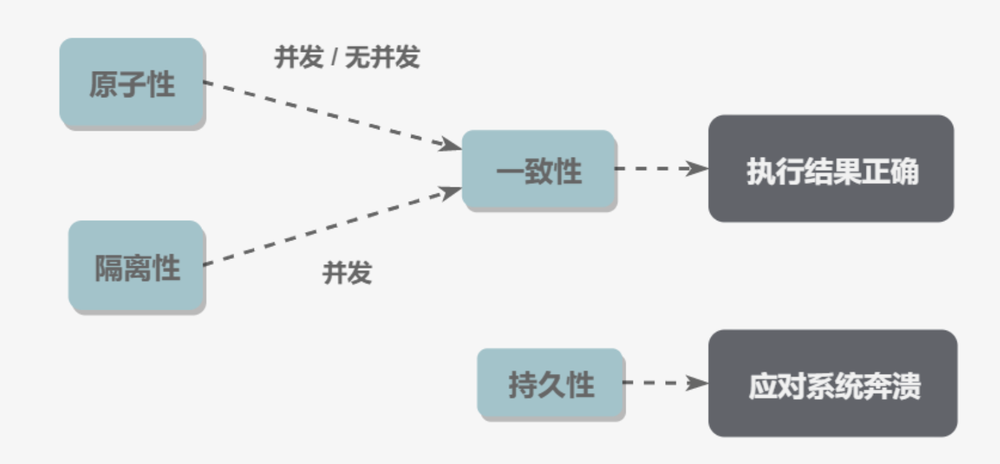
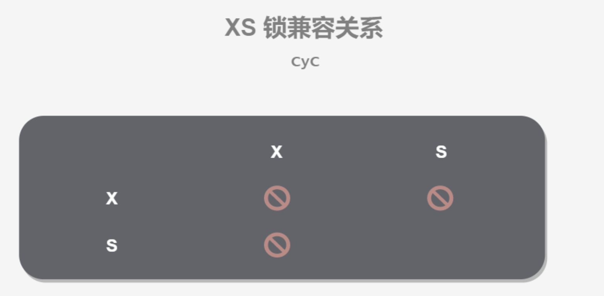
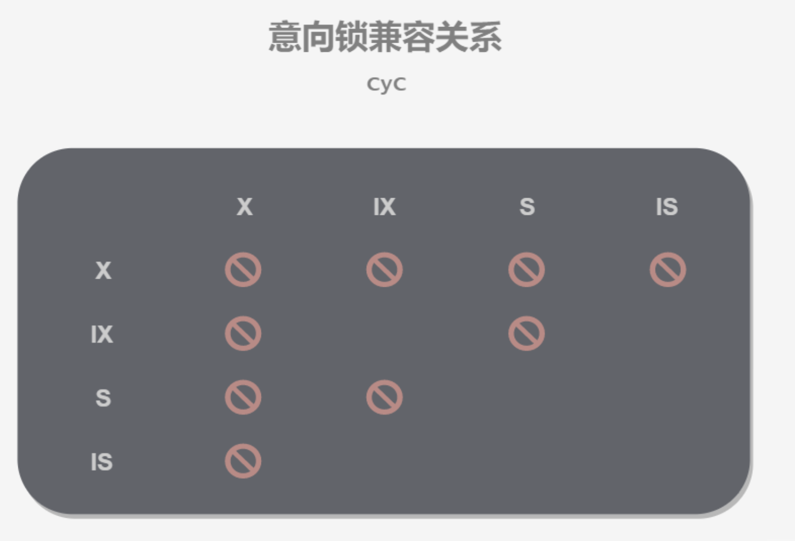
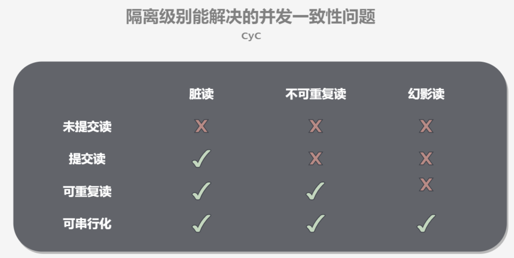
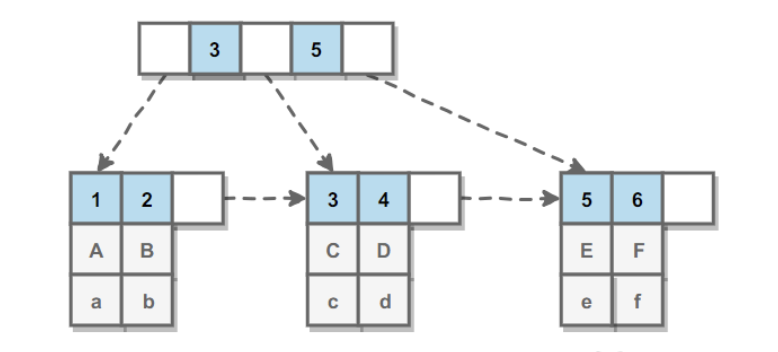

## DB  
- **事务**  
  - **概念**  
    事务指的是满足 ACID 特性的一组操作，可以通过 Commit 提交一个事务，也可以使用 Rollback 进行回滚  
  - **ACID**  
    - 原子性（Atomicity）  
      事务被视为不可分割的最小单元，事务的所有操作要么全部提交成功，要么全部失败回滚。回滚可以用回滚日志（Undo Log）来实现，回滚日志记录着事务所执行的修改操作，在回滚时反向执行这些修改操作即可  
    - 一致性（Consistency）  
      数据库在事务执行前后都保持一致性状态。在一致性状态下，所有事务对同一个数据的读取结果都是相同的  
    - 隔离性（Isolation）  
      一个事务所做的修改在最终提交以前，对其它事务是不可见的  
    - 持久性（Durability）  
      一旦事务提交，则其所做的修改将会永远保存到数据库中。即使系统发生崩溃，事务执行的结果也不能丢失。系统发生奔溃可以用重做日志（Redo Log）进行恢复，从而实现持久性。与回滚日志记录数据的逻辑修改不同，重做日志记录的是数据页的物理修改  
      
  - **AUTOCOMMIT**  
    MySQL 默认采用自动提交模式。也就是说，如果不显式使用START TRANSACTION语句来开始一个事务，那么每个查询操作都会被当做一个事务并自动提交  

- **并发一致性问题**  
  在并发环境下，事务的隔离性很难保证，因此会出现很多并发一致性问题  
  - **丢失修改**  
    丢失修改指一个事务的更新操作被另外一个事务的更新操作替换。一般在现实生活中常会遇到，例如：T1 和 T2 两个事务都对一个数据进行修改，T1 先修改并提交生效，T2 随后修改，T2 的修改覆盖了 T1 的修改  
  - **读脏数据**  
    读脏数据指在不同的事务下，当前事务可以读到另外事务未提交的数据。例如：T1 修改一个数据但未提交，T2 随后读取这个数据。如果 T1 撤销了这次修改，那么 T2 读取的数据是脏数据  
  - **不可重复读**  
    不可重复读指在一个事务内多次读取同一数据集合。在这一事务还未结束前，另一事务也访问了该同一数据集合并做了修改，由于第二个事务的修改，第一次事务的两次读取的数据可能不一致。例如：T2 读取一个数据，T1 对该数据做了修改。
    如果 T2 再次读取这个数据，此时读取的结果和第一次读取的结果不同  
  - **幻影读**  
    幻读本质上也属于不可重复读的情况，T1 读取某个范围的数据，T2 在这个范围内插入新的数据，T1 再次读取这个范围的数据，此时读取的结果和和第一次读取的结果不同  
  - 产生并发不一致性问题的主要原因是破坏了事务的隔离性，解决方法是通过并发控制来保证隔离性。并发控制可以通过封锁来实现，但是封锁操作需要用户自己控制，相当复杂。数据库管理系统提供了事务的隔离级别，让用户以一种更轻松的方式处理并发一致性问题  

- **封锁**  
  - **封锁粒度**  
    MySQL 中提供了两种封锁粒度：行级锁以及表级锁  
    应该尽量只锁定需要修改的那部分数据，而不是所有的资源。锁定的数据量越少，发生锁争用的可能就越小，系统的并发程度就越高。
    但是加锁需要消耗资源，锁的各种操作（包括获取锁、释放锁、以及检查锁状态）都会增加系统开销。因此封锁粒度越小，系统开销就越大。
    在选择封锁粒度时，需要在锁开销和并发程度之间做一个权衡  
  - **封锁类型**  
    - **读写锁(行级)**  
      - 互斥锁（Exclusive），简写为 X 锁，又称写锁  
      - 共享锁（Shared），简写为 S 锁，又称读锁  
      - 一个事务对数据对象 A 加了 X 锁，就可以对 A 进行读取和更新。加锁期间其它事务不能对 A 加任何锁  
      - 一个事务对数据对象 A 加了 S 锁，可以对 A 进行读取操作，但是不能进行更新操作。加锁期间其它事务能对 A 加 S 锁，但是不能加 X 锁  
      
    - **意向锁(表级)**  
      使用意向锁（Intention Locks）可以更容易地支持多粒度封锁  
      在存在行级锁和表级锁的情况下，事务 T 想要对表 A 加 X 锁，就需要先检测是否有其它事务对表 A 或者表 A 中的任意一行加了锁，那么就需要对表 A 的每一行都检测一次，这是非常耗时的。
      意向锁在原来的 X/S 锁之上引入了 IX/IS，IX/IS 都是表锁，用来表示一个事务想要在表中的某个数据行上加 X 锁或 S 锁。有以下两个规定：  
      - 一个事务在获得某个数据行对象的 S 锁之前，必须先获得表的 IS 锁或者更强的锁  
      - 一个事务在获得某个数据行对象的 X 锁之前，必须先获得表的 IX 锁  
      通过引入意向锁，事务 T 想要对表 A 加 X 锁，只需要先检测是否有其它事务对表 A 加了 X/IX/S/IS 锁，如果加了就表示有其它事务正在使用这个表或者表中某一行的锁，因此事务 T 加 X 锁失败  
        
      解释如下：  
      任意 IS/IX 锁之间都是兼容的，因为它们只表示想要对表加锁，而不是真正加锁；
      这里兼容关系针对的是表级锁，而表级的 IX 锁和行级的 X 锁兼容，两个事务可以对两个数据行加 X 锁。
      （事务 T1 想要对数据行 R1 加 X 锁，事务 T2 想要对同一个表的数据行 R2 加 X 锁，两个事务都需要对该表加 IX 锁，但是 IX 锁是兼容的，并且 IX 锁与行级的 X 锁也是兼容的，因此两个事务都能加锁成功，对同一个表中的两个数据行做修改。）  
  - **封锁协议**  
    - **三级封锁协议**  
      - 一级封锁协议  
        事务 T 要修改数据 A 时必须加 X 锁，直到 T 结束才释放锁。可以解决`丢失修改问题`，因为不能同时有两个事务对同一个数据进行修改，那么事务的修改就不会被覆盖  
      - 二级封锁协议  
        在一级的基础上，要求读取数据 A 时必须加 S 锁，读取完马上释放 S 锁。可以解决`读脏数据问题`，因为如果一个事务在对数据 A 进行修改，根据 1 级封锁协议，会加 X 锁，那么就不能再加 S 锁了，也就是不会读入数据  
      - 三级封锁协议  
        在二级基础上，要求读取数据 A 时必须加 S 锁，直到事务结束了才能释放 S 锁。可以解决`不可重复读的问题`，因为读 A 时，其它事务不能对 A 加 X 锁，从而避免了在读的期间数据发生改变  
    - **两段锁协议**  
      加锁和解锁分为两个阶段进行。可串行化调度是指，通过并发控制，使得并发执行的事务结果与某个串行执行的事务结果相同。串行执行的事务互不干扰，不会出现并发一致性问题。  
  - **MySQL 隐式与显示锁定**  
    MySQL 的 InnoDB 存储引擎采用两段锁协议，会根据隔离级别在需要的时候自动加锁，并且所有的锁都是在同一时刻被释放，这被称为隐式锁定  

- **隔离级别**  
  - **未提交读（READ UNCOMMITTED）**  
    事务中的修改，即使没有提交，对其它事务也是可见的  
  - **提交读（READ COMMITTED）**  
    一个事务只能读取已经提交的事务所做的修改。换句话说，一个事务所做的修改在提交之前对其它事务是不可见的  
  - **可重复读（REPEATABLE READ）**  
    保证在同一个事务中多次读取同一数据的结果是一样的  
  - **可串行化（SERIALIZABLE）**  
    强制事务串行执行，这样多个事务互不干扰，不会出现并发一致性问题。该隔离级别需要加锁实现，因为要使用加锁机制保证同一时间只有一个事务执行，也就是保证事务串行执行  
    

- **索引**  
  - **B+ Tree原理**  
    - 数据结构  
      B Tree 指的是 Balance Tree，也就是平衡树。平衡树是一颗查找树，并且所有叶子节点位于同一层。
      B+ Tree 是基于 B Tree 和叶子节点顺序访问指针进行实现，它具有 B Tree 的平衡性，并且通过顺序访问指针来提高区间查询的性能。
      在 B+ Tree 中，一个节点中的 key 从左到右非递减排列，如果某个指针的左右相邻 key 分别是 keyi 和 keyi+1，且不为 null，则该指针指向节点的所有 key 大于等于 keyi 且小于等于 keyi+1  
    - 操作  
      进行查找操作时，首先在根节点进行二分查找，找到一个 key 所在的指针，然后递归地在指针所指向的节点进行查找。直到查找到叶子节点，然后在叶子节点上进行二分查找，找出 key 所对应的 data。
      插入删除操作会破坏平衡树的平衡性，因此在进行插入删除操作之后，需要对树进行分裂、合并、旋转等操作来维护平衡性  
    - 与红黑树的比较  
      红黑树等平衡树也可以用来实现索引，但是文件系统及数据库系统普遍采用 B+ Tree 作为索引结构，这是因为使用 B+ 树访问磁盘数据有更高的性能  
      - B+ 树有更低的树高，平衡树的树高 O(h)=O(logdN)，其中 d 为每个节点的出度。红黑树的出度为 2，而 B+ Tree 的出度一般都非常大，所以红黑树的树高 h 很明显比 B+ Tree 大非常多。
      - 磁盘访问原理，操作系统一般将内存和磁盘分割成固定大小的块，每一块称为一页，内存与磁盘以页为单位交换数据。数据库系统将索引的一个节点的大小设置为页的大小，使得一次 I/O 就能完全载入一个节点。
        如果数据不在同一个磁盘块上，那么通常需要移动制动手臂进行寻道，而制动手臂因为其物理结构导致了移动效率低下，从而增加磁盘数据读取时间。B+ 树相对于红黑树有更低的树高，**进行寻道的次数与树高成正比**，
        在同一个磁盘块上进行访问只需要很短的磁盘旋转时间，所以 B+ 树更适合磁盘数据的读取。
      - 磁盘预读特性，为了减少磁盘 I/O 操作，磁盘往往不是严格按需读取，而是每次都会预读。预读过程中，磁盘进行顺序读取，顺序读取不需要进行磁盘寻道，并且只需要很短的磁盘旋转时间，速度会非常快。并且可以利用预读特性，相邻的节点也能够被预先载入  
  - **MySQL索引**  
    索引是在存储引擎层实现的，而不是在服务器层实现的，所以不同存储引擎具有不同的索引类型和实现  
    - **B+ Tree索引**  
      是大多数 MySQL 存储引擎的默认索引类型。  
      因为不再需要进行全表扫描，只需要对树进行搜索即可，所以查找速度快很多。
      因为 B+ Tree 的有序性，所以除了用于查找，还可以用于排序和分组。
      可以指定多个列作为索引列，多个索引列共同组成键。
      适用于全键值、键值范围和键前缀查找，其中键前缀查找只适用于最左前缀查找。如果不是按照索引列的顺序进行查找，则无法使用索引。
      InnoDB 的 B+Tree 索引分为`主索引`和`辅助索引`。  
      主索引的叶子节点 data 域记录着完整的数据记录，这种索引方式被称为`聚簇索引`。因为无法把数据行存放在两个不同的地方，所以一个表只能有一个聚簇索引  
        
      辅助索引的叶子节点的 data 域记录着主键的值，因此在使用辅助索引进行查找时，需要先查找到主键值，然后再到主索引中进行查找  
        
    - **哈希索引**    
      哈希索引能以 O(1) 时间进行查找，但是失去了有序性：
      - 无法用于排序与分组；  
      - 只支持精确查找，无法用于部分查找和范围查找  
      InnoDB 存储引擎有一个特殊的功能叫“自适应哈希索引”，当某个索引值被使用的非常频繁时，会在 B+Tree 索引之上再创建一个哈希索引，这样就让 B+Tree 索引具有哈希索引的一些优点，比如快速的哈希查找  
    - **全文索引**  
      MyISAM 存储引擎支持全文索引，用于查找文本中的关键词，而不是直接比较是否相等。
      查找条件使用 MATCH AGAINST，而不是普通的 WHERE。
      全文索引使用倒排索引实现，它记录着关键词到其所在文档的映射。
      InnoDB 存储引擎在 MySQL 5.6.4 版本中也开始支持全文索引  
    - **空间数据索引**    
      MyISAM 存储引擎支持空间数据索引（R-Tree），可以用于地理数据存储。空间数据索引会从所有维度来索引数据，可以有效地使用任意维度来进行组合查询。必须使用 GIS 相关的函数来维护数据  
  - **索引优化**  
    - **独立的列**  
      在进行查询时，索引列不能是表达式的一部分，也不能是函数的参数，否则无法使用索引  
      例如下面的查询不能使用 actor_id 列的索引  
      ```sql
      SELECT actor_id FROM sakila.actor WHERE actor_id + 1 = 5
      ```
    - **多列索引**    
      在需要使用多个列作为条件进行查询时，使用多列索引比使用多个单列索引性能更好。例如下面的语句中，最好把 actor_id 和 film_id 设置为多列索引  
      ```sql
      SELECT film_id, actor_ id FROM sakila.film_actor
      WHERE actor_id = 1 AND film_id = 1;
      ```
    - **索引列的顺序**  
      让选择性最强的索引列放在前面。  
      索引的选择性是指：不重复的索引值和记录总数的比值。最大值为 1，此时每个记录都有唯一的索引与其对应。选择性越高，每个记录的区分度越高，查询效率也越高。  
      例如下面显示的结果中 customer_id 的选择性比 staff_id 更高，因此最好把 customer_id 列放在多列索引的前面  
      ```sql
      SELECT COUNT(DISTINCT staff_id)/COUNT(*) AS staff_id_selectivity,
      COUNT(DISTINCT customer_id)/COUNT(*) AS customer_id_selectivity,
      COUNT(*)
      FROM payment;
      ```
    - **前缀索引**  
      对于 BLOB、TEXT 和 VARCHAR 类型的列，必须使用前缀索引，只索引开始的部分字符。前缀长度的选取需要根据索引选择性来确定  
    - **覆盖索引**  
      索引包含所有需要查询的字段的值，具有以下优点  
      - 索引通常远小于数据行的大小，只读取索引能大大减少数据访问量。  
      - 一些存储引擎（例如 MyISAM）在内存中只缓存索引，而数据依赖于操作系统来缓存。因此，只访问索引可以不使用系统调用（通常比较费时）。  
      - 对于 InnoDB 引擎，若辅助索引能够覆盖查询，则无需访问主索引  
  - **索引的优点**  
    - 大大减少了服务器需要扫描的数据行数  
    - 帮助服务器避免进行排序和分组，以及避免创建临时表（B+Tree 索引是有序的，可以用于 ORDER BY 和 GROUP BY 操作。临时表主要是在排序和分组过程中创建，不需要排序和分组，也就不需要创建临时表）  
    - 将随机 I/O 变为顺序 I/O（B+Tree 索引是有序的，会将相邻的数据都存储在一起）  
  - **索引使用条件**  
    - 对于非常小的表、大部分情况下简单的全表扫描比建立索引更高效  
    - 对于中到大型的表，索引就非常有效  
    - 但是对于特大型的表，建立和维护索引的代价将会随之增长。这种情况下，需要用到一种技术可以直接区分出需要查询的一组数据，而不是一条记录一条记录地匹配，例如可以使用分区技术  

- **查询性能优化**  
  - **使用Explain分析**  
    Explain 用来分析 SELECT 查询语句，开发人员可以通过分析 Explain 结果来优化查询语句。  
    比较重要的字段有：
    - select_type : 查询类型，有简单查询、联合查询、子查询等  
    - key : 使用的索引  
    - rows : 扫描的行数  

