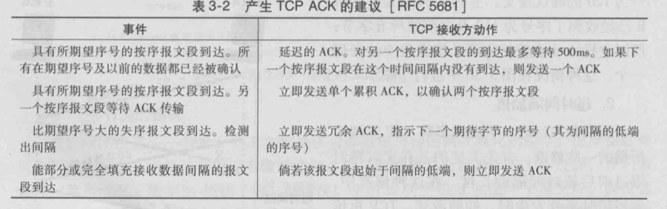
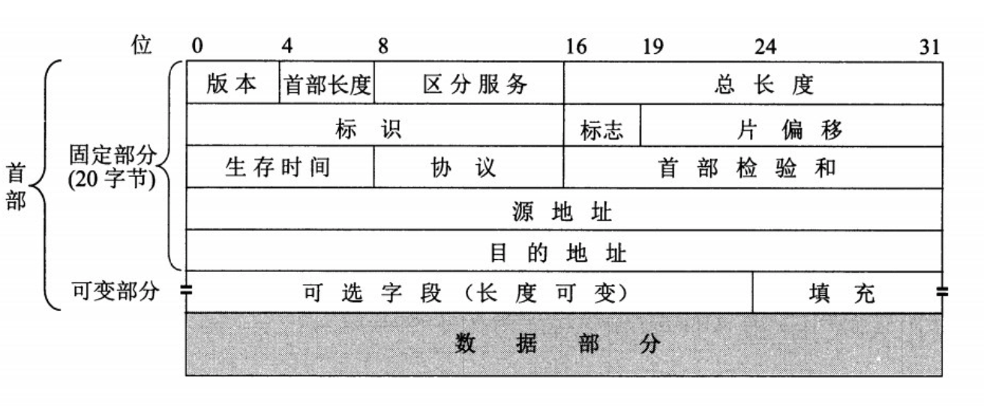
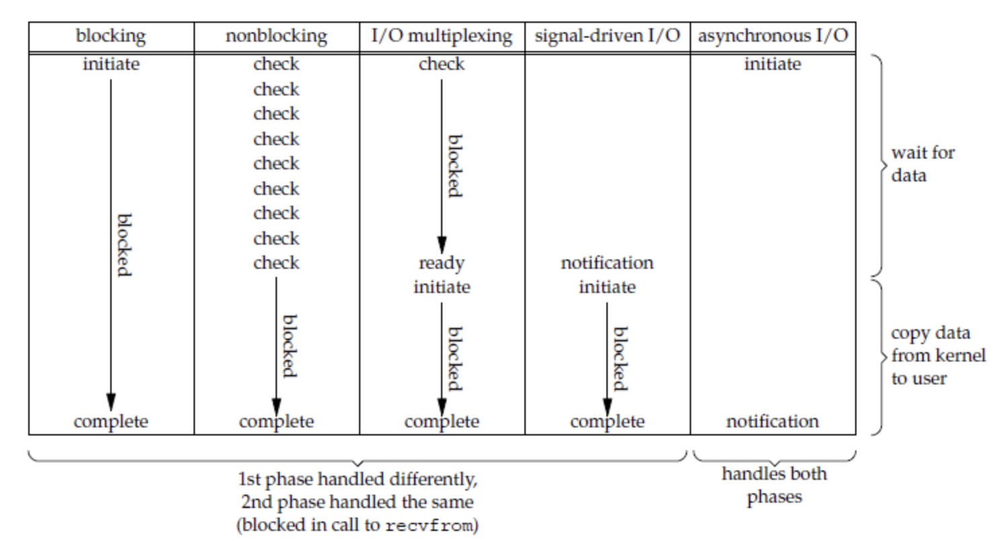

# **NETWORK**  
## **网络结构分层**  
 ***OSI 7层：*** 应用层，会话层，表示层，传输层，网络层，数据链路层，物理层  
 ***TCP/IP 4层:***  应用层，传输层，网络层，网络接口层  
 ***综合 5层：*** 应用层，传输层，网络层，数据链路层，物理层  
### ***应用层***   
 通过应用进程之间的交互完成特定网络应用，该层协议定义应用进程之间的通信和交互规则
 常用协议有：**域名系统`DNS`**, **支持网络的`HTTP`**, **支持电子邮件的`SMTP`**等   
 
 - ***域名解析系统DNS：***`DNS`被设计为一个联机分布式数据库系统，并采用客户服务器方式。`DNS`使大多数名字都在本地进行解析，  
 仅少量解析需要在互联网上通信，因此`DNS`的效率很高。由于`DNS`是分布式系统，即使单个计算机出现了故障也不会妨碍到整个`DNS系统`的正常运行。  
  - 解析过程：主机向本地域名服务器的查询一般都采用递归查询，递归查询指如果主机所询问的本地域名服务器不知道被查询域名的`IP地址`，  
  那么本地域名服务器就以`DNS客户`的身份向其他根域名服务器继续发出查询请求报文。递归查询额结果是要查询的`IP地址`，或者是报错，表示无法查询到所需的`IP地址`。  
  本地域名服务器向根域名服务器查询通常采用迭代查询，迭代查询指当根域名服务器收到本地域名服务器发出的迭代查询请求报文时，要么给出所要查询的`IP地址`，要么告诉它该向哪一个域名服务器进行查询。本地域名服务器也可以采用递归查询，这取决于最初的查询请求报文设置的查询方式。  
  - **e.g. (www.amazon.com)：**客户首先跟`根服务器`联系，它将返回`顶级域名`com的TLD(Top-Level Domain)服务器的IP地址，客户则与这些TLD服务器之一联系，它将为amazon.com返回`权威服务器`的IP地址。最后，该客户与amazon.com权威服务器之一联系，它为主机名`www.amazon.com`返回`IP地址`。
 - ***文件传送协议FTP：*** `FTP` 使用`TCP可靠的运输服务`，`FTP`使用客户服务器方式，一个`FTP服务器进程`可以同时为多个客户进程提供服务，
 在进行文件传输时，`FTP`的客户和服务器之间要建立两个并行的`TCP连接`：控制连接和数据连接，实际用于传输文件的是数据连接。  
 - ***超文本传输协议HTTP：***`HTTP`是超文本传输协议，规范了浏览器如何向万维网服务器请求万维网文档，服务器如何向浏览器发送万维网文档。  
   从层次的角度看，`HTTP`是面向事务的应用层协议，是浏览器和服务器之间的传送数据文件的重要基础。  
   **特点：**HTTP是无状态的，之所以说无状态是因为`HTTP`对事务没有记忆性。同一个客户第二次访问同一个服务器，服务器的响应结果和第一次是一样的。  
    `HTTP`的无状态简化了服务器的设计，允许服务器支持高并发的`HTTP`请求。如果要解决无状态的问题，可以使用`cookie`和`session`。  
    `Cookie`相当于服务器给浏览器的一个通行证，是一个唯一识别码，服务器发送的响应报文包含`Set-Cookie`首部字段，客户端得到响应报文后把`Cookie`内容保存到浏览器中。客户端之后对同一个服务器发送请求时，会从浏览器中取出`Cookie信息`并通过`Cookie请求首部字段`发送给服务器，
    服务器就可以识别是否是同一个客户。`Session`是服务器的会话技术，是存储在服务器的  
   **区别：**   
    ①`Cookie`只能存储`ASCII码字符串`，而`Session`则可以存储任何类型的数据，因此在考虑数据复杂性时首选`Session`  
    ②`Cookie`存储在浏览器中，容易被恶意查看。如果非要将一些隐私数据存在`Cookie`中，可以将`Cookie值`进行加密，然后在服务器进行解密  
    ③对于大型网站，如果用户所有的信息都存储在`Session`中，那么开销是非常大的，因此不建议将所有的用户信息都存储到`Session`中  

   **结构：**`HTTP报文`分为`HTTP请求报文`和`响应报文`，`请求报文`由请求行（请求方法，请求资源的URL和HTTP的版本）、首部行和实体（通常不用）组成
  `响应报文`由状态行（状态码，短语和HTTP版本）、首部行和实体（有些不用）组成  
  `HTTP请求头`有`Accept`, `Accept-Charset`,`Accept- Encoding`,`Accept-Language`,`Authorization`,`From`,`Host`,`If-Modified-Since`,`If-Match`,`If-None-Match`,`If-Range`,`If-Range`,`If-Unmodified-Since`,`Max-Forwards`,`Proxy-Authorization`,`Range`,`Referer`,`User-Agent`. 比较典型的几个`Accept`告诉WEB服务器自己接受什么介质类型，`User-Agent`
  浏览器表明自己的身份，`Host`客户端指定自己想访问的WEB服务器的域名/IP：PORT，`Accept-Language`浏览器表明自己接收的语言, `Accept-Charset`浏览器接收的字符集，`Accept-Encoding`浏览器接收的编码方式  
  `HTTP响应头`有`Age`,`Location`,`Proxy-Authenticate`,`Public`,`Retry- After`,`Server`,`Vary`,`Warning`,`WWW-Authenticate`
  `AGE`当代理服务器用自己的缓存请求实体去响应请求时，表示实体从产生到现在的时间，`Server`WEB服务器表明自己的软件和版本信息  
 - **http连接中状态码有哪些，如果出现某些错误的状态码，分析出是什么情况吗**  
    - 1XX（信息）: 100 continue 请求正常，客户端可以继续发送请求  
    - 2XX（成功）: 200 OK / 204 No Content 请求处理成功，但是返回的响应报文无实体的主体部分 / 206 Partial Content 客户端进行了范围请求，响应报文包含由Content-Range指定范围的实体内容  
    - 3XX（重定向）: 301 Moved Premanently 永久重定向 / 302 Found 临时重定向 / 303 See Other 与302功能相同，但303明确要求客户端应采取Get方法获取资源 / 304 Not Modified 若请求报文首部包含一些条件，If-Match，If-Modified-Since等，条件不满足时，返回304 / 307 Remporary Redirect 临时重定向，与302类似，但307要求浏览器不会把重定向请求的 POST 方法改成 GET 方法  
    - 4XX（客户端错误）: 400 Bad Request 请求报文中存在语法错误 / 401 Unauthorized 状态码表示发送的请求需要有认证信息（BASIC 认证、DIGEST 认证）。如果之前已进行过一次请求，则表示用户认证失败 / 403 Forbidden 请求被拒绝 / 404 Not Found 资源未找到  
    - 5XX（服务器错误）: 500 Internal Server Error 服务器正在执行请求时发生错误 / 503 Service unavailable 服务器暂时处于超负载或正在进行停机维护，现在无法处理请求
 - **GET 和 POST**  
    *GET：*主要用于获取资源，用于访问被URI同意资源标识符识别的资源  
    *POST：*主要用于传递信息给服务器  
    *REST角度：*从REST服务角度上说，GET是幂等的，即读取同一个资源，总是得到相同的数据，而POST不是幂等的，因为每次请求对资源的改变并不是相同的；进一步地，GET不会改变服务器上的资源，而POST会对服务器资源进行改变  
    *参数：*从请求参数形式上看，`GET请求`的数据会附在URL之后，即将请求数据放置在HTTP报文的 请求头中，以`?`分割`URL`和传输数据，参数之间以`&`相连。特别地，如果数据是英文字母/数字，原样发送；否则，会将其编码为 `application/x-www-form-urlencoded MIME `字符串(如果是`空格`，转换为`+`，如果是中文/其他字符，则直接把字符串用`BASE64`加密，得出如：%E4%BD%A0%E5%A5%BD，其中％XX中的XX为该符号以16进制表示的ASCII)；而`POST请求`会把提交的数据则放置在是HTTP请求报文的请求体中。不能因为 POST 参数存储在实体主体中就认为它的安全性更高，因为照样可以通过一些抓包工具查看  
    *安全性：*安全的HTTP方法不会改变服务器状态，也就是说它只是可读的。GET方法是安全的，而POST却不是，因为 POST 的目的是传送实体主体内容，
    这个内容可能是用户上传的表单数据，上传成功之后，服务器可能把这个数据存储到数据库中，因此状态也就发生了改变  
    *发送数据：*XMLHttpRequest是一个 API，在Ajax中大量使用。它为客户端提供了在客户端和服务器之间传输数据的功能，
    它提供了一个通过URL 来获取数据的简单方式，并且不会使整个页面刷新。这使得网页只更新一部分页面而不会打扰到用户。
    使用XMLHttpRequest时，GET请求发送一个TCP数据包，浏览器同时发送HTTP header和data，服务器响应状态码200。POST每次发送两个TCP数据包，
    浏览器先发送HTTP header，服务器收到后返回100（continue），浏览器再继续发送data，服务器响应200  
    PUT 上传文件 DELETE 删除文件 OPTIONS 查看当前URL支持的HTTP方法 HEAD 获取首部  
    RESTFUL  
 - **输入一个网址流程**  
  ①先检查输入的URL是否合法，然后查询浏览器的缓存，如果有则直接显示  
  ②通过DNS域名解析服务解析IP地址，先从浏览器缓存查询、然后是操作系统和hosts文件的缓存，如果没有查询本地服务器的缓存  
  ③根据IP和PORT，通过TCP的三次握手机制建立连接，建立连接后向服务器发送HTTP请求（如果是HTTPS，还需建立TLS连接）请求数据包  
  ④服务器收到浏览器的请求后，进行处理并响应（重定向（301，302）/有缓存（304））  
  ⑤浏览器收到服务器数据后，如果可以就存入缓存  
  ⑥浏览器发送请求内嵌在HTML中的资源，例如css、js、图片和视频等，如果是未知类型会弹出对话框  
  ⑦浏览器渲染页面并呈现给用户  
 - **HTTP2.0和HTTP1.1的区别，HTTP2.0的原理**  
 `HTTP1.0`使用的是非持续连接，每次请求文档就有2倍的RTT开销，另外客户和服务器每一次建立新的`TCP`连接都要分配缓存和变量，  
 这种非持续连接会给服务器造成很大的压力  
 `HTTP1.1`使用的是持续连接，服务器会在发送响应后在一段时间内继续保持这条连接，  
 使同一个浏览器和服务器可以继续在这条连接上传输后续的`HTTP请求和响应报文`。`HTTP1.1`的持续连接有两种工作方式，非流水线和流水线方式  
 非流水线方式就是客户在收到前一个响应后才能发送下一个请求，流水线方式是客户收到响应前就能连着发送新的请求  
 `HTTP2.0` 特点是在不改动HTTP语义、方法、状态码、URI及首部字段的情况下，大幅度提高了web性能，基于`SPDY协议`，  
 是speed的谐音，Google开发基于`TCP协议`的应用层协议，目标是优化`HTTP性能`，通过压缩，多路复用和优先级，缩短网页加载时间并提高安全性，
 核心思想是尽量减少`TCP连接数`，对`HTTP协议`的增强  
 `HTTP1.x`缺点：  
    - HTTP/1.0一次只允许在一个TCP连接上发起一个请求，HTTP/1.1使用的流水线技术也只能部分处理请求并发，仍然会存在队列头阻塞问题,  
    因此客户端在需要发起多次请求时，通常会采用建立多连接来减少延迟。
    - 单向请求，只能由客户端发起  
    - 请求报文与响应报文首部信息冗余量大  
    - 数据未压缩，导致数据的传输量大    

   `HTTP2.0`改进  
      - 所有加强性能的核心是`二进制传输`. `HTTP1.x`都是通过文本的方式传输数据，`HTTP2.0`引入新的编码机制，所有传输的数据会被分割，  
      并采用二进制格式编码，为了保证HTTP不受影响则需要在应用层`HTTP2.0`和传输层`TCP/UDP`之间增加二进制分帧层，在该层会将传输的信息分为更小  
      的消息和帧，并采用二进制格式编码，其中`HTTP1.x`的首部信息会被封装到`Header帧`，而`RequestBody`则封装到`Data帧`  
      - `HTTP2.0`中`帧（frame）`：最小数据单位，每个帧会标识其属于哪个流和`流（stream)`：多个帧组成的数据流很重要。多路复用，即在一个`TCP连接`中存在多个`流`，即可以同时发送多个请求，对端可以通过帧中的标识知道该帧属于哪个请求。在客户端这些帧乱序发送，到对端再根据每个帧首部的流标识副重新  
      组装。借此，可以避免`HTTP1.x`的队头阻塞问题，提高传输性能  
      - `Header压缩`，在`HTTP1.x中`，`Header`以文本形式传输，若其中有`Cookie`，每次开销很大， `Http2.0`中，使用了`HPACK（头部压缩算法`对`header`进行编码，  
      减少了其大小。并在两端维护索引表，用于记录出现过的Header，方便后续查找使用  
 `QUIC`是Google基于`UDP`实现的同为传输层的协议，目标是希望替代`TCP`。该协议支持多路复用，且实现了自己的加密协议，也支持重传和纠错机制（丢一个包用纠错，  
 多个就要重传，算不出来）  
 - **SMTP & HTTP**  
  *相同点:*两个协议都用于从一台主机向另一台主机传送文件，都使用持续连接。  
  *区别点：*`HTTP`主要是一个`拉协议(pull protocol)`即在方便的时候拉取Web服务器上的信息，TCP连接是由接收文件的机器发起。SMTP主要是一个推协议，
  即发送邮件服务器把文件推向接收邮件服务器。特别是TCP连接是由发送该文件的机器发起的。第二个区别是，`SMTP`要求每个报文使用7比特的ASCII码格式，如果包含非7比特的ASCII字符或二进制数据，也要按照7比特ASCII进行编码，HTTP无此限制。第三个区别是如何处理一个既有文本又有图形的文档，HTTP把没个对象封装在自己的HTTP响应报文中，SMTP则把所有的报文对象放在一个报文中  
 - **POP3 & IMAP**  
  `POP3`是邮局协议的第3个版本，它将电子邮件从服务器上的邮箱传输到用户的本地计算机。POP3不允许用户在邮箱上组织邮件；用户无法在服务器上创建不同的文件夹。用户在下载之前无法部分检查电子邮件的内容。用户必须下载电子邮件才能在POP中阅读。IMAP协议：`IMAP（Internet邮件访问协议）`用于从邮件服务器的邮箱访问邮件。使用IMAP，用户可以在下载之前检查电子邮件标题。在下载电子邮件之前，用户也能够检查电子邮件的内容以查找特定字符串。如果带宽有限，使用IMAP，用户可以部分下载邮件。用户还可以在文件夹中创建这些邮箱的层次结构

 - **HTTPS**  
 `HTTP隐患：`使用明文通信，内容可能被监听，不验证对方身份，可能会被伪装通信方身份；无法证明报文完整性，可能被篡改  
 `HTTPS`让HTTP先和SSL通信，再由SSL和TCP通信，也就是说HTTPS使用了隧道进行通信。通过使用SSL，HTTPS具有了加密（防窃听）、认证（防伪装）、完整性保护（防篡改）  
 `HTTP`端口80， `HTTPS`端口443  
    - **流程**  
    加密算法主要有`对称加密`和`非对称加密`  
    对称加密的运算速度快，但安全性不高。非对称密钥加密，加密和解密使用不同的密钥。公开密钥所有人都可以获得，
    通信发送方获得接收方的公开密钥之后，就可以使用公开密钥进行加密，接收方收到通信内容后使用私有密钥解密。  
    非对称密钥除了用来加密还可以用来进行签名。因为私有密钥无法被其他人获取，因此通信发送方使用其私有密钥进行签名，通信接收方使用发送方的公开密钥对签名进行解密，
    就能判断这个签名是否正确。非对称加密的运算速度慢，但是更安全。  
    `HTTPS`采用混合的加密机制，使用`非对称密钥加密`用于*传输对称密钥来保证传输过程的安全性*，之后使用`对称密钥加密`进行*通信来保证通信过程的效率*。  
    浏览器和服务器建立`TCP连接`后，会发送一个证书请求，其中包含了自己可以实现的算法列表和一些必要信息，用于商议双方使用的加密算法。  
    服务器收到请求后会选择加密算法，然后返回证书，包含了服务器的信息，域名、申请证书的公司、加密的公钥以及加密的算法等。  
    浏览器收到之后，检查签发该证书的机构是否正确，该机构的公钥签名是否有效，如果有效就生成对称密钥，并利用公钥对其加密，然后发送给服务器。  
    服务器收到密钥后，利用自己的私钥解密。之后浏览器和服务器就可以基于对称加密对数据进行加密和通信。  
    - **认证**  
    通过使用 `证书` 来对通信方进行认证  
    数字证书认证机构（CA，Certificate Authority）是客户端与服务器双方都可信赖的第三方机构。
    服务器的运营人员向 CA 提出公开密钥的申请，CA 在判明提出申请者的身份之后，会对已申请的公开密钥做数字签名，然后分配这个已签名的公开密钥，并将该公开密钥放入公开密钥证书后绑定在一起。
    进行 HTTPS 通信时，服务器会把证书发送给客户端。客户端取得其中的公开密钥之后，先使用数字签名进行验证，如果验证通过，就可以开始通信了。  
    再具体的说，那么，其他人怎么确认你的证书是合法的呢。首先你的证书会在https握手过程中被传递到浏览器，浏览器从你的证书中找到了颁发者，从颁发者的证书（如果你电脑上有的话）又找到了CA的证书（CA证书会在操作系统安装时就安装好，所以每个人电脑上都有根证书），使用CA证书中带的公钥来对颁发者证书做验签，一旦匹配，说明你电脑上的颁发者证书不是伪造的，同理，再用颁发者证书中的公钥去验证你的证书，以此证明你的证书不是伪造的。这样整个链状的验证，从而确保你的证书一定是直接或间接从CA签发的，这样浏览器地址栏会显示一个绿色的盾牌，表示你的网站能通过证书验证  
    
### ***传输层***   
 负责向两台主机进程之间的通信提供通用的数据传输服务  
 常用的协议有：  
  - **传输控制协议`TCP`**，它提供面向连接的、可靠的数据传输服务，传输单位是`报文段(segment)`  
  - **用户数据报协议`UDP`**，它提供无连接的传输服务，传输单位是`用户数据报`  
- **TCP & UDP**  
  - ***用户数据报协议UDP：***  
    - UDP只在IP的数据报服务上增加了很少一点功能，就是复用和分用以及差错监测  
    其特点主要是：  
    - UDP是无连接的，发送数据前不需要建立连接；
    - UDP使用最大努力交付，不保证数据传输的可靠性；  
    - UDP是面向报文的，发送方UDP对应用程序交下来的报文在添加首部后就向下交付IP层；  
    - UDP没有拥塞控制；UDP支持一对一，一对多，多对一和多对多的交互通信；UDP首部开销小，只有8个字节，TCP需要20个字节  
    
  - ***传输控制协议TCP：***  
    其主要特点是：  
    - TCP是面向连接的运输层协议，即TCP在进行数据通信前需要建立连接，主要是通过三次握手机制实现，在进行数据通信后，需要断开连接，通过四次挥手机制实现  
    - 每条TCP连接只能有两个端点  
    - TCP提供可靠的交付服务，通过TCP发送的数据无差错，不丢失，不重复  
    - TCP是全双工通信，在发送端和接收端没有缓存，发送发将数据发送到缓存后，接收方将数据放入缓存，上层应用程序会在合适时机获取数据  
    - TCP是面向字节流的，所谓流就是流入进程或者进程重流出的字节序列。虽然应用进程和TCP交互是一次一个数据块，但是TCP会将数据块看成  
    一连串无结构的字节流，不能保证发送的数据块和接收的数据块大小一致，但是字节流是完全一样的  
    
    - **Q：如何保证可靠？**  
    TCP的发送的报文是交给IP层传送的，而IP只能提供尽最大努力服务，所以TCP必须采取适当的措施才能使得两个运输层之间的通信变得可靠。  
    理想的通信有两个条件，第一是传输的数据不会出现差错，第二是无论发生数据的速度有多快，接收端都来得及接收。但是在现实的网络环境下  
    几乎是不可能实现的，TCP使用了重传机制来解决传输数据出错的问题，使用流量控制来降低发送端的速度，以便接收端来的及接收（**数据包校验：**，使用checksum，是一个端到端的校验和，由发送端计算。1、首先将检验和置零；2、然后将`TCP伪首部部分`（伪首部共有12字节，包含如下信息：源IP地址、目的IP地址、保留字节(置0)、传输层协议号(TCP是6)、TCP报文长度(报头+数据)。伪首部是为了增加TCP校验和的检错能力：如检查TCP报文是否收错了(目的IP地址)、传输层协议是否选对了(传输层协议号)等。），`TCP首部部分`，`数据部分`都划分成16位的一个个16进制数；（如果总长度为奇数个字节，则在最后增添一个位都为0的字节）3、将这些数逐个相加，记得溢出的部分加到最低位上，这是`循环加法`；4、最后将得到的结果`取反`，则可以得到检验和位目的是检测数据在传输过程中的任何变化，若校验出包有错，则丢弃报文段并且不给出响应，这时TCP发送数据端超时后会重发数据；**对失序数据包重排序：**既然TCP报文段作为IP数据报来传输，而IP数据报的到达可能会失序，因此TCP报文段的到达也可能会失序。TCP将对失序数据进行重新排序，然后才交给应用层；**丢弃重复数据：**对于重复数据，能够丢弃重复数据；**应答机制：**当TCP收到发自TCP连接另一端的数据，它将发送一个确认。这个确认不是立即发送，通常将推迟几分之一秒；**超时重发：**当TCP发出一个段后，它启动一个定时器，等待目的端确认收到这个报文段。如果不能及时收到一个确认，将重发这个报文段；**流量控制：**TCP连接的每一方都有固定大小的缓冲空间。TCP的接收端只允许另一端发送接收端缓冲区所能接纳的数据，这可以防止较快主机致使较慢主机的缓冲区溢出，这就是流量控制。TCP使用的流量控制协议是可变大小的滑动窗口协议)
    - **停止等待协议**  
    每发送一个分组就停下来，等收到了对方对该分组的确认之后再继续发送下一个分组。每发送完一个分组就设置一个超时计时器，  
    如果在规定的时间内没有收到分组的确认消息，就会进行超时重传。在规定时间内收到了确认消息就会撤销计时器
    同时需要注意三点：  
    1.计时器设置的超时时间应该稍微长于分组的往返时间，如果时间太长通信效率就会很低，如果时间过短会产生不必要的重传，浪费网络资源  
    2.每一个分组都设有一个副本，以便超时重传时使用，当收到了分组的确认后再进行清除  
    3.分组和确认分组都必须进行编号，这样才能明确是哪一个分组收到了确认  
    - **ARQ协议/重传机制**  
    假设分组的包确认丢失了，发送方在设定的超时时间内没有收到确认，不知道是自己发送的分组丢失还是接收方的确认丢失，  
    因此发送方需要重传分组。当接收方收到了分组后就丢失这个分组，重新发送确认  
    还有一种情况是分组没有丢失但是晚到了，发送端会受到重复确认，接收端仍然会收到重复的分组，同样丢弃并确认  
    上述确认和重传机制，即`ARQ(Automatic Repeat reQuest)`，自动重传请求，接收端不需要向发送端发送重传请求，当超过指定时间时发送端会自动进行超时重传  
    - **效率问题**  
    停止等待协议的优点是简单，缺点是信道利用率太低。信道利用率为TD/(TD+RTT+TA)，TD是发送分组的时间，T2是发送确认分组的时间，RTT是往返时间，  
    当RTT远大于TD时通信效率就会非常低。为了提高传输效率，可以采用流水线传输，例如连续ARQ协议和滑动窗口机制  
    - **连续ARQ**  
    连续ARQ规定每收到一个确认就把发送窗口向前滑动一个分组的位置，接收方一般采用累积确认的方式，就是说接收方不必对收到的分组逐个确认，  
    只需要对按序到达的最后一个分组进行确认。优点是实现容易，即使确认丢失也不必重传，缺点是不能向发送方反映出接收方已经正确收到的所有分组的消息。  
    例如发送方发送了5个分组，第3个分组丢失了，接收方只能确认前2个，发送方必须把后面3个都重新发送
    - **滑动窗口机制**  
    滑动窗口以字节为单位。发送端有一个发送窗口，窗口中的序号是允许发送的序号，窗口的后沿是已经发送并且确认的序号，窗口的前沿是不允许发送的序号。  
    窗口的后沿可能不动（代表没有收到新的确认），也有可能前移（代表收到了新的确认），但是不会后移（不可能撤销已经确认的数据）。  
    窗口的前沿一般是向前的，也有可能不动（表示没有收到新的请求或对方的接收窗口变小），也有可能收缩，但是TCP强烈不建议这么做，  
    因为发送端在收到通知前可能已经发送了很多数据，此时如果收缩窗口可能会产生错误
    - **tcp 三次握手 四次挥手**  
    TCP是全双工通信，任何一方都可以发起建立连接的请求，假设A是客户端，B是服务器。  
    初始时A和B均处于CLOSED状态，B会创建传输进程控制块TCB，然后处于LISTEND状态，监听端口是否收到了TCP请求以便及时响应。  
    当A要发生数据时，就向B发送一个连接请求报文，TCP规定连接请求报文的SYN=1，ACK=0，SYN表示synchronization，ACK表示acknowledgement，SYN不可以携带数据，  
    但要消耗一个序号，此时A发送的序号seq假设为x。发送完之后，A就进入了SYN-SENT同步已发送状态。  
    当B收到了A的连接请求报文后，如果B同意建立连接，会发送给A一个确认连接请求报文，其中SYN=1，ACK=1，ack=x+1，seq=y，ack的值为A发送的序号加1，ACK可以携带数据，  
    如果不携带的话，则不消耗序号。发送完之后，B进入SYN-RCVD同步已接收状态。  
    当A收到了B的确认连接请求报文后，还要对该确认再进行一次确认，报文的ACK=1，ack=y+1，seq=x+1，发送之后A处于established状态，当B接收到该报文后也进入established状态。  
    *之所以要进行三次握手*，是因为第二次握手时A知道了自己的发送和接收是没有问题的，而第三次握手时B才能知道自己的发送和接收也都是没有问题的。  
    同时三次握手防止了已失效的连接请求问题，假设这样一种正常情况，A发送的第一个连接请求报文丢失了，之后超时重传，建立了连接，通信之后释放了连接。  
    但假设A第一个发送的连接请求报文并没有丢失，而是在网络中某结点停滞了，之后又到达了B。如果是两次握手，此时B会以为是A请求建立连接，  
    同意之后并不会收到任何数据，因为A已经关闭了，此时B的资源就会被白白浪费。  
    *四次挥手*，当A已经没有要发送的数据了，决定释放连接，就会发送一个终止连接报文，其中FIN=1，seq=u，u的值为之前A发送的最后一个序号+1。此时A进入FIN-WAIT-1状态。  
    B收到该报文后，发送给A一个确认报文，ACK=1，ack=u+1，seq=v，v的值为B之前发送的最后一个序号+1。此时A进入了FIN-WAIT-2状态，但B进入了CLOSE-WAIT状态，  
    但连接并未完全释放，B会通知高层的应用层结束A到B这一方向的连接，此时TCP处于半关闭状态。  
    当B发送完数据后，准备释放连接时就向A发送连接终止报文，FIN=1，同时还要重发ACK=1，ack=u+1，seq=w（在半关闭状态B可能又发送了一些数据）。此时B进入LAST-ACK状态。  
    A收到连接终止报文后还要再进行一次确认，确认报文中ACK=1，ack=w+1，seq=u+1。发送完之后进入TIME-WAIT状态，等待2MSL之后进入CLOSED状态，B收到该确认后也进入CLOSED状态。
    MSL是最大报文段寿命，之所以要等待2MSL是为了保证A发送的最后一个ACK报文能被B接收，如果A发送的确认报文丢失，B没有收到就会超时重传之前的FIN+ACK报文，  
    而如果A在发送了确认报文之后就立即释放连接就无法收到B超时重传的报文，因而也不会再一次发送确认报文段，B就无法正常进入CLOSED状态。  
    第二点原因是2MSL时间之后，本连接中的所有报文就都会从网络中消失，防止出现三次握手中的已失效的请求报文问题，影响下一次的TCP连接。  
    - 之所以不是三次挥手是因为服务器TCP是全双工的，当A发送完数据之后可能B还没有发送完，当B发送完所有的数据之后才会关闭B到A方向的连接。  
    除此之外，TCP还设有一个保活计时器，用于解决服务器故障的问题，服务器每收到一次客户的数据就重新设置保活计时器，时间为2小时。  
    如果2小时内没有收到就间隔75秒发送一次探测报文，连续10次都没有响应后就关闭连接。
    - 如果只是客户端调用close，而服务器没有调用close，服务器这个端口就会一直处于close_wait状态，并且不会自动消除，而客户端会处于fin-wait-2状态，注意：close_wait状态不会超时消除，会一直占用资源，积累越多就会内核崩溃，fin-wait-2状态则在一些操作系统下可以自动超时关闭，这样就可以自动释放了，windows和linux都可以设置  
    - 如果客户端主动close，但是服务端崩溃了，连ack也没有发出来，那么客户端就是fin-wait-1状态，这个状态会超时自动关闭的  
    - 服务器：发出FIN,客户端回复ACK，进入TIME_WAIT状态 客户端：没有close(),处于close_wait()状态，接着向服务器继续发送数据，会出现什么情况？ 客户端：因为对方关闭（相当于管道中对方的读端关闭写端写满缓冲区就会触发SIGPIPE信号，操作系统会强制关闭写端），客户端继续写的话，会触发SIGPIPE信号，操作系统会强制关闭客户端

  - **网络拥塞控制四种算法，慢启动，拥塞避免，快重传，快恢复**  
    -*慢启动*，就是基于窗口的拥塞控制，发送端设有一个拥塞窗口，拥塞窗口cwnd取决于网络的拥塞程度，发送窗口就等于拥塞窗口，初始时为了防止注入过多的数据引起网络拥塞，  
    所以将拥塞窗口值设为1，然后逐渐增大拥塞窗口，逐渐增大发送窗口，每经过一次传输轮次，拥塞窗口就加倍。结束方式一：如果存在一个由超时指示的丢包事件（即拥塞）则TCP发送方将cwnd设为1，重新开始慢启动，还将ssthresh慢启动阈值设置cwnd/2，第二种方式：当cwnd到达ssthresh时，结束慢启动，进入拥塞避免模式。最后一种方式是检测到3个duplicate ACK，  
    这时TCP执行快速重传并进入快速恢复状态。  
    -*拥塞避免*就是每经过一个往返时间RRT将拥塞窗口的值增加1，而不是像慢启动那样加倍地增大拥塞窗口。慢启动不是指窗口增大的速度慢，而是在TCP开始发生报文时先设置拥塞窗口为1，  
    使发送方开始只发送一个报文段，相比一下将许多报文注入到网络慢。但是有时候个报文段丢失，而网络中并没有出现拥塞，错误地导致慢启动，降低了传输效率。这时应该使用快重传来让发送方尽早知道出现了个别分组的丢失，何时结束呢，当出现超时时，TCP的拥塞避免算法行为相同，  
    -*快重传*要求接收端不要等待自己发送数据时再捎带确认，而是要立即发送确认。即使收到了乱序的报文段后也要立即发出对已收到报文段的重复确认。  
    当发送端连续收到三个重复的确认后就知道出现了报文段丢失的情况，就会立即重传，快重传可以使整个网络的吞吐量提升约20%。  
    
    当发送方知道了只是丢失了个别报文段使，不会使用慢开始，而是使用*快恢复*来设置阻塞窗口的值，并开始执行拥塞避免算法。    
    -*快恢复*Tahoe版本，不管发生超时指示还是3个duplicate ack，都无条件将cwnd减至1，然后慢启动。而Reno则综合了快速恢复。    
      
  
### ***网络层：*** 负责为分组交换网络上不同的主机提供通信服务，在发送数据时网络层吧运输层产生的报文段或用户数据报封装成分组或
 包进行传送。另一个任务是选择合适的路由，使源主机传输层传过来的分组能过通过网络中的路由器找到目的主机  
 常用的协议有：  
 - **网际协议`IP`**,用来使互联起来的计算机网络能够相互通信，（网际层由来）`IPV4`, `IPV6`    
   
 [Details](https://github.com/CyC2018/CS-Notes/blob/master/notes/%E8%AE%A1%E7%AE%97%E6%9C%BA%E7%BD%91%E7%BB%9C%20-%20%E7%BD%91%E7%BB%9C%E5%B1%82.md)
 - **地址解析协议`ARP`**, `IP`使用`ARP协议`，其作用是通过ARP高速缓存存储本地局域网的各主机和路由器的`IP地址`到`MAC地址`的映射表，
 以从网络层的IP地址解析出在数据链路层使用的MAC地址。`RARP`逆地址解析协议，使硬件地址的主机能够找出IP地址，被`DHCP取代`  
 - **网际控制报文协议`ICMP`**, `ICMP报文`作为IP数据报的数据，加上首部后组成`IP数据报`发送出去，ICMP允许主机或者路由器报告差错情况
 和提供有关异常情况的报告。ICMP有两种报文，`差错报告报文`和`询问报文`。其最重要的应用就是`ping`，来测试两台主机之间的连通性，ping使用了
 `ICMP回送请求`与`回送回答报文`    
   
 - **网际组管理协议`IGMP`**，是IP多播使用的协议，作用是让连接在本地局域网上的多播路由器知道本局域网上是否有某个进程参加或退出了某个多播组
 - **路由**  
  每台路由器都有一张转发表，路由器通过检查到达分组首部字段的值来转发分组，然后使用该值在该路由器的转发表中索引查询。  
  路由表分为`静态路由表`，`动态路由表`。  
  - **路由表的建立**  
    - 路由表中有 `目的地址`，用来标识IP包的目的地址或者目的网络。 `网络掩码`，与目的地址一起标识目的主机或者路由器所在的网段地址。`路由开销`，当到达一个目的地的多个路由优先级相同时，路由开销最小的将成为最优路由。`优先级`，标识路由加入IP路由表的优先级。`输出接口`，说明IP包将从该路由器哪个接口转发。`下一跳IP地址`，说明IP包所经过的下一个路由器。
    - 建立过程：不同类型路由表有不同的算法  
      静态路由算法有`Dijkstra算法`（计算一个节点到其他所有节点的最短路径），主要特点是以起始点为中心向外层层扩展，直到扩展到终点为止,`扩散法`，事先不需要任何网络信息；路由器把收到的每一个分组，向除了该分组到来的线路外的所有输出线路发送。将来会由多个分组的副本到达目的地端，最先到达的，可能是走了”最优路径”。`基于流量的路由算法` 既考虑拓扑结构，又兼顾网络负荷；前提：每对结点间平均数据流是相对稳定和可预测的；根据网络带宽和平均流量，可得出平均包延迟，因此路由选择问题归结为找产生网络最小延迟的路由选择算法。  
      动态路由算法有`距离向量路由算法`也叫最大流量演算法，其被距离向量协议作为一个算法，使用这个算法的路由器必须掌握这个距离表，它告诉在网络中每一个节点的最远和最近距离。在距离表中的这个信息是根据临近节点信息的改变而时时更新的。表中数据的量和网络中的所有的节点是等同的。这个表中的列代表直接和它相连的邻居，行代表在网络中的所有目的地。每个数据包括传送数据包到每个在网上的目的地的路径和距离或时间在那个路径上传输。这个在那个算法中的度量公式是跳跃次数，等待时间，流出数据包的数量等。在距离向量路由算法中，相邻路由器之间周期性地相互交换各自的路由表备份。当网络拓扑结构发生变化时，路由器之间也将及时的相互通知。`链路状态最短路由优先算法SPF` 发现邻居结点，并学习它们的网络地址；测量到各邻居结点的延迟或者开销；创建链路状态分组；使用扩散法发布链路状态分组；计算到每个其他路由器的最短路径。  


## **Socket**  
[Detail](https://github.com/CyC2018/CS-Notes/blob/master/notes/Socket.md)  
 - **I/O模型**  
 一个输入操作通常包括两个阶段：*等待数据准备好*和*从内核向进程复制数据*   
 对于一个套接字上的输入操作，第一步通常涉及等待数据从网络中到达。当所等待数据到达时，它被复制到内核中的某个缓冲区。第二步就是把数据从内核缓冲区复制到应用进程缓冲区。  
 Unix有五种I/O模型：  
  - 阻塞式I/O  
  - 非阻塞式I/O  
  - I/O复用（select和poll）  
  - 信号驱动式I/O（SIGIO）  
  - 异步I/O（AIO）  

 - **阻塞式I/O**  
 应用进程被阻塞，直到数据从内核缓冲区复制到应用进程缓冲区中才返回  
 在阻塞的过程中，其它应用进程还可以执行，因此阻塞不意味着整个操作系统都被阻塞。因为其它应用进程还可以执行，所以不消耗 CPU 时间，这种模型的 CPU 利用率会比较高  
 - **非阻塞式I/O**  
 应用进程执行系统调用之后，内核返回一个错误码。应用进程可以继续执行，但是需要不断的执行系统调用来获知 I/O 是否完成，这种方式称为轮询（polling）  
 由于 CPU 要处理更多的系统调用，因此这种模型的 CPU 利用率比较低  
 - **I/O复用**  
 使用 select 或者 poll 等待数据，并且可以等待多个套接字中的任何一个变为可读。这一过程会被阻塞，当某一个套接字可读时返回，之后再使用 recvfrom 把数据从内核复制到进程中  
 它可以让单个进程具有处理多个 I/O 事件的能力。又被称为 Event Driven I/O，即事件驱动 I/O  
 如果一个 Web 服务器没有 I/O 复用，那么每一个 Socket 连接都需要创建一个线程去处理。如果同时有几万个连接，那么就需要创建相同数量的线程。相比于多进程和多线程技术，I/O 复用不需要进程线程创建和切换的开销，系统开销更小  
 - **信号驱动I/O**  
 应用进程使用 sigaction 系统调用，内核立即返回，应用进程可以继续执行，也就是说等待数据阶段应用进程是非阻塞的。内核在数据到达时向应用进程发送 SIGIO 信号，应用进程收到之后在信号处理程序中调用 recvfrom 将数据从内核复制到应用进程中  
 相比于非阻塞式 I/O 的轮询方式，信号驱动 I/O 的 CPU 利用率更高  
 - **异步I/O**  
 应用进程执行 aio_read 系统调用会立即返回，应用进程可以继续执行，不会被阻塞，内核会在所有操作完成之后向应用进程发送信号。异步 I/O 与信号驱动 I/O 的区别在于，异步 I/O 的信号是通知应用进程 I/O 完成，而信号驱动 I/O 的信号是通知应用进程可以开始 I/O  

 - **I/O模型比较**  
  - 同步I/O：将数据从内核缓冲区复制到应用进程缓冲区的阶段（第二阶段），应用进程会阻塞  
  - 异步I/O：第二阶段应用进程不会阻塞  
  同步 I/O 包括阻塞式 I/O、非阻塞式 I/O、I/O 复用和信号驱动 I/O ，它们的主要区别在第一个阶段  
  非阻塞式 I/O 、信号驱动 I/O 和异步 I/O 在第一阶段不会阻塞  
   

 - **I/O复用**  
 select/poll/epoll 都是 I/O 多路复用的具体实现，select 出现的最早，之后是 poll，再是 epoll  
 ```clike
 int select(int n, fd_set *readfds, fd_set *writefds, fd_set *exceptfds, struct timeval *timeout);
 ```
 select 允许应用程序监视一组文件描述符，等待一个或者多个描述符成为就绪状态，从而完成 I/O 操作。

  - fd_set 使用数组实现，数组大小使用 FD_SETSIZE 定义，所以只能监听少于 FD_SETSIZE 数量的描述符。有三种类型的描述符类型：readset、writeset、exceptset，分别对应读、写、异常条件的描述符集合  

  - timeout 为超时参数，调用 select 会一直阻塞直到有描述符的事件到达或者等待的时间超过 timeout  

  - 成功调用返回结果大于 0，出错返回结果为 -1，超时返回结果为 0  

 ```clike
 int poll(struct pollfd *fds, unsigned int nfds, int timeout);
 ```
 poll 的功能与 select 类似，也是等待一组描述符中的一个成为就绪状态  
 poll 中的描述符是 pollfd 类型的数组，pollfd 的定义如下  
 ```clike
struct pollfd {
               int   fd;         /* file descriptor */
               short events;     /* requested events */
               short revents;    /* returned events */
           };
 ```

  **比较**  
  1. 功能
    select 和 poll 的功能基本相同，不过在一些实现细节上有所不同。

    - select 会修改描述符，而 poll 不会
    - select 的描述符类型使用数组实现，FD_SETSIZE 大小默认为 1024，因此默认只能监听少于 1024 个描述符。如果要监听更多描述符的话，需要修改 FD_SETSIZE 之后重新编译；而 poll 没有描述符数量的限制  
    - poll 提供了更多的事件类型，并且对描述符的重复利用上比 select 高
    - 如果一个线程对某个描述符调用了 select 或者 poll，另一个线程关闭了该描述符，会导致调用结果不确定   
  2. 速度
    select 和 poll 速度都比较慢，每次调用都需要将全部描述符从应用进程缓冲区复制到内核缓冲区。   

  3. 可移植性
    几乎所有的系统都支持 select，但是只有比较新的系统支持 poll  

 ```clike
int epoll_create(int size);
int epoll_ctl(int epfd, int op, int fd, struct epoll_event *event)；
int epoll_wait(int epfd, struct epoll_event * events, int maxevents, int timeout);
 ```
 epoll_ctl() 用于向内核注册新的描述符或者是改变某个文件描述符的状态。已注册的描述符在内核中会被维护在一棵红黑树上，通过回调函数内核会将 I/O 准备好的描述符加入到一个链表中管理，进程调用 epoll_wait() 便可以得到事件完成的描述符   

 从上面的描述可以看出，epoll 只需要将描述符从进程缓冲区向内核缓冲区拷贝一次，并且进程不需要通过轮询来获得事件完成的描述符  
 epoll 仅适用于 Linux OS  
 epoll 比 select 和 poll 更加灵活而且没有描述符数量限制  
 epoll 对多线程编程更有友好，一个线程调用了 epoll_wait() 另一个线程关闭了同一个描述符也不会产生像 select 和 poll 的不确定情况   
