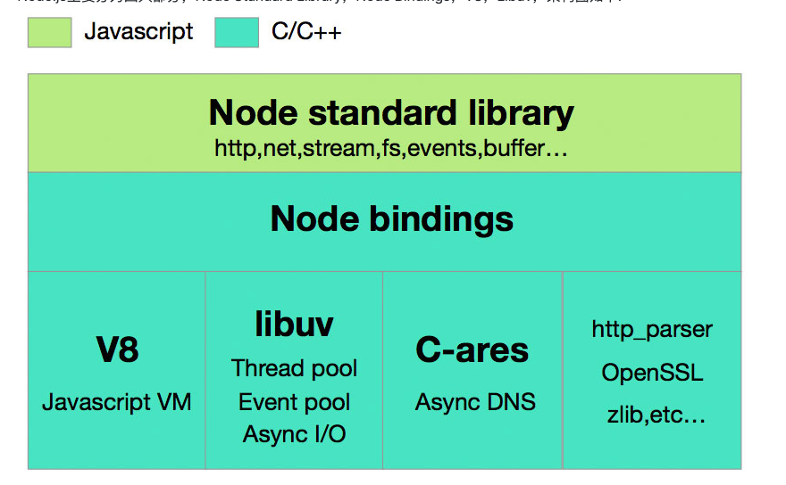

# **Node.js是什么？**  
  - `Node.js`是一个基于`Chrome V8`引擎的`JavaScript`运行环境，一个让`JavaScript` 运行在服务端的开发平台，用于方便地搭建响应速度快、易于扩展的网络应用。`Node`使用事件驱动， 非阻塞I/O 模型而得以轻量和高效，非常适合在分布式设备上运行数据密集型的实时应用。作为后端`JavaScript`的运行平台，Node保留了前端浏览器`JavaScript`中那些熟悉的接口，没有改写语言本身的任何特性，依旧基于作用域和原型链，区别在于它将前端中广泛运用的思想迁移到了服务器端  
  - **特点：**  
    - 异步I/O  
      在Node中，绝大多数的操作都以异步的方式进行调用。其在底层构建了很多异步I/O的API，从文件读取到网络请求等，均是如此。这样的意义在于，在Node中，我们可以从语言层面很自然地进行并行I/O操作。每个调用之间无须等待之前的I/O调用结束。在编程模型上可以极大提升效率。以同时执行两个文件读取任务为例，异步I/O取决于最慢的那个文件读取的耗时，而同步I/O的耗时是两个任务的耗时之和。这里异步带来的优势是显而易见的  
    - 事件  
      将前端浏览器中应用广泛且成熟的事件引入后端， 配合异步I/O，将事件点暴露给业务逻辑。事件的编程方式具有轻量级、松耦合、只关注事务点等优势，但是在多个异步任务的场景下，事件与事件之间各自独立，如何协作是一个问题  
    - 回调函数  
      Node除了异步和事件外，回调函数是一大特色。纵观下来，回调函数也是最好的接受异步调用返回数据的方式  
    - 单线程  
      `JavaScript`语言的一大特点就是单线程，也就是说，同一个时间只能做一件事。`JavaScript`的单线程，与它的用途有关。作为浏览器脚本语言，`JavaScript`的主要用途是与用户互动，以及操作DOM。这决定了它只能是单线程，否则会带来很复杂的同步问题。比如，假定`JavaScript`同时有两个线程，一个线程在某个DOM节点上添加内容，另一个线程删除了这个节点，这时浏览器应该以哪个线程为准？Node保持了`JavaScript`在浏览器中单线程的特点。而且在Node中，`JavaScript`与其余线程是无法共享任何状态的。单线程的最大好处是不用像多线程编程那样处处在意状态的同步问题，这里没有死锁的存在，也没有线程上下文交换所带来的性能上的开销  
  - **弱点**  
    - 无法利用多核CPU  
    - 错误会引起整个应用退出  
    - 大量计算占用CPU导致无法继续调用异步I/O  
    像浏览器中JavaScript与UI共用一个线程一样，JavaScript长时间执行会导致UI的渲染和响应被中断。在Node中，长时间的CPU占用也会导致后续的异步I/O发不出调用，已完成的异步I/O的回调函数也会得不到及时执行  
# **Node旨在解决什么问题？**  
  Node 公开宣称的目标是 “旨在提供一种简单的构建可伸缩网络程序的方法”。当前的服务器程序有什么问题？我们来做个数学题。在 Java™ 和 PHP 这类语言中，每个连接都会生成一个新线程，每个新线程可能需要 2 MB 的配套内存。在一个拥有 8 GB RAM 的系统上，理论上最大的并发连接数量是 4,000 个用户。随着您的客户群的增长，如果希望您的 Web 应用程序支持更多用户，那么，您必须添加更多服务器。当然，这会增加服务器成本、流量成本和人工成本等成本。除这些成本上升外，还有一个潜在技术问题，即用户可能针对每个请求使用不同的服务器，因此，任何共享资源都必须在所有服务器之间共享。鉴于上述所有原因，整个 Web 应用程序架构（包括流量、处理器速度和内存速度）中的瓶颈是：服务器能够处理的并发连接的最大数量  

  Node 解决这个问题的方法是：更改连接到服务器的方式。每个连接发射一个在 Node 引擎的进程中运行的事件，而不是为每个连接生成一个新的 OS 线程（并为其分配一些配套内存）。Node 声称它绝不会死锁，因为它根本不允许使用锁，它不会直接阻塞 I/O 调用。Node 还宣称，运行它的服务器能支持数万个并发连接  

# **Node如何工作？**  
  Node 本身运行 V8 JavaScript。什么是 V8？V8 JavaScript 引擎是 Google 用于其 Chrome 浏览器的底层 JavaScript 引擎。很少有人考虑 JavaScript 在客户机上实际做了些什么？实际上，JavaScript 引擎负责解释并执行代码。Google 使用 V8 创建了一个用 C++ 编写的超快解释器，该解释器拥有另一个独特特征；您可以下载该引擎并将其嵌入 任何 应用程序。V8 JavaScript 引擎并不仅限于在一个浏览器中运行。因此，Node 实际上会使用 Google 编写的 V8 JavaScript 引擎，并将其重建为可在服务器上使用  

# **Node源码分析**  
## **Node架构**  
  Node.js主要分为四大部分，Node Standard Library，Node Bindings，V8，Libuv  
  - Node Standard Library 标准库, 包含http, net, stream, fs, events, buffer...  
  - Node Bindings 沟通c++和js的桥梁，封装V8和Libuv的细节，向上层提供API服务  
  - 这一层是支撑 Node.js 运行的关键，由 C/C++ 实现  
    - V8 是Google开发的JavaScript引擎，提供JavaScript运行环境，可以说它就是 Node.js 的发动机  
    - Libuv 是专门为Node.js开发的一个封装库，提供跨平台的异步I/O能力  
    - C-ares：提供了异步处理 DNS 相关的能力  
    - http_parser、OpenSSL、zlib 等：提供包括 http 解析、SSL、数据压缩等其他的能力  
    

### **libuv**  
  - 即便是 SSD 的访问相较于高速的 CPU，仍然是慢速设备。于是基于事件驱动的 IO 模型就应运而生，解决了高速设备同步等待慢速设备或访问的问题。这不是 libuv 的独创，linux kernel 原生支持的 NIO也是这个思路。 但 libuv 统一了网络访问，文件访问，做到了跨平台  
  - **libuv架构**  
      
    从左往右分为两部分，一部分是与网络I/O相关的请求，而另外一部分是由文件I/O, DNS Ops以及User code组成的请求  
    对于Network I/O和以File I/O为代表的另一类请求，异步处理的底层支撑机制是完全不一样的  
    对于Network I/O相关的请求， 根据OS平台不同，分别使用Linux上的epoll，OSX和BSD类OS上的kqueue，SunOS上的event ports以及Windows上的IOCP机制  
    而对于File I/O为代表的请求，则使用thread pool。利用thread pool的方式实现异步请求处理，在各类OS上都能获得很好的支持  