## OS  
- **基本特征**  
  - **并发**指宏观上在一段时间内能同时运行多个程序，而并行则指同一时刻能运行多个指令。
  并行需要硬件支持，如多流水线、多核处理器或者分布式计算系统。
  操作系统通过引入进程和线程，使得程序能够并发运行  
  - **共享**指系统中的资源可以被多个并发进程共同使用。
  有两种共享方式：*互斥共享*和*同时共享*。
  互斥共享的资源称为临界资源，例如打印机等，在同一时刻只允许一个进程访问，需要用同步机制来实现互斥访问  
  - **虚拟**把一个物理实体转换为多个逻辑实体。
  主要有两种虚拟技术：*时（时间）分复用技术*和*空（空间）分复用技术*。
  多个进程能在同一个处理器上并发执行使用了时分复用技术，让每个进程轮流占用处理器，每次只执行一小个时间片并快速切换。
  虚拟内存使用了*空分复用技术*，它将物理内存抽象为地址空间，每个进程都有各自的地址空间。地址空间的页被映射到物理内存，地址空间的页并不需要全部在物理内存中，当使用到一个没有在物理内存的页时，执行页面置换算法，将该页置换到内存中  
  - **异步**指进程不是一次性执行完毕，而是走走停停，以不可知的速度向前推进  

- **基本功能**  
  - **进程管理** 有进程控制，进程同步，进程通信，死锁处理，处理机调度等  
  - **内存管理** 有内存分配，地址映射，内存保护与共享，虚拟内存等  
  - **文件管理** 有文件存储空间的管理，目录管理，文件读写管理和保护等  
  - **设备管理** 完成用户的I/O请求，方便哟关乎使用各种设备，并提高设备的利用率，主要有缓冲管理，设备分配，设备处理，虚拟设备等  

- **系统调用**  
  如果一个进程在用户态需要使用内核态的功能，就进行系统调用从而陷入内核，由操作系统代为完成  
  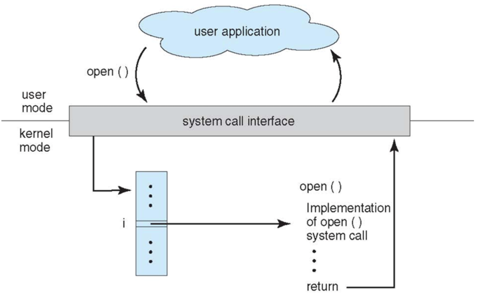
  Linux系统调用主要有  
  | Tasks | Commands |
  | ----- | -------- |
  | 进程控制 | fork(); exit(); wait(); |
  | 进程通信 | pipe(); shmget(); mmap(); |
  | 文件操作 | open(); read(); write(); |
  | 设备操作 | ioctl(); read(); write(); |
  | 信息维护 | getpid(); alarm(); sleep(); |
  | 安全 | chmod(); umask(); chown(); |

- **大内核与微内核**  
  *大内核*是将操作系统功能作为一个紧密结合的整体放到内，由于各模块共享信息，因此有很高的性能  
  *微内核*指由于操作系统不断复杂，因此将一部分操作系统功能移出内核，从而降低内核的复杂性。移出的部分根据分层的原则划分成若干服务，相互独立。在微内核结构下，操作系统被划分成小的、定义良好的模块，只有微内核这一个模块运行在内核态，其余模块运行在用户态。
  因为需要频繁地在用户态和核心态之间进行切换，所以会有一定的性能损失。

- **中断分类**  
  - **外中断** 由 CPU 执行指令以外的事件引起，如 I/O 完成中断，表示设备输入/输出处理已经完成，处理器能够发送下一个输入/输出请求。此外还有时钟中断、控制台中断等  
  - **异常**由 CPU 执行指令的内部事件引起，如非法操作码、地址越界、算术溢出等  
  - **陷入** 在用户程序中使用系统调用  

- **用户态和内核态**
  当一个任务（进程）执行系统调用而陷入内核代码中执行时，我们就称进程处于内核运行态（或简称为内核态）。此时处理器处于特权级最高的（0级）内核代码中执行。
  当进程处于内核态时，执行的内核代码会使用当前进程的内核栈。每个进程都有自己的内核栈。当进程在执行用户自己的代码时，则称其处于用户运行态（用户态）。即此时处理器在特权级最低的（3级）用户代码中运行  
  - **为什么分用户态和内核态**  
  因为在CPU的指令中，有一些是很危险的，错用将导致系统崩溃，如清内存或设置时钟等。假设没有这种内核态和用户态之分，程序随随便便就能访问硬件资源，比如说分配内存，程序能随意的读写所有的内存空间，如果程序员一不小心将不适当的内容写到了不该写的地方，就很可能导致系统崩溃。用户程序是不可信的，不管程序员是有意的还是无意的，都很容易将系统干到崩溃。正因为如此，Intel就发明了ring0-ring3这些访问控制级别来保护硬件资源，ring0的就是我们所说的内核级别,要想使用硬件资源就必须获取相应的权限（设置PSW寄存器，这个操作只能由操作系统设置）。操作系统对内核级别的指令进行封装，统一管理硬件资源，然后向用户程序提供系统服务，用户程序进行系统调用后，操作系统执行一系列的检查验证，确保这次调用是安全的，再进行相应的资源访问操作。内核态能有效保护硬件资源的安全。另外，用户程序是通过内部中断来进行系统调用的，触发内部中断的指令是 INT N ，触发中断后CPU根据中断号到中断向量表中查找中断服务程序入口，中断服务程序的处理过程一般是，设置PSW状态字（设置了之后才能执行一切指令），保存用户态上下文，调用过程执行，执行完成恢复用户程序上下文。
  - **用户态进入内核态的方式，如何进入内核态**  
  1. 系统调用  
  这是用户态进程主动要求切换到内核态的一种方式，用户态进程通过系统调用申请使用操作系统提供的服务程序完成工作，比如fork()实际上就是执行了一个创建新进程的系统调用。而系统调用的机制其核心还是使用了操作系统为用户特别开放的一个中断来实现，例如Linux的int 80h中断  
  2. 异常  
  当CPU在执行运行在用户态下的程序时，发生了某些事先不可知的异常，这时会触发由当前运行进程切换到处理此异常的内核相关程序中，也就转到了内核态，比如缺页异常  
  3. 外围设备的中断  
  当外围设备完成用户请求的操作后，会向CPU发出相应的中断信号，这时CPU会暂停执行下一条即将要执行的指令转而去执行与中断信号对应的处理程序，如果先前执行的指令是用户态下的程序，
  那么这个转换的过程自然也就发生了由用户态到内核态的切换。比如硬盘读写操作完成，系统会切换到硬盘读写的中断处理程序中执行后续操作等。  
  - 这3种方式是系统在运行时由用户态转到内核态的最主要方式，其中系统调用可以认为是用户进程主动发起的，异常和外围设备中断则是被动的。  

- **僵尸进程**  
  - **定义：**完成了生命周期但却依然留在进程表中的进程，我们称之为 “僵尸进程”  
  - **产生：**当你运行一个程序时，它会产生一个父进程以及很多子进程。 所有这些子进程都会消耗内核分配给它们的内存和 CPU 资源。
  这些子进程完成执行后会发送一个 Exit 信号然后死掉。这个 Exit 信号需要被父进程所读取。父进程需要随后调用 wait 命令来读取子进程的退出状态，并将子进程从进程表中移除。
  若父进程正确第读取了子进程的 Exit 信号，则子进程会从进程表中删掉。但若父进程未能读取到子进程的 Exit 信号，则这个子进程虽然完成执行处于死亡的状态，但也不会从进程表中删掉  
  - **处理方式：**`ps aux | grep Z`  `kill -s SIGCHLD pid`将这里的 pid 替换成父进程的进程 id，这样父进程就会删除所有以及完成并死掉的子进程了。确保删除子僵尸的唯一方法就是杀掉它们的父进程  

- **孤儿进程**  
  - **定义和产生：**一个父进程退出，而它的一个或多个子进程还在运行，那么那些子进程将成为孤儿进程。孤儿进程将被init进程(进程号为1)所收养，并由init进程对它们完成状态收集工作
- **进程与线程**  
  - **进程**  
    进程是资源分配的基本单位。一个进程由三部分组成：程序、数据及进程控制块(PCB)
    进程控制块 (Process Control Block, PCB) 描述进程的基本信息和运行状态，是进程存在的程序唯一标识,所谓的创建进程和撤销进程，都是指对 PCB 的操作  
  - **线程**  
    线程是独立调度的基本单位。
    一个进程中可以有多个线程，它们共享进程资源。
    QQ 和浏览器是两个进程，浏览器进程里面有很多线程，例如 HTTP 请求线程、事件响应线程、渲染线程等等，线程的并发执行使得在浏览器中点击一个新链接从而发起 HTTP 请求时，浏览器还可以响应用户的其它事件  
  - **区别**  
    - 拥有资源  
    进程是资源分配的基本单位，但是线程不拥有资源，线程可以访问隶属进程的资源  
    - 调度  
    线程是独立调度的基本单位，在同一进程中，线程的切换不会引起进程切换，从一个进程中的线程切换到另一个进程中的线程时，会引起进程切换  
    - 系统开销  
    由于创建或撤销进程时，系统都要为之分配或回收资源，如内存空间、I/O 设备等，所付出的开销远大于创建或撤销线程时的开销。类似地，在进行进程切换时，涉及当前执行进程 CPU 环境的保存及新调度进程 CPU 环境的设置，而线程切换时只需保存和设置少量寄存器内容，开销很小  
    - 通信方面  
    线程间可以通过直接读写同一进程中的数据进行通信，但是进程通信需要借助 IPC  
  - **线程共享哪些进程资源**  
    地址空间，全局变量，堆（全局堆和局部堆），全局堆就是所有没有分配的空间，局部堆就是用户分配的空间  
  - **线程独占的资源**  
    栈（保存运行状态和局部变量），寄存器，状态字

- **进程状态的切换**  
  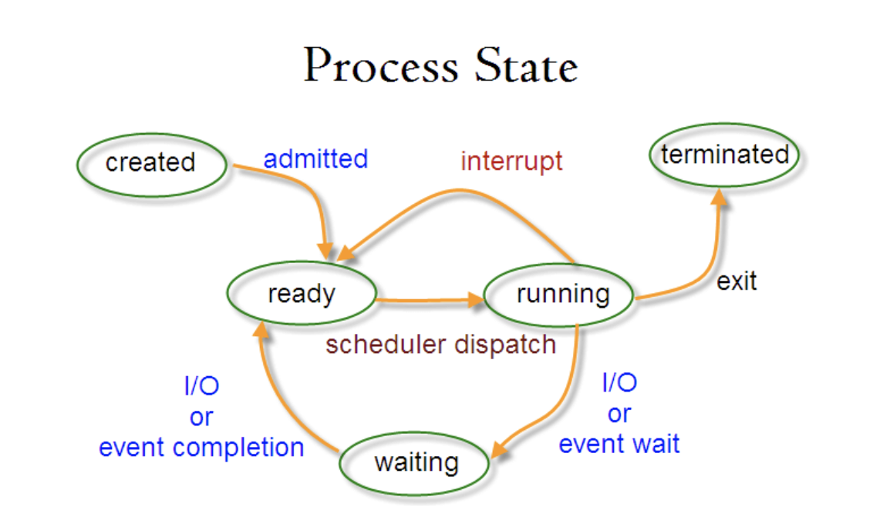  
  - **就绪状态（ready）：**等待被调度  
  - **运行状态（running）**  
  - **阻塞状态（waiting）：**等待资源  
  - 只有就`绪态和运行态`可以相互转换，其它的都是单向转换。就绪状态的进程通过调度算法从而获得 CPU 时间，转为运行状态；而运行状态的进程，在分配给它的 CPU 时间片用完之后就会转为就绪状态，等待下一次调度  
  - 阻塞状态是缺少需要的资源从而由运行状态转换而来，但是该资源*不包括* CPU 时间，缺少 CPU 时间会从运行态转换为就绪态  

- **Linux进程五种状态**  
  1. 运行(正在运行或在运行队列中等待)  
  2. 中断(休眠中, 受阻, 在等待某个条件的形成或接受到信号)  
  3. 不可中断(收到信号不唤醒和不可运行, 进程必须等待直到有中断发生)  
  4. 僵死(进程已终止, 但进程描述符存在, 直到父进程调用wait4()系统调用后释放)  
  5. 停止(进程收到SIGSTOP, SIGSTP, SIGTIN, SIGTOU信号后停止运行运行)  

- **进程通信方式**  
  - 管道( pipe)：管道是一种半双工的通信方式，数据只能单向流动，而且只能在具有亲缘关系的进程间使用。进程的亲缘关系通常是指父子或兄弟进程关系,通过pipe函数创建，fd[0]用于读，fd[1]用于写  
    ```clike
    #include <unistd.h>
    int pipe(int fd[2]);
    ```
  - FIFO/命名管道 (named pipe) ： 有名管道也是半双工的通信方式，但是它允许无亲缘关系进程间的通信,FIFO 常用于客户-服务器应用程序中，FIFO 用作汇聚点，在客户进程和服务器进程之间传递数据  
    ```clike
    #include <sys/stat.h>
    int mkfifo(const char *path, mode_t mode);
    int mkfifoat(int fd, const char *path, mode_t mode);
    ```
  - 消息队列( message queue ) ： 消息队列是由消息的链表，存放在内核中并由消息队列标识符标识。消息队列克服了信号传递信息少、而相比于管道，消息队列有如下有点
    - FIFO只能承载无格式字节流以及缓冲区大小受限  
    - 消息队列可以独立于读写进程存在，从而避免了 FIFO 中同步管道的打开和关闭时可能产生的困难  
    - 避免了 FIFO 的同步阻塞问题，不需要进程自己提供同步方法  
    - 读进程可以根据消息类型有选择地接收消息，而不像 FIFO 那样只能默认地接收  
  - 信号量( semophore ) ： 信号量是一个计数器，可以用来控制多个进程对共享资源的访问。它常作为一种锁机制，防止某进程正在访问共享资源时，其他进程也访问该资源。因此，主要作为进程间以及同一进程内不同线程之间的同步手段  
  - 信号(sinal) ：信号是一种比较复杂的通信方式，用于通知接收进程某些事件已经发生，要注意信号处理中调用的函数是否为信号安全  
  - 共享内存( shared memory ) ：共享内存就是映射一段能被其他进程所访问的内存，这段共享内存由一个进程创建，但多个进程都可以访问。共享内存是最快的 IPC 方式，它是针对其他进程间通信方式运行效率低而专门设计的。它往往与其他通信机制，如信号两，配合使用，来实现进程间的同步和通信  
  - 套接字( socket ) ： 套解口也是一种进程间通信机制，与其他通信机制不同的是，它可用于不同及其间的进程通信  
  **最快的方式是共享内存**：采用共享内存通信的一个显而易见的好处是效率高，因为进程可以直接读写内存，而不需要任何数据的拷贝。对于像管道和消息队列等通信方式，则需要在内核和用户空间进行四次的数据拷贝

- **进程调度算法**  
  - **批处理系统** 批处理系统没有太多的用户操作，在该系统中，调度算法目标是保证吞吐量和周转时间（从提交到终止的时间）  
    - 先来先服务 first-come first-serverd（FCFS）  
      非抢占式的调度算法，按照请求的顺序进行调度。有利于长作业，但不利于短作业，因为短作业必须一直等待前面的长作业执行完毕才能执行，而长作业又需要执行很长时间，造成了短作业等待时间过长  
    - 短作业优先 shortest job first（SJF）  
      非抢占式的调度算法，按估计运行时间最短的顺序进行调度。长作业有可能会饿死，处于一直等待短作业执行完毕的状态。因为如果一直有短作业到来，那么长作业永远得不到调度  
    - 最短剩余时间优先 shortest remaining time next（SRTN）  
      最短作业优先的抢占式版本，按剩余运行时间的顺序进行调度。 当一个新的作业到达时，其整个运行时间与当前进程的剩余时间作比较。如果新的进程需要的时间更少，则挂起当前进程，运行新的进程。否则新的进程等待  
  - **交互式系统** 交互式系统有大量的用户交互操作，在该系统中调度算法的目标是快速地进行响应  
    - 时间片轮转  
      将所有就绪进程按 FCFS 的原则排成一个队列，每次调度时，把 CPU 时间分配给队首进程，该进程可以执行一个时间片。当时间片用完时，由计时器发出时钟中断，调度程序便停止该进程的执行，并将它送往就绪队列的末尾，同时继续把 CPU 时间分配给队首的进程  
      时间片轮转算法的效率和时间片的大小有很大关系：1. 因为进程切换都要保存进程的信息并且载入新进程的信息，如果时间片太小，会导致进程切换得太频繁，在进程切换上就会花过多时间 2.而如果时间片过长，那么实时性就不能得到保证  
    - 优先级调度  
      为每个进程分配一个优先级，按优先级进行调度。为了防止低优先级的进程永远等不到调度，可以随着时间的推移增加等待进程的优先级  
    - 多级反馈队列  
      一个进程需要执行 100 个时间片，如果采用时间片轮转调度算法，那么需要交换 100 次。多级队列是为这种需要连续执行多个时间片的进程考虑，它设置了多个队列，每个队列时间片大小都不同，例如 1,2,4,8,..。进程在第一个队列没执行完，
      就会被移到下一个队列。这种方式下，之前的进程只需要交换 7 次。每个队列优先权也不同，最上面的优先权最高。因此只有上一个队列没有进程在排队，才能调度当前队列上的进程。可以将这种调度算法看成是时间片轮转调度算法和优先级调度算法的结合  
  - **实时系统**  
      实时系统要求一个请求在一个确定时间内得到响应。分为硬实时和软实时，前者必须满足绝对的截止时间，后者可以容忍一定的超时  

- **线程的状态**  
  线程通常都有五种状态，创建、就绪、运行、阻塞和死亡  
  第一是创建状态。在生成线程对象，并没有调用该对象的start方法，这是线程处于创建状态  
  第二是就绪状态。当调用了线程对象的start方法之后，该线程就进入了就绪状态，但是此时线程调度程序还没有把该线程设置为当前线程，此时处于就绪状态。在线程运行之后，从等待或者睡眠中回来之后，也会处于就绪状态  
  第三是运行状态。线程调度程序将处于就绪状态的线程设置为当前线程，此时线程就进入了运行状态，开始运行run函数当中的代码  
  第四是阻塞状态。线程正在运行的时候，被暂停，通常是为了等待某个时间的发生（比如说某项资源就绪）之后再继续运行。sleep,suspend等方法都可以导致线程阻塞  
  第五是死亡状态。如果一个线程的run方法执行结束，该线程就会死亡。对于已经死亡的线程，无法再使用start方法令其进入就绪状态  

- **进程同步**  
  - **临界区**
    对临界资源进行访问的那段代码称为临界区。为了互斥访问临界资源，每个进程在进入临界区之前，需要先进行检查  
    ```clike
    // entry section
    // critical section;
    // exit section
    ```  
  - **同步与互斥**  
    - 同步：多个进程因为合作产生的直接制约关系，使得进程有一定的先后执行关系  
    - 互斥：多个进程在同一时刻只有一个进程能进入临界区  
  - **信号量**  
    信号量（Semaphore）是一个整型变量，可以对其进行`P`和`V`操作  
    `P`:如果信号量大于 `0` ，执行 `-1` 操作；如果信号量等于 `0`，进程睡眠，等待信号量大于 `0`  
    `V`:对信号量执行 `+1` 操作，唤醒睡眠的进程让其完成 `P` 操作  
    通常执行这些操作时需要进行屏蔽中断  
    如果信号量取值只能为0/1，那么就成为了**互斥量（Mutex）**，`0`表示临界区已经上锁，`1`表示临界区解锁  
    ```clike
    typedef int semaphore;
    semaphore mutex = 1;
    void P1() {
        P(&mutex);
        // 临界区
        V(&mutex);
    }

    void P2() {
        P(&mutex);
        // 临界区
        V(&mutex);
    }
    ```
    **Example:使用信号量实现生产者-消费者问题**  
    >问题描述：使用一个缓冲区来保存物品，只有缓冲区没有满，生产者才可以放入物品；只有缓冲区不为空，消费者才可以拿走物品。因为缓冲区属于临界资源，因此需要使用一个互斥量 mutex 来控制对缓冲区的互斥访问。
    >为了同步生产者和消费者的行为，需要记录缓冲区中物品的数量。数量可以使用信号量来进行统计，这里需要使用两个信号量：empty 记录空缓冲区的数量，full 记录满缓冲区的数量。其中，empty 信号量是在生产者进程中使用，
    >当 empty 不为 0 时，生产者才可以放入物品；full 信号量是在消费者进程中使用，当 full 信号量不为 0 时，消费者才可以取走物品。
    >注意，不能先对缓冲区进行加锁，再测试信号量。也就是说，不能先执行 P(mutex) 再执行 P(empty)。如果这么做了，那么可能会出现这种情况：生产者对缓冲区加锁后，执行 P(empty) 操作，
    >发现 empty = 0，此时生产者睡眠。消费者不能进入临界区，因为生产者对缓冲区加锁了，消费者就无法执行 V(empty) 操作，empty 永远都为 0，导致生产者永远等待下，不会释放锁，消费者因此也会永远等待下去。
    ```clike
    #define N 100
    typedef int semaphore;
    semaphore mutex = 1;
    semaphore empty = N;
    semaphore full = 0;

    void producer() {
        while(TRUE) {
            int item = produce_item();
            P(&empty);
            P(&mutex);
            insert_item(item);
            V(&mutex);
            V(&full);
        }
    }

    void consumer() {
        while(TRUE) {
            P(&full);
            P(&mutex);
            int item = remove_item();
            consume_item(item);
            V(&mutex);
            V(&empty);
        }
    }
    ```
  - **管程**  
    使用信号量机制实现的生产者消费者问题需要客户端代码做很多控制，而管程把控制的代码独立出来，不仅不容易出错，也使得客户端代码调用更容易  
    管程有一个重要特性：在一个时刻只能有一个进程使用管程。进程在无法继续执行的时候不能一直占用管程，否则其它进程永远不能使用管程。
    管程引入了 **条件变量** 以及相关的操作：`wait()` 和 `signal()` 来实现同步操作。对条件变量执行 `wait()` 操作会导致调用进程阻塞，把管程让出来给另一个进程持有。`signal()` 操作用于唤醒被阻塞的进程  

- **经典同步问题**  
  - **哲学家进餐问题**  
    >五个哲学家围着一张圆桌，每个哲学家面前放着食物。哲学家的生活有两种交替活动：吃饭以及思考。当一个哲学家吃饭时，需要先拿起自己左右两边的两根筷子，并且一次只能拿起一根筷子  
    
    为防止出现死锁，设置两个条件：1. 必须同时拿起左右两根筷子 2. 只有在两个邻居都没有进餐的情况下才可以进餐  
    ```clike
    #define N 5
    #define LEFT (i + N - 1) % N // 左邻居
    #define RIGHT (i + 1) % N    // 右邻居
    #define THINKING 0
    #define HUNGRY   1
    #define EATING   2
    typedef int semaphore;
    int state[N];                // 跟踪每个哲学家的状态
    semaphore mutex = 1;         // 临界区的互斥，临界区是 state 数组，对其修改需要互斥
    semaphore s[N];              // 每个哲学家一个信号量

    void philosopher(int i) {
        while(TRUE) {
            think(i);
            take_two(i);
            eat(i);
            put_two(i);
        }
    }

    void take_two(int i) {
        P(&mutex);
        state[i] = HUNGRY;
        check(i);
        up(&mutex);
        V(&s[i]); // 只有收到通知之后才可以开始吃，否则会一直等下去
    }

    void put_two(i) {
        P(&mutex);
        state[i] = THINKING;
        check(LEFT); // 尝试通知左右邻居，自己吃完了，你们可以开始吃了
        check(RIGHT);
        V(&mutex);
    }

    void eat(int i) {
        P(&mutex);
        state[i] = EATING;
        V(&mutex);
    }

    // 检查两个邻居是否都没有用餐，如果是的话，就 V(&s[i])，使得 P(&s[i]) 能够得到通知并继续执行
    void check(i) {         
        if(state[i] == HUNGRY && state[LEFT] != EATING && state[RIGHT] !=EATING) {
            state[i] = EATING;
            V(&s[i]);
        }
    }
    ```
  - **读者-写者问题**  
    允许多个进程同时对数据进行读操作，但是不允许读和写以及写和写操作同时发生。一个整型变量 `count` 记录在对数据进行读操作的进程数量，一个互斥量 `count_mutex` 用于对 `count` 加锁，一个互斥量 `data_mutex` 用于对读写的数据加锁  
    ```clike
    typedef int semaphore;
    semaphore count_mutex = 1;
    semaphore data_mutex = 1;
    int count = 0;

    void reader() {
        while(TRUE) {
            P(&count_mutex);
            count++;
            if(count == 1) P(&data_mutex); // 第一个读者需要对数据进行加锁，防止写进程访问
            V(&count_mutex);
            read();
            P(&count_mutex);
            count--;
            if(count == 0) V(&data_mutex);
            V(&count_mutex);
        }
    }

    void writer() {
        while(TRUE) {
            P(&data_mutex);
            write();
            V(&data_mutex);
        }
    }
    ```
- **死锁**  
  - **必要条件**  
    - 互斥：至少有一个资源必须属于非共享模式，即一次只能被一个进程使用；若其他申请使用该资源，那么申请进程必须等到该资源被释放为止   
    - 占有和等待：一个进程必须占有至少一个资源，并等待另一个资源，而该资源为其他进程所占有  
    - 不可抢占：已经分配给一个进程的资源不能强制性地被抢占，它只能被占有它的进程显式地释放  
    - 循环等待：若干进程之间形成一种头尾相接的环形等待资源关系  
  
  - **处理方法**  
    - 鸵鸟策略  
    - 死锁检测和死锁恢复  
    - 死锁预防  
    - 死锁避免  

  - **鸵鸟策略**  
    因为解决死锁问题的代价很高，因此鸵鸟策略这种不采取任务措施的方案会获得更高的性能。当发生死锁时不会对用户造成多大影响，或发生死锁的概率很低，可以采用鸵鸟策略。大多数操作系统，包括 Unix，Linux 和 Windows，处理死锁问题的办法仅仅是忽略它  
  - **死锁检测与死锁恢复**  
    不试图阻止死锁，而是当检测到死锁发生时，采取措施进行恢复  
    - 每种类型一个资源的死锁检测  
      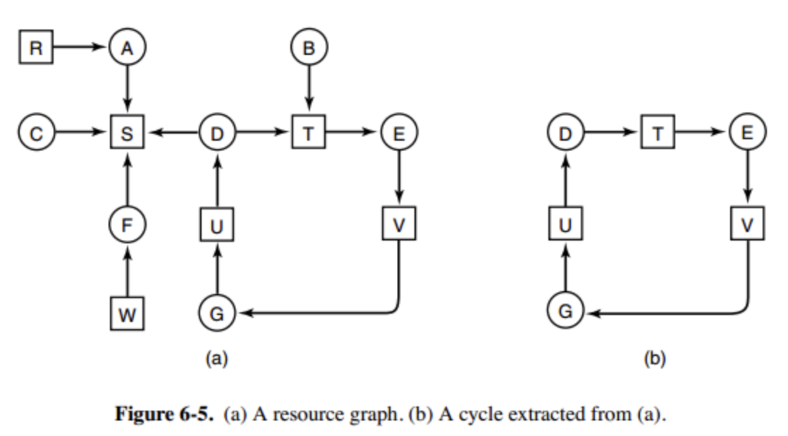  
      上图为资源分配图，其中方框表示资源，圆圈表示进程。资源指向进程表示该资源已经分配给该进程，进程指向资源表示进程请求获取该资源。图 a 可以抽取出环，如图 b，它满足了环路等待条件，因此会发生死锁。
      每种类型一个资源的死锁检测算法是通过检测*有向图是否存在环*来实现，从一个节点出发进行深度优先搜索，对访问过的节点进行标记，如果访问了已经标记的节点，就表示有向图存在环，也就是检测到死锁的发生。  
    - 每种类型多个资源的死锁检测  
        
      上图中，有三个进程四个资源，每个数据代表的含义如下：  
      E 向量：资源总量  
      A 向量：资源剩余量  
      C 矩阵：每个进程所拥有的资源数量，每一行都代表一个进程拥有资源的数量  
      R 矩阵：每个进程请求的资源数量  
      进程 P1 和 P2 所请求的资源都得不到满足，只有进程 P3 可以，让 P3 执行，之后释放 P3 拥有的资源，此时 A = (2 2 2 0)。P2 可以执行，执行后释放 P2 拥有的资源，A = (4 2 2 1) 。P1 也可以执行。所有进程都可以顺利执行，没有死锁。  
      算法总结如下：  
      每个进程最开始时都不被标记，执行过程有可能被标记。当算法结束时，任何没有被标记的进程都是死锁进程。  
      寻找一个没有标记的进程 Pi，它所请求的资源小于等于 A。
      如果找到了这样一个进程，那么将 C 矩阵的第 i 行向量加到 A 中，标记该进程，并转回 1。
      如果没有这样一个进程，算法终止  
    - 死锁恢复  
      - 利用抢占恢复  
      - 利用回滚恢复  
      - 通过杀死进程恢复  
  - **死锁预防**  
    - 破坏互斥条件： 例如假脱机打印机技术允许若干个进程同时输出，唯一真正请求物理打印机的进程是打印机守护进程  
    - 破坏占有等待条件： 一种实现方式是规定所有进程在开始执行前请求所需要的全部资源  
    - 破坏不可抢占条件：  
    - 破坏环路等待条件： 给资源统一编号，进程只能按编号顺序来请求资源  
  - **死锁避免**  
    - 安全状态  
      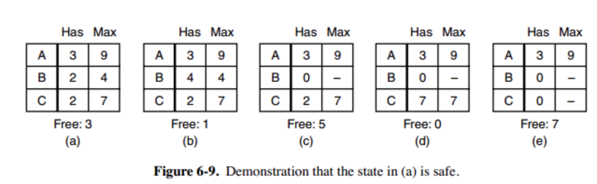  
      图 a 的第二列 Has 表示已拥有的资源数，第三列 Max 表示总共需要的资源数，Free 表示还有可以使用的资源数。从图 a 开始出发，先让 B 拥有所需的所有资源（图 b），运行结束后释放 B，此时 Free 变为 5（图 c）；
      接着以同样的方式运行 C 和 A，使得所有进程都能成功运行，因此可以称图 a 所示的状态时安全的。  
      定义：如果没有死锁发生，并且即使所有进程突然请求对资源的最大需求，也仍然存在某种调度次序能够使得每一个进程运行完毕，则称该状态是安全的。  
      安全状态的检测与死锁的检测类似，因为安全状态必须要求不能发生死锁。下面的银行家算法与死锁检测算法非常类似，可以结合着做参考对比  
    - 单个资源的银行家算法  
      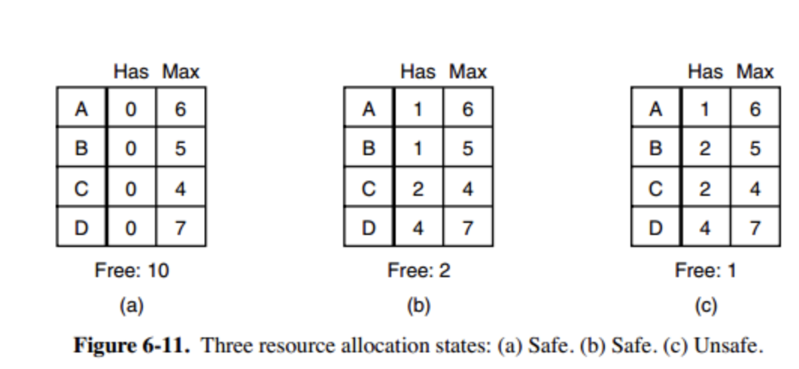  
      一个小城镇的银行家，他向一群客户分别承诺了一定的贷款额度，算法要做的是判断对请求的满足是否会进入不安全状态，如果是，就拒绝请求；否则予以分配。  
      上图 c 为不安全状态，因此算法会拒绝之前的请求，从而避免进入图 c 中的状态  
    - 多个资源的银行家算法  
      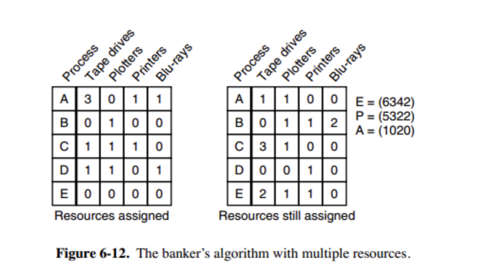  
      上图中有五个进程，四个资源。左边的图表示已经分配的资源，右边的图表示还需要分配的资源。最右边的 E、P 以及 A 分别表示：总资源、已分配资源以及可用资源，注意这三个为向量，而不是具体数值，例如 A=(1020)，表示 4 个资源分别还剩下 1/0/2/0。  
      检查一个状态是否安全的算法如下：  
      - 查找右边的矩阵是否存在一行小于等于向量 A。如果不存在这样的行，那么系统将会发生死锁，状态是不安全的。
      - 假若找到这样一行，将该进程标记为终止，并将其已分配资源加到 A 中。
      - 重复以上两步，直到所有进程都标记为终止，则状态时安全的。
      如果一个状态不是安全的，需要拒绝进入这个状态  
    
- **虚拟内存**  
  虚拟内存的目的是为了让物理内存扩充成更大的逻辑内存，从而让程序获得更多的可用内存。  
  为了更好的管理内存，操作系统将内存抽象成地址空间。每个程序拥有自己的地址空间，这个地址空间被分割成多个块，每一块称为一页。这些页被映射到物理内存，但不需要映射到连续的物理内存，也不需要所有页都必须在物理内存中。当程序引用到不在物理内存中的页时，由硬件执行必要的映射，将缺失的部分装入物理内存并重新执行失败的指令。  
  从上面的描述中可以看出，虚拟内存允许程序不用将地址空间中的每一页都映射到物理内存，也就是说一个程序不需要全部调入内存就可以运行，这使得有限的内存运行大程序成为可能。例如有一台计算机可以产生 16 位地址，那么一个程序的地址空间范围是 0~64K。该计算机只有 32KB 的物理内存，虚拟内存技术允许该计算机运行一个 64K 大小的程序  

- **局部性原理**  
  局部性原理表现在以下两个方面：  
  - 时间局部性：如果程序中的某条指令一旦执行，不久以后该指令可能再次执行；如果某数据被访问过，不久以后该数据可能再次被访问。产生时间局部性的典型 原因，是由于在程序中存在着大量的循环操作。  
  - 空间局部性：一旦程序访问了某个存储单元，在不久之后，其附近的存储单元也将被访问，即程序在一段时间内所访问的地址，可能集中在一定的范围之内，这是因为指令通常是顺序存放、顺序执行的，数据也一般是以向量、数组、表等形式簇聚存储的。  
  - 时间局部性是通过将近来使用的指令和数据保存到高速缓存存储器中，并使用高速缓存的层次结构实现。空间局部性通常是使用较大的高速缓存，并将预取机制集成到高速缓存控制逻辑中实现。虚拟内存技术实际上就是建立了 “内存一外存”的两级存储器的结构，利用局部性原理实现髙速缓存  

- **虚拟地址空间**  
  在 32 位机器下，虚拟地址空间大小为 4G。这些虚拟地址通过页表 (Page Table) 映射到物理内存，页表由操作系统维护，并被处理器的内存管理单元 (MMU) 硬件引用。每个进程都拥有一套属于它自己的页表，因此对于每个进程而言都好像独享了整个虚拟地址空间。Linux 内核将这 4G 字节的空间分为两部分，将最高的 1G 字节（0xC0000000-0xFFFFFFFF）供内核使用，称为 内核空间。而将较低的3G字节（0x00000000-0xBFFFFFFF）供各个进程使用，称为 用户空间。每个进程可以通过系统调用陷入内核态，因此内核空间是由所有进程共享的。虽然说内核和用户态进程占用了这么大地址空间，但是并不意味它们使用了这么多物理内存，仅表示它可以支配这么大的地址空间。它们是根据需要，将物理内存映射到虚拟地址空间中使用。  
  - Linux对进程地址空间有标准的布局，地址空间由各个不同的内存段组成：  
    - 程序段 (Text Segment)：可执行文件代码的内存映射  
    - 数据段 (Data Segment)：可执行文件的已初始化全局变量的内存映射  
    - BSS段 (BSS Segment)：未初始化的全局变量或者静态变量（用零页初始化）  
    - 堆区 (Heap) : 存储动态内存分配，匿名的内存映射  
    - 栈区 (Stack) : 进程用户空间栈，由编译器自动分配释放，存放函数的参数值、局部变量的值等  
    - 映射段(Memory Mapping Segment)：任何内存映射文件  
    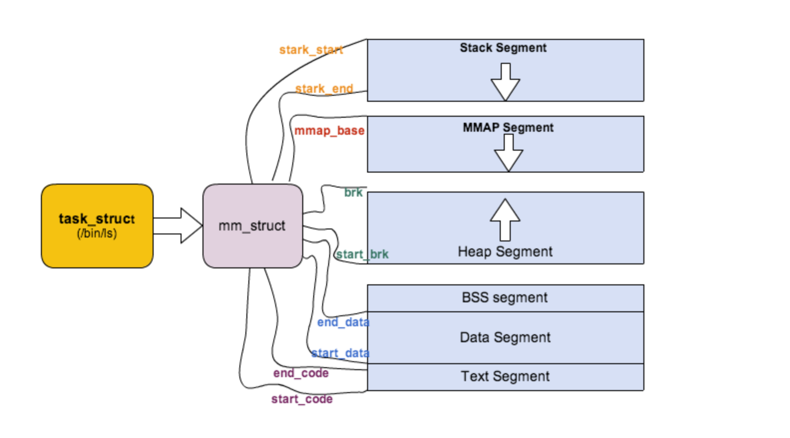
    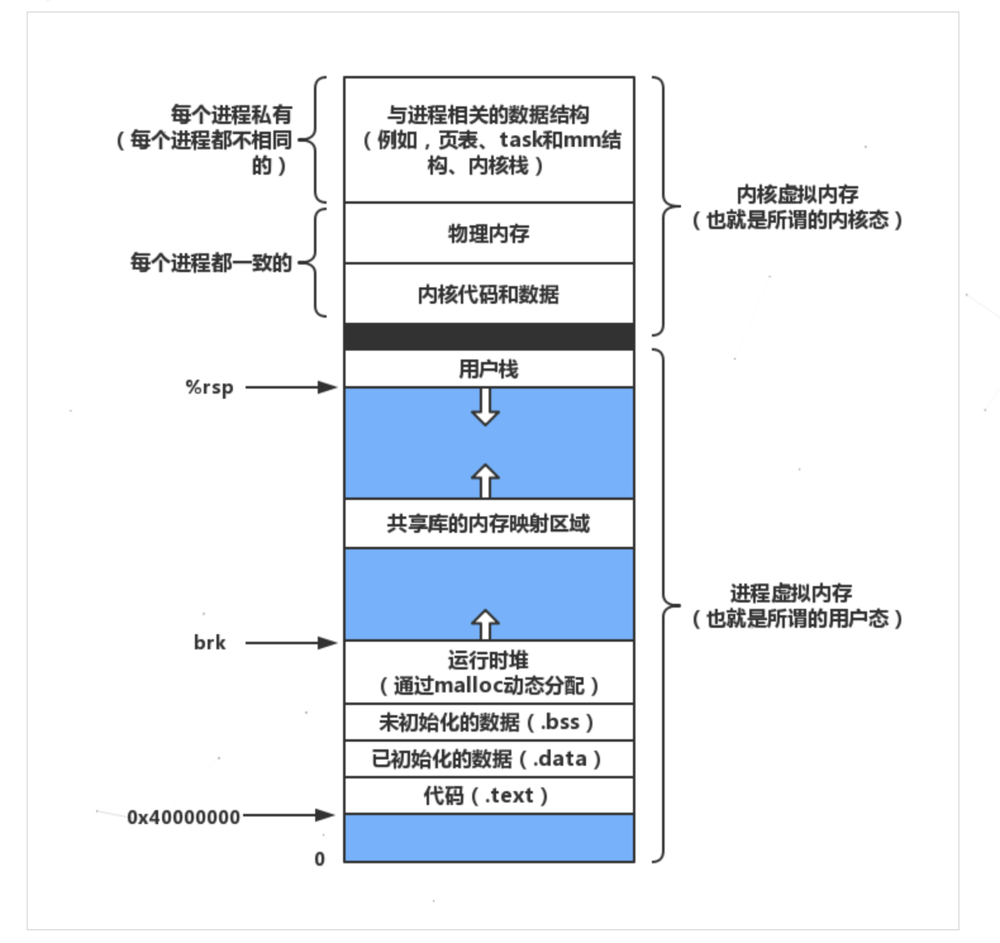

- **用户栈和内核栈**  
  内核在创建进程时，会同时创建task_struct和进程相应堆栈。每个进程都会有两个堆栈，一个用户栈，存在于用户空间，一个内核栈，存在于内核空间。当进程在用户空间运行时，CPU堆栈寄存器的内容是用户堆栈地址，使用用户栈。当进程在内核空间时，CPU堆栈寄存器的内容是内核栈地址空间，使用的是内核栈。  
  当进程因为中断或系统调用进入内核时，进程使用的堆栈也需要从用户栈到内核栈。进程陷入内核态后，先把用户堆栈的地址保存到内核堆栈中，然后设置设置CPU堆栈寄存器为内核栈的地址，这样就完成了用户栈到内核栈的转换。
  当进程从内核态恢复到用户态时，把内核中保存的用户态堆栈的地址恢复到堆栈指针寄存器即可。这样就实现了内核栈到用户栈的转换。
  注意：陷入内核栈时，如何知道内核栈的地址呢？
  进程由用户栈到内核栈转换时，进程的内核栈总是空的。每次从用户态陷入内核时，得到的内核栈都是空的，所以在进程陷入内核时，直接把内核栈顶地址给堆栈指针寄存器即可。  
- **四种栈**  
  [link](https://blog.csdn.net/yangkuanqaz85988/article/details/52403726)  
  [link](https://www.jianshu.com/p/091b54740979)  
  - 进程栈  
    进程栈是属于用户态栈，和进程 虚拟地址空间密切相关。进程虚拟空间中的栈区，即进程栈。进程栈的初始化大小是由编译器和链接器计算出来的，但是栈的实时大小并不是固定的，Linux 内核会根据入栈情况对栈区进行动态增长（其实也就是添加新的页表）。但是并不是说栈区可以无限增长，它也有最大限制 RLIMIT_STACK (一般为 8M)，我们可以通过 ulimit 来查看或更改 RLIMIT_STACK 的值。  
    - 进程在运行的过程中，通过不断向栈区压入数据，当超出栈区容量时，就会耗尽栈所对应的内存区域，这将触发一个 缺页异常 (page fault)。通过异常陷入内核态后，异常会被内核的 expand_stack() 函数处理，进而调用 acct_stack_growth() 来检查是否还有合适的地方用于栈的增长。如果栈的大小低于 RLIMIT_STACK（通常为8MB），那么一般情况下栈会被加长，程序继续执行，感觉不到发生了什么事情，这是一种将栈扩展到所需大小的常规机制。然而，如果达到了最大栈空间的大小，就会发生 栈溢出（stack overflow），进程将会收到内核发出的 段错误（segmentation fault） 信号。动态栈增长是唯一一种访问未映射内存区域而被允许的情形，其他任何对未映射内存区域的访问都会触发页错误，从而导致段错误。一些被映射的区域是只读的，因此企图写这些区域也会导致段错误。  
  - 线程栈  
    线程仅仅被视为一个与其他进程共享某些资源的进程，而是否共享地址空间几乎是进程和 Linux 中所谓线程的唯一区别。线程创建的时候，加上了 CLONE_VM 标记，这样 线程的内存描述符 将直接指向 父进程的内存描述符。  
    虽然线程的地址空间和进程一样，但是对待其地址空间的 stack 还是有些区别的。对于 Linux 进程或者说主线程，其 stack 是在 fork 的时候生成的，实际上就是复制了父亲的 stack 空间地址，然后写时拷贝 (cow) 以及动态增长。然而对于主线程生成的子线程而言，其 stack 将不再是这样的了，而是事先固定下来的，使用 mmap 系统调用，它不带有 VM_STACK_FLAGS 标记。由于线程的 mm->start_stack 栈地址和所属进程相同，所以线程栈的起始地址并没有存放在 task_struct 中，应该是使用 `pthread_attr_t` 中的 `stackaddr` 来初始化 `task_struct->thread->sp`（sp 指向 `struct pt_regs` 对象，该结构体用于保存用户进程或者线程的寄存器现场）。**线程栈不能动态增长，一旦用尽就没了，这是和生成进程的 fork 不同的地方**。由于线程栈是从进程的地址空间中 map 出来的一块内存区域，原则上是线程私有的。但是同一个进程的所有线程生成的时候浅拷贝生成者的 task_struct 的很多字段，其中包括所有的 vma，如果愿意，其它线程也还是可以访问到的  
  - 进程内核栈  
    在每一个进程的生命周期中，必然会通过到系统调用陷入内核。在执行系统调用陷入内核之后，这些内核代码所使用的栈并不是原先进程用户空间中的栈，而是一个单独内核空间的栈，这个称作进程内核栈。进程内核栈在进程创建的时候，通过 slab 分配器从 thread_info_cache 缓存池中分配出来，其大小为 THREAD_SIZE，一般来说是一个页大小 4K/8K  
  - 中断栈  
    进程陷入内核态的时候，需要内核栈来支持内核函数调用。中断也是如此，当系统收到中断事件后，进行中断处理的时候，也需要中断栈来支持函数调用。由于系统中断的时候，系统当然是处于内核态的，所以中断栈是可以和内核栈共享的。但是具体是否共享，这和具体处理架构密切相关。  

- **堆与栈**  
  - 栈：栈是用于存放本地变量，内部临时变量以及有关上下文的内存区域。程序在调用函数时，操作系统会自动通过压栈和弹栈完成保存函数现场等操作，不需要程序员手动干预。栈是一块连续的内存区域，栈顶的地址和栈的最大容量是系统预先规定好的。能从栈获得的空间较小。如果申请的空间超过栈的剩余空间时，例如递归深度过深，将提示stackoverflow。栈是机器系统提供的数据结构，计算机会在底层对栈提供支持：分配专门的寄存器存放栈的地址，压栈出栈都有专门的指令执行，这就决定了栈的效率比较高    
  - 堆：堆是用于存放除了栈里的东西之外所有其他东西的内存区域，当使用malloc和free时就是在操作堆中的内存。对于堆来说，释放工作由程序员控制，容易产生memory leak。堆是向高地址扩展的数据结构，是不连续的内存区域。这是由于系统是用链表来存储的空闲内存地址的，自然是不连续的，而链表的遍历方向是由低地址向高地址。堆的大小受限于计算机系统中有效的虚拟内存。由此可见，堆获得的空间比较灵活，也比较大。对于堆来讲，频繁的new/delete势必会造成内存空间的不连续，从而造成大量的碎片，使程序效率降低。对于栈来讲，则不会存在这个问题，因为栈是先进后出的队列，永远都不可能有一个内存块从栈中间弹出。堆都是动态分配的，没有静态分配的堆。栈有2种分配方式：静态分配和动态分配。静态分配是编译器完成的，比如局部变量的分配。动态分配由alloca函数进行分配，但是栈的动态分配和堆是不同的，他的动态分配是由编译器进行释放，无需我们手工实现。计算机底层并没有对堆的支持，堆则是C/C++函数库提供的，同时由于上面提到的碎片问题，都会导致堆的效率比栈要低。  

- **内存分配**  
  - 虚拟地址：用户编程时将代码（或数据）分成若干个段，每条代码或每个数据的地址由段名称 + 段内相对地址构成，这样的程序地址称为虚拟地址  
  - 逻辑地址：虚拟地址中，段内相对地址部分称为逻辑地址  
  - 物理地址：实际物理内存中所看到的存储地址称为物理地址  
  - 逻辑地址空间：在实际应用中，将虚拟地址和逻辑地址经常不加区分，通称为逻辑地址。逻辑地址的集合称为逻辑地址空间  
  - 线性地址空间：CPU地址总线可以访问的所有地址集合称为线性地址空间  
  - 物理地址空间：实际存在的可访问的物理内存地址集合称为物理地址空间  
  - MMU(Memery Management Unit内存管理单元)：实现将用户程序的虚拟地址（逻辑地址） → 物理地址映射的CPU中的硬件电路  
  - 基地址：在进行地址映射时，经常以段或页为单位并以其最小地址（即起始地址）为基值来进行计算  
  - 偏移量：在以段或页为单位进行地址映射时，相对于基地址的地址值  
  - 虚拟地址先经过分段机制映射到线性地址，然后线性地址通过分页机制映射到物理地址。  

- **分页系统地址映射**  
  内存管理单元（MMU）管理着地址空间和物理内存的转换，其中的页表（Page table）存储着页（程序地址空间）和页框（物理内存空间）的映射表。  
  一个虚拟地址分成两个部分，一部分存储页面号，一部分存储偏移量。  
  下图的页表存放着 16 个页，这 16 个页需要用 4 个比特位来进行索引定位。例如对于虚拟地址（0010 000000000100），前 4 位是存储页面号 2，读取表项内容为（110 1），页表项最后一位表示是否存在于内存中，1 表示存在。后 12 位存储偏移量。这个页对应的页框的地址为 （110 000000000100）  
  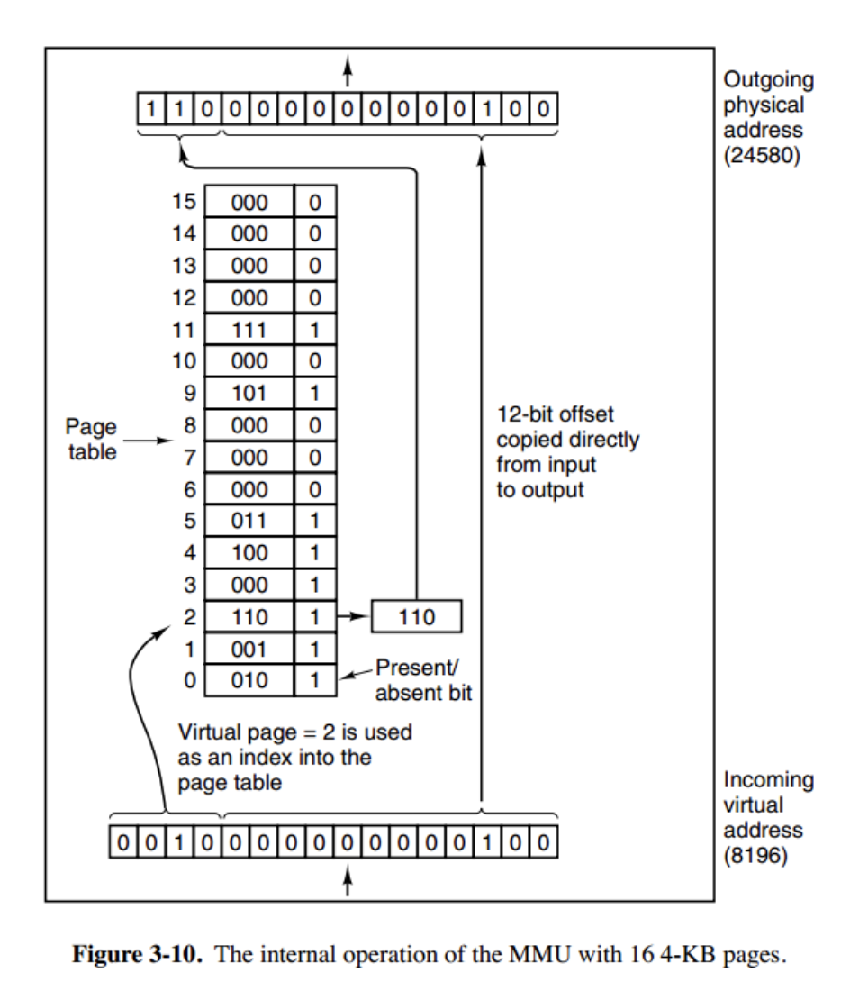  

- **页表**  
  虚拟内存空间被组织为一个存放在硬盘上的M个连续的字节大小的单元组成的数组，每个字节都有一个唯一的虚拟地址，作为到数组的索引（这点其实与物理内存是一样的）。  

  操作系统通过将虚拟内存分割为大小固定的块来作为硬盘和内存之间的传输单位，这个块被称为虚拟页（Virtual Page, VP），每个虚拟页的大小为P=2^p字节。物理内存也会按照这种方法分割为物理页（Physical Page, PP），大小也为P字节。  

  CPU在获得虚拟地址之后，需要通过MMU将虚拟地址翻译为物理地址。而在翻译的过程中还需要借助页表，所谓页表就是一个存放在物理内存中的数据结构，它记录了虚拟页与物理页的映射关系。  

  页表是一个元素为页表条目（Page Table Entry, PTE）的集合，每个虚拟页在页表中一个固定偏移量的位置上都有一个PTE。下面是PTE仅含有一个有效位标记的页表结构，该有效位代表这个虚拟页是否被缓存在物理内存中。  
  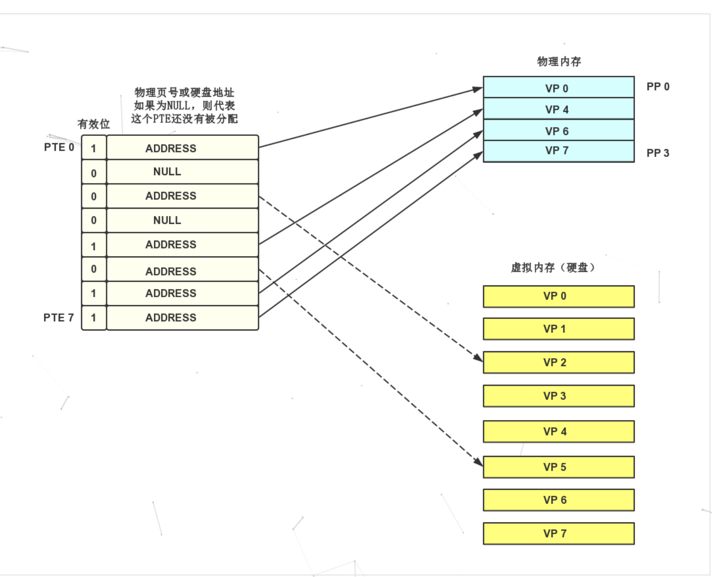  
  虚拟页VP 0、VP 4、VP 6、VP 7被缓存在物理内存中，虚拟页VP 2和VP 5被分配在页表中，但并没有缓存在物理内存，虚拟页VP 1和VP 3还没有被分配。  

  在进行动态内存分配时，例如malloc()函数或者其他高级语言中的new关键字，操作系统会在硬盘中创建或申请一段虚拟内存空间，并更新到页表（分配一个PTE，使该PTE指向硬盘上这个新创建的虚拟页）。  

  由于CPU每次进行地址翻译的时候都需要经过PTE，所以如果想控制内存系统的访问，可以在PTE上添加一些额外的许可位（例如读写权限、内核权限等），这样只要有指令违反了这些许可条件，CPU就会触发一个一般保护故障，将控制权传递给内核中的异常处理程序。一般这种异常被称为“段错误（Segmentation Fault）”。  

- **分页地址翻译过程**  
  地址翻译是一个N元素的虚拟地址空间中的元素和一个M元素的物理地址空间中元素之间的映射  
  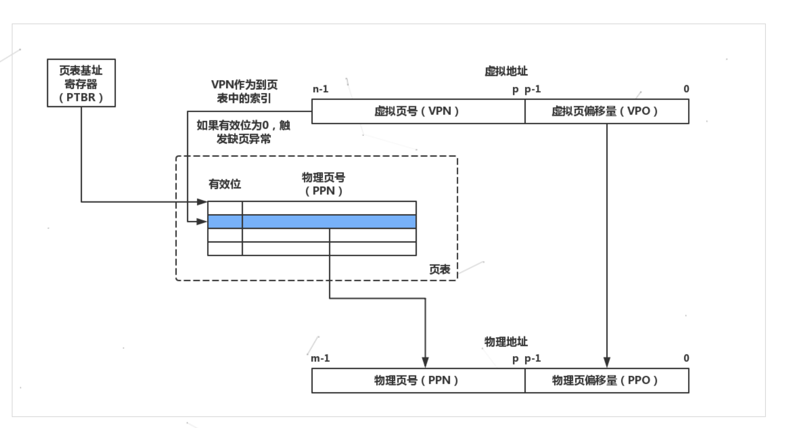  
  页表基址寄存器（PTBR）指向当前页表。一个n位的虚拟地址包含两个部分，一个p位的虚拟页面偏移量（Virtual Page Offset, VPO）和一个（n - p）位的虚拟页号（Virtual Page Number, VPN）。  
 
  MMU根据VPN来选择对应的PTE，例如VPN 0代表PTE 0、VPN 1代表PTE 1….因为物理页与虚拟页的大小是一致的，所以物理页面偏移量（Physical Page Offset, PPO）与VPO是相同的。那么之后只要将PTE中的物理页号（Physical Page Number, PPN）与虚拟地址中的VPO串联起来，就能得到相应的物理地址。  

  多级页表的地址翻译也是如此，只不过因为有多个层次，所以VPN需要分成多段。假设有一个k级页表，虚拟地址会被分割成k个VPN和1个VPO，每个VPN i都是一个到第i级页表的索引。为了构造物理地址，MMU需要访问k个PTE才能拿到对应的PPN.  
  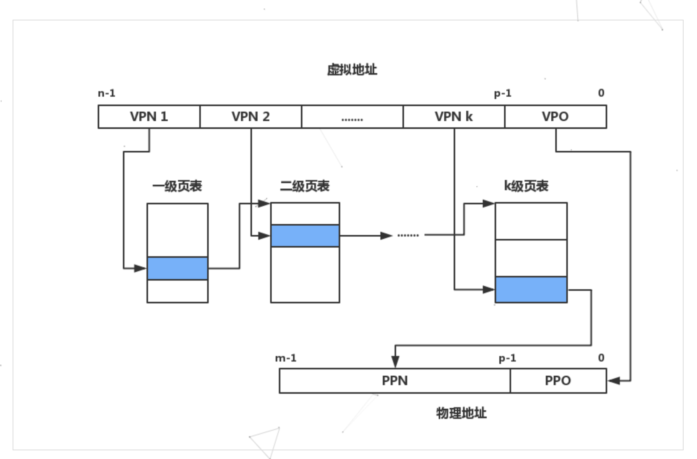  
  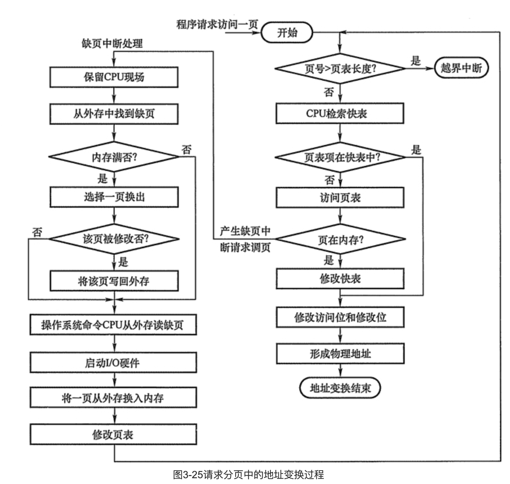  
- **TLB(Translation Lookaside Buffer)**  
  翻译后备缓冲器或翻译旁路缓冲器，它是MMU中的一个缓冲区，其中每一行都保存着一个由单个PTE组成的块。用于组选择和行匹配的索引与标记字段是从VPN中提取出来的.

- **内存共享**  
  虚拟内存系统为每个进程提供了私有的虚拟地址空间，这样可以保证进程之间不会发生错误的读写。但多个进程之间也含有相同的部分，例如每个C程序都使用到了C标准库，如果每个进程都在物理内存中保持这些代码的副本，那会造成很大的内存资源浪费。  
  内存映射提供了共享对象的机制，来避免内存资源的浪费。一个对象被映射到虚拟内存的一个区域，要么是作为共享对象，要么是作为私有对象的。内存映射提供了共享对象的机制，来避免内存资源的浪费。一个对象被映射到虚拟内存的一个区域，要么是作为共享对象，要么是作为私有对象的。  
  如果一个进程将一个共享对象映射到它的虚拟地址空间的一个区域内，那么这个进程对这个区域的任何写操作，对于那些也把这个共享对象映射到它们虚拟内存的其他进程而言，也是可见的。相对的，对一个映射到私有对象的区域的任何写操作，对于其他进程来说是不可见的。一个映射到共享对象的虚拟内存区域叫做共享区域，类似地，也有私有区域  
  为了节约内存，私有对象开始的生命周期与共享对象基本上是一致的（在物理内存中只保存私有对象的一份副本），并使用写时复制的技术来应对多个进程的写冲突  
  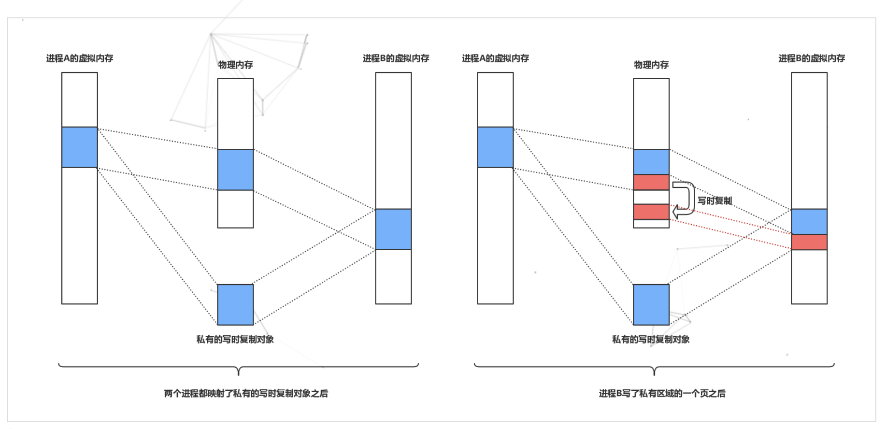  
  只要没有进程试图写它自己的私有区域，那么多个进程就可以继续共享物理内存中私有对象的一个单独副本。然而，只要有一个进程试图对私有区域的某一页面进行写操作，就会触发一个保护异常。在上图中，进程B试图对私有区域的一个页面进行写操作，该操作触发了保护异常。异常处理程序会在物理内存中创建这个页面的一个新副本，并更新PTE指向这个新的副本，然后恢复这个页的可写权限
- **内存碎片**  
  造成堆的空间利用率很低的主要原因是一种被称为碎片（fragmentation）的现象，当虽然有未使用的内存但这块内存并不能满足分配请求时，就会产生碎片。有以下两种形式的碎片：  
  - 内部碎片：在一个已分配块比有效载荷大时发生。例如，程序请求一个5字（这里我们不纠结字的大小，假设一个字为4字节，堆的大小为16字并且要保证边界双字对齐）的块，内存分配器为了保证空闲块是双字边界对齐的（具体实现中对齐的规定可能略有不同，但对齐是肯定会有的），只好分配一个6字的块。在本例中，已分配块为6字，有效载荷为5字，内部碎片为已分配块减去有效载荷，为1字  
  - 外部碎片：当空闲内存合计起来足够满足一个分配请求，但是没有一个单独的空闲块足够大到可以来处理这个请求时发生。外部碎片难以量化且不可预测，所以分配器通常采用启发式策略来试图维持少量的大空闲块，而不是维持大量的小空闲块。分配器也会根据策略与分配请求的匹配来分割空闲块与合并空闲块（必须相邻）  
- **分页&分段**  
  - 分页是由于系统管理的需要而不是用户的需要，它是信息的物理单位；分段的目的是为了能更好地满足用户的需要，它是信息的逻辑单位，它含有一组其意义相对完整的信息  
  - 页的大小固定且由系统决定,因而便于构造页表，易于管理，且不存在外碎片，而段的长度却不固定，由其所完成的功能决定  
  - 段向用户提供二维地址空间；页向用户提供的是一维地址空间  
  - 段是信息的逻辑单位，便于存储保护和信息的共享，页的保护和共享受到限制  
  - 页式存储管理的优点是没有外碎片（因为页的大小固定），但会产生内碎片（一个页可能填充不满）；而段式管理的优点是没有内碎片（因为段大小可变，改变段大小来消除内碎片）。但段换入换出时，会产生外碎片（比如4k的段换5k的段，会产生1k的外碎片）

- **页面置换算法**  
  在程序运行过程中，如果要访问的页面不在内存中，就发生缺页中断从而将该页调入内存中。此时如果内存已无空闲空间，系统必须从内存中调出一个页面到磁盘对换区中来腾出空间。  
  页面置换算法和缓存淘汰策略类似，可以将内存看成磁盘的缓存。在缓存系统中，缓存的大小有限，当有新的缓存到达时，需要淘汰一部分已经存在的缓存，这样才有空间存放新的缓存数据。  
  页面置换算法的主要目标是使页面置换频率最低（也可以说缺页率最低）  
  - OPT, Optimal replacement algorithm (最佳)  
    所选择的被换出的页面将是最长时间内不再被访问，通常可以保证获得最低的缺页率。是一种理论上的算法，因为无法知道一个页面多长时间不再被访问。  
    举例：一个系统为某进程分配了三个物理块，并有如下页面引用序列：
    7，0，1，2，0，3，0，4，2，3，0，3，2，1，2，0，1，7，0，1
    开始运行时，先将 7, 0, 1 三个页面装入内存。当进程要访问页面 2 时，产生缺页中断，会将页面 7 换出，因为页面 7 再次被访问的时间最长  
  - LRU, Least Recently Used (最近最久未使用)  
    虽然无法知道将来要使用的页面情况，但是可以知道过去使用页面的情况。LRU 将最近最久未使用的页面换出。
    为了实现 LRU，需要在内存中维护一个所有页面的链表。当一个页面被访问时，将这个页面移到链表表头。这样就能保证链表表尾的页面是最近最久未访问的。
    因为每次访问都需要更新链表，因此这种方式实现的 LRU 代价很高  
  - NRU, Not Recently Used (最近未使用)  
    每个页面都有两个状态位：R 与 M，当页面被访问时设置页面的 R=1，当页面被修改时设置 M=1。其中 R 位会定时被清零。可以将页面分成以下四类：  
    R=0，M=0  
    R=0，M=1  
    R=1，M=0  
    R=1，M=1  
    当发生缺页中断时，NRU 算法随机地从类编号最小的非空类中挑选一个页面将它换出。NRU 优先换出已经被修改的脏页面（R=0，M=1），而不是被频繁使用的干净页面（R=1，M=0）  
  - FIFO, First In First Out (先进先出)  
    选择换出的页面是最先进入的页面。该算法会将那些经常被访问的页面换出，导致缺页率升高  
  - 第二次机会算法  
    FIFO 算法可能会把经常使用的页面置换出去，为了避免这一问题，对该算法做一个简单的修改：当页面被访问 (读或写) 时设置该页面的 R 位为 1。需要替换的时候，检查最老页面的 R 位。
    如果 R 位是 0，那么这个页面既老又没有被使用，可以立刻置换掉；如果是 1，就将 R 位清 0，并把该页面放到链表的尾端，修改它的装入时间使它就像刚装入的一样，然后继续从链表的头部开始搜索  
    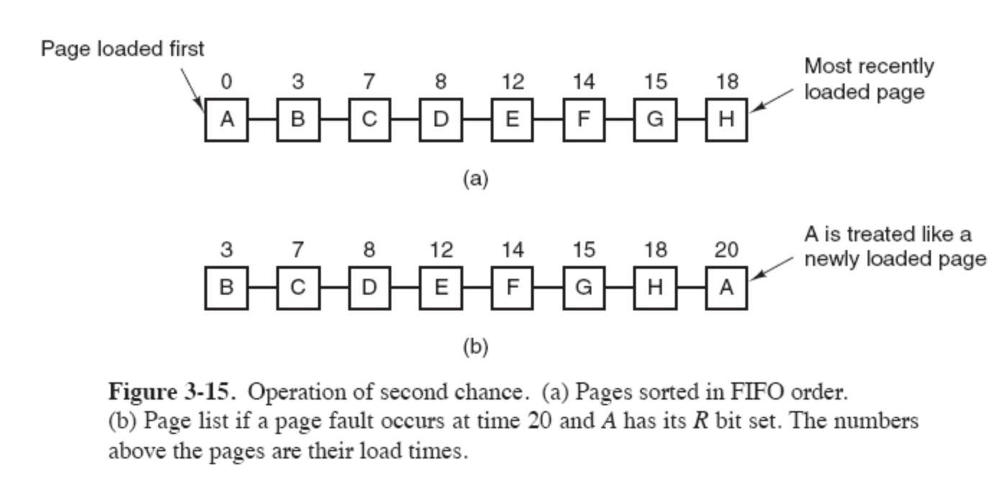  
  - Clock (时钟)  
    第二次机会算法需要在链表中移动页面，降低了效率。时钟算法使用环形链表将页面连接起来，再使用一个指针指向最老的页面  
    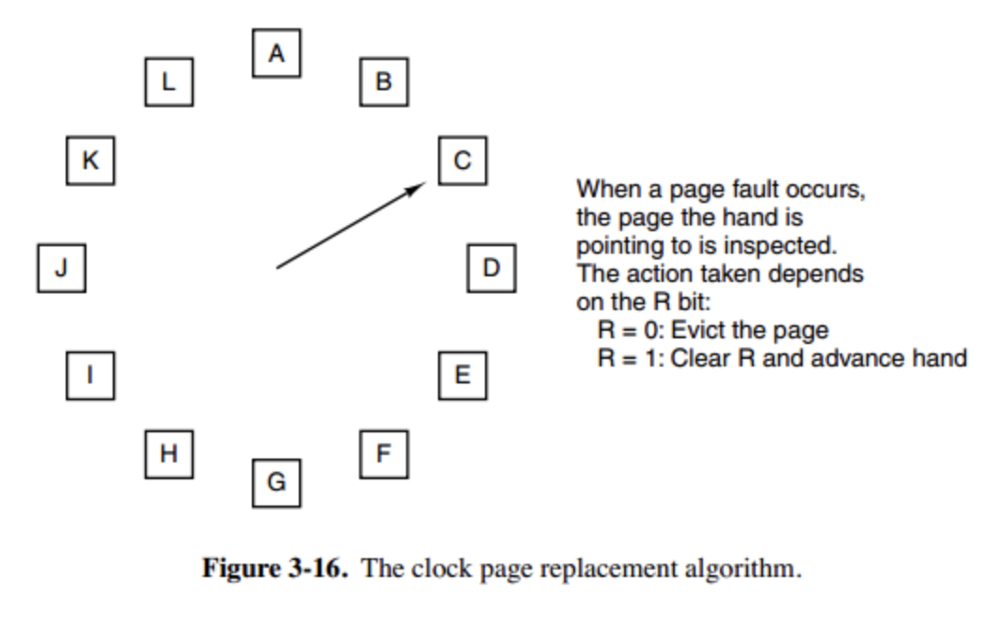

- **分段**  
  虚拟内存采用的是分页技术，也就是将地址空间划分成固定大小的页，每一页再与内存进行映射。  
  下图为一个编译器在编译过程中建立的多个表，有 4 个表是动态增长的，如果使用分页系统的一维地址空间，动态增长的特点会导致覆盖问题的出现。
  分段的做法是把每个表分成段，一个段构成一个独立的地址空间。每个段的长度可以不同，并且可以动态增长，每段从0 开始编址，并分配一段连续的地址空间（段内要求连续，段间不要求连续，因此整个作业的地址空间是二维的）。其逻辑地址由段号S与段内偏移量W两部分组成。在页式系统中，逻辑地址的页号和页内偏移量对用户是透明的，但在段式系统中，段号和段内偏移量必须由用户显示提供，在髙级程序设计语言中，这个工作由编译程序完成    

- **段表**  
  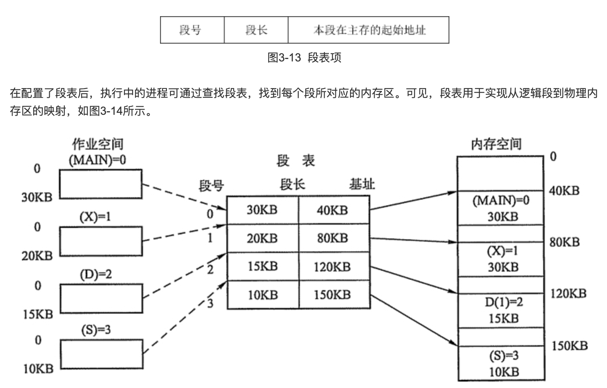  

- **分段地址翻译过程**
  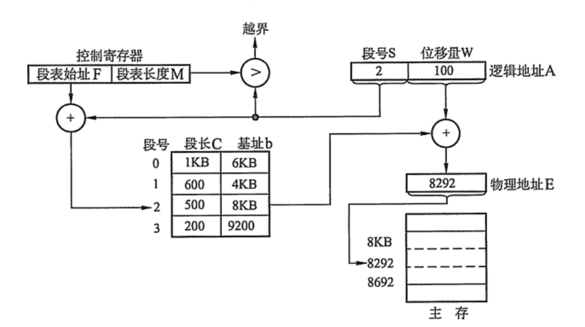  

- **段的共享与保护**  
  在分段系统中，段的共享是通过两个作业的段表中相应表项指向被共享的段的同一个物理副本来实现的。当一个作业正从共享段中读取数据时，必须防止另一个作业修改此共享段中的数据。不能修改的代码称为纯代码或可重入代码（它不属于临界资源)，这样的代码和不能修改的数据是可以共享的，而可修改的代码和数据则不能共享。  

  与分页管理类似，分段管理的保护方法主要有两种：一种是存取控制保护，另一种是地址越界保护。地址越界保护是利用段表寄存器中的段表长度与逻辑地址中的段号比较，若段号大于段表长度则产生越界中断；再利用段表项中的段长和逻辑地址中的段内位移进行比较，若段内位移大于段长，也会产生越界中断  

- **分段优缺点**  
  - 段的逻辑独立性使其易于编译、管理、修改和保护，也便于多道程序共享。  
  - 段长可以根据需要动态改变，允许自由调度，以便有效利用主存空间。  
  - 方便编程，分段共享，分段保护，动态链接，动态增长  
  
  - 主存空间分配比较麻烦。  
  - 容易在段间留下许多碎片，造成存储空间利用率降低。  
  - 由于段长不一定是2的整数次幂，因而不能简单地像分页方式那样用虚拟地址和实存地址的最低若干二进制位作为段内地址，并与段号进行直接拼接，必须用加法操作通过段起址与段内地址的求和运算得到物理地址。因此，段式存储管理比页式存储管理方式需要更多的硬件支持。  
- **段页式**  
  程序的地址空间划分成多个拥有独立地址空间的段，每个段上的地址空间划分成大小相同的页。这样既拥有分段系统的共享和保护，又拥有分页系统的虚拟内存功能  
  - 用分段方法来分配和管理虚拟存储器。程序的地址空间按逻辑单位分成基本独立的段，而每一段有自己的段名，再把每段分成固定大小的若干页。  

  - 用分页方法来分配和管理实存。即把整个主存分成与上述页大小相等的存储块，可装入作业的任何一页。程序对内存的调入或调出是按页进行的。但它又可按段实现共享和保护。  


- **分页与分段的比较**  
  - 对程序员的透明性：分页透明，但是分段需要程序员显式划分每个段  
  - 地址空间的维度：分页是一维地址空间，分段是二维的  
  - 大小是否可以改变：页的大小不可变，段的大小可以动态改变  
  - 出现的原因：分页主要用于实现虚拟内存，从而获得更大的地址空间；分段主要是为了使程序和数据可以被划分为逻辑上独立的地址空间并且有助于共享和保护  

- **磁盘结构**  
  - 盘面（Platter）：一个磁盘有多个盘面；  
  - 磁道（Track）：盘面上的圆形带状区域，一个盘面可以有多个磁道； 
  - 扇区（Track Sector）：磁道上的一个弧段，一个磁道可以有多个扇区，它是最小的物理储存单位，目前主要有 512 bytes 与 4 K 两种大小；  
  - 磁头（Head）：与盘面非常接近，能够将盘面上的磁场转换为电信号（读），或者将电信号转换为盘面的磁场（写）；  
  - 制动手臂（Actuator arm）：用于在磁道之间移动磁头；  
  - 主轴（Spindle）：使整个盘面转动 
  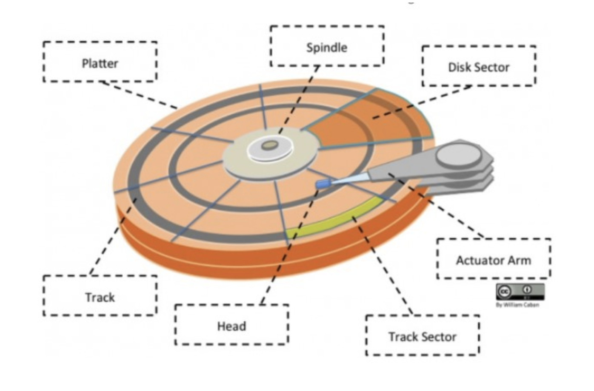

- **磁盘调度算法**  
  读写一个磁盘块的时间的影响因素有：
  - 旋转时间（主轴转动盘面，使得磁头移动到适当的扇区上）  
  - 寻道时间（制动手臂移动，使得磁头移动到适当的磁道上）  
  - 实际的数据传输时间  
  其中，寻道时间最长，因此磁盘调度的主要目标是使磁盘的平均寻道时间最短

  - **FCFS, First Come First Served (先来先服务)**  
    按照磁盘请求的顺序进行调度。优点是公平和简单。缺点也很明显，因为未对寻道做任何优化，使平均寻道时间可能较长  
  - **SSTF, Shortest Seek Time First (最短寻道时间优先)**  
    优先调度与当前磁头所在磁道距离最近的磁道。虽然平均寻道时间比较低，但是不够公平。如果新到达的磁道请求总是比一个在等待的磁道请求近，那么在等待的磁道请求会一直等待下去，也就是出现饥饿现象。具体来说，两端的磁道请求更容易出现饥饿现象  
  - **SCAN (电梯算法)**  
    电梯总是保持一个方向运行，直到该方向没有请求为止，然后改变运行方向。电梯算法（扫描算法）和电梯的运行过程类似，总是按一个方向来进行磁盘调度，直到该方向上没有未完成的磁盘请求，然后改变方向。
    因为考虑了移动方向，因此所有的磁盘请求都会被满足，解决了 SSTF 的饥饿问题  
